# NoSQL的四大分类

## KV键值对：

- 新浪：Redis
- 美团：Redis + Tair（是由淘宝网自主开发的KV结构数据存储系统，在淘宝网有着大规模的应用）
- 阿里、百度：Redis + memecache（高速缓存系统，与redis相似 ）

## 文档型数据库（bson  和json一样）：

- MongoDB（一般必须要掌握）
  - MongoDB是一个基于分布式文件存储的数据库，C++编写的，只要用来处理大量的文档！
  - MongoDB是一个介于关系型数据库和非关系型数据库中中间的产品！MongoDB是非关系型数据库中功能最丰富，最像关系型数据库的！
- ConchDB

## **列存储数据库**（分布式的文件系统）

- HBase
- 分布式文件系统

## **图关系数据库**    (社交网络，推荐系统等。专注于构建关系图谱)

- Neo4J
- InfoGrid
- infinite Graph


# Redis入门

### 概述：

> Redis是什么？

​	Redis（==Re==mote ==d==ictionary ==S==erver），即远程字典服务！

是一个开源的使用ANSI C语言编写、支持网络、可基于内存亦可持久化的日志型、Key-Value数据库，并提供多种语言的API。

免费和开源！是当下最热门的NoSQL技术之一！也被人们称之为结构化数据库！

> Redis能干什么？

1. 内存存储、持久化，内存中是断电即失、所以说持久化很重要（edb、aof）
2. 效率高，可以用于高速缓存
3. 发布订阅系统
4. 地图信息分析
5. 计时器、计数器（浏览量！）
6. ……

> 特性

1. 多样的数据类型
2. 持久化
3. 集群
4. 事务

### 安装Redis

#### Windows安装

直接下载Redis64位的解压在自己电脑的环境目录下就OK了

> 启动服务端，然后使用客户端连接Redis


#### Linux安装（推荐使用）

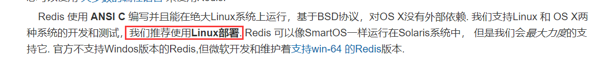

1、将redis的Linux版解压安装到Linux服务器上

解压命令：==tar -zxvf redis.tar.gz==

2、redis默认不是后端启动的，修改配置文件


3、启动redis服务


4、使用redis-cli连接测试

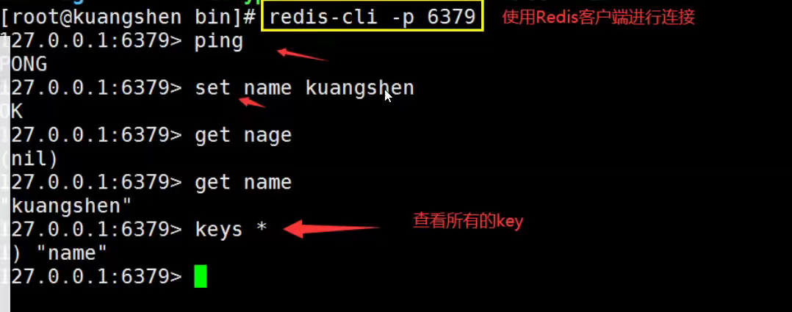

5、查看redis的进程是否开启！


6、关闭redis服务 ==shutdown==


### 性能测试

```bash
# 测试： 100个并发连接   100000请求
redis-benchmark -h localhost -p 6379 -c100 -n 100000
```


**参数**


### 基础的知识

redis默认有16个数据库

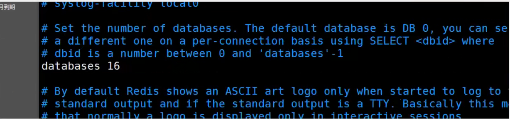

默认使用的是第0个

~~~bash
127.0.0.1:6379> select 3 #切换数据库
OK
127.0.0.1:6379[3]>DBSIZE #查看DB大小
(integer) 0
127.0.0.1:6379[3]>keys * #查看数据库所有的key
1) "name"
127.0.0.1:6379[3]>flushdb #清除当前数据库
OK
127.0.0.1:6379[3]>keys *
(empty list or set)
127.0.0.1:6379[3]>flushall #清除全部数据库的内容
~~~

> **Redis 是单线程的！**

> 明白Redis是很快的，官方表示，Reis是基于内存操作，CPU不是Redis性能瓶颈，Redis的瓶颈是根据机器的内存和网络带宽，既然可以使用单线程来实现，就使用单线程了！

> Redis是C语言写的，官方提供的数据为 100000+的QPS，完全不比同样是使用Key-Value的Memecache差！

> **Redis 为什么单线程还这么快？**
>
> 1、误区1：高性能的服务器一定是多线程的？
>
> 2、误区2：多线程（CPU上下文会切换！）一定比单线程效率高！

**核心**：redis是将所有的数据全部放在内存中的，所以使用单线程去操作效率就是最高的多线程（CPU上下文会切换！：耗时的操作！！！），对于内存系统来说，如果没有上下文切换效率就是最高的！多次读写都在一个CPU上，在内存情况下，这个就是最佳的方案！


# 五大数据类型

Redis 是一个开源（BSD许可）的，内存中的数据结构存储系统，它可以用作==数据库==、==缓存==和==消息中间件==。 它支持多种类型的数据结构，如 [字符串（strings）](http://redis.cn/topics/data-types-intro.html#strings)， [散列（hashes）](http://redis.cn/topics/data-types-intro.html#hashes)， [列表（lists）](http://redis.cn/topics/data-types-intro.html#lists)， [集合（sets）](http://redis.cn/topics/data-types-intro.html#sets)， [有序集合（sorted sets）](http://redis.cn/topics/data-types-intro.html#sorted-sets) 与范围查询， [bitmaps](http://redis.cn/topics/data-types-intro.html#bitmaps)， [hyperloglogs](http://redis.cn/topics/data-types-intro.html#hyperloglogs) 和 [地理空间（geospatial）](http://redis.cn/commands/geoadd.html) 索引半径查询。 Redis 内置了 [复制（replication）](http://redis.cn/topics/replication.html)，[LUA脚本（Lua scripting）](http://redis.cn/commands/eval.html)， [LRU驱动事件（LRU eviction）](http://redis.cn/topics/lru-cache.html)，[事务（transactions）](http://redis.cn/topics/transactions.html) 和不同级别的 [磁盘持久化（persistence）](http://redis.cn/topics/persistence.html)， 并通过 [Redis哨兵（Sentinel）](http://redis.cn/topics/sentinel.html)和自动 [分区（Cluster）](http://redis.cn/topics/cluster-tutorial.html)提供高可用性（high availability）。 

Redis-Key

~~~bash
exists [key] 		#判断当前的key是否存在
move [key] 1   		#移动key到1号数据库
expire [key] 10 		#设置key的过期时间（单位是秒）
ttl [key] 			#查看key的剩余时间
type [key]		 	#查看key的类型
~~~


### String（字符串）

~~~bash
append [key] "hello" 		#追加字符串，如果key不存在就相当于set key "hello"
strlen [key]				#获取key值的长度

#############################################################################
set [key] 0 			#设置key的value为0
incr [key] 				#增长1
decr [key] 				#减少1
INCRBY [key] 5 			#增加5
DECRBY [key] 4 			#减少4
GETRANGE [key] 0 3 		#截取字符串[0,3]
GETRANGE [key] 0 -1 	#截取全部的字符串  相当于get key
SETRANGE [key] 2		#假设key的value为hello  则结果为 
#############################################################################

setex [key] [value] 30		#设置key的值并设置有效期为30秒
setnx [key] [value] 		#设置key的值，如果key存在，则set失败，反之set成功（常用于分布式锁）

#设置/获取多个值
mset k1 v1 k2 v2 k3 v3		#同时设置多个值
mget k1 k2 k3				#同时获取多个值
msetnx k1 k4    #(k1存在，k4不存在)， msetnx是个原子性的操作，要么全成功，要么全失败

#对象
mset user:1:name zhangsan user:1:age 2	#设置一个对象name值为zhangsan，age值为2

#getset 先get后set
getset db redis		#如果值不存在则返回nil（此处的set是成功的）
getset db mongodb 	#如果db值存在则先获取db的值，然后更新db的值为mongodb
~~~


### List（列表）

基本的数据类型，列表


在redis里面，我们可以把list玩成，栈、队列、阻塞队列!

所有的list命令都是用l开头的，Redis不区分大小写命令

~~~bash
########################################################################
Lpush

Lrange
127.0.0.1:6379> LPUSH list one	#将一个值或者多个值，插入到列表头部(左)
(integer) 1
127.0.0.1:6379> LPUSH list two
(integer) 2
127.0.0.1:6379> LPUSH list three
(integer) 3
127.0.0.1:6379> LRANGE 1ist 0 -1		#获取1ist中值!
1) "three"
2) "two"
3) "one"
127.0.0.1:6379> LRANGE list 0 1			#通过区间获取具体的值!
1) "three"
2) "two"
127.0.0.1:6379> Rpush list right 		#将一个值或者多个值，插入到列表位部（右)(integer)4
127.0.0.1:6379> LRANGE list 0 -1
1) "three"
2) "two"
3) "one"
4)"right"
########################################################################
LPOP
RPOP

127.0.0.1:6379> LRANGE 1ist 0 -1
1) "three"
2) "two"
3) "one "
4)"right"
127.0.0.1:6379> Lpop list 	#移除1ist的第一个元素
"three"
127.0.0.1:6379> Rpop list	#移除1ist的最后一个元素
"right"
127.0.0.1:6379> LRANGE list 0 -1
1) "two"
2) "one"
########################################################################
Lindex

127.0.0.1:6379> LRANGE list 0 -1
1) "two"
2) "one"
127.0.0.1:6379> Lindex list 1		#通过下标获得list中的某一个值!
"one"
127.0.0.1:6379> Lindex list 0
"two"

########################################################################
Llen

127.0.0.1:6379> Lpush list one
(integer) 1
127.0.0.1:6379> Lpush list two
(integer) 2
127.0.0.1:6379> Lpush list three
(integer) 3
127.0.0.1:6379> Llen list	# 返回列表的长度
(integer) 3

########################################################################
移除指定的值！
取关  uid

Lrem

127.0.0.1:6379> LRANGE 1ist 0 -1
1) "three"
2) "three"
3) "two"
4) "one"
127.0.0.1:6379> Lrem list 1 one  #移除list集合中指定个数的value，精确匹配
(integer) 1
127.0.0.1:6379> LRANGE list 0 -1
1) "three"
2) "three"
3) "two"
127.0.0.1:6379> Lrem list 1 three
(integer) 1
127.0.0.1:6379> LRANGE 1ist 0 -1
1) "three"
2) "two"
127.0.0.1:6379> Lpush list three
(integer) 3
127.0.0.1:6379> Lrem list 2 three
(integer) 2
127.0.0.1:6379> LRANGE 1ist 0 -1
1) "two"

########################################################################
trim 修剪。 让列表只保留指定区间内的元素

127.0.0.1:6379>Rpush mylist "he11o"
(integer) 1
127.0.0.1:6379> Rpush mylist "he11o1"
(integer) 2
127.0.0.1:6379> Rpush mylist "he17o2"
(integer) 3
127.0.0.1:6379> Rpush mylist "he11o3"
(integer) 4
127.0.0.1:6379>Ltrim mylist 1 2        #通过下标截取指定的长度，这个1ist已经被改变了，截断了只剩下截取的元素!oK
127.0.0.1:6379> LRANGE mylist 0 -1
1) "he11o1"
2) "he11o2"

########################################################################
rpoplpush  #移除列表最右边的元素并添加到另一个list（从左边往进添加）

127.0.0.1:6379> Lpush list one two three four five
(integer) 5
127.0.0.1:6379> Lrange list 0 -1
1) "five"
2) "four"
3) "three"
4) "two"
5) "one"
127.0.0.1:6379> RpopLpush list mylist
"one"
127.0.0.1:6379> Lrange list 0 -1
1) "five"
2) "four"
3) "three"
4) "two"
127.0.0.1:6379> Lrange mylist 0 -1
1) "one"
127.0.0.1:6379> 


########################################################################
lset 将列表中指定下标的值替换为另外一个值，更新操作

127.0.0.1:6379> EXISTS list		#判断这个列表是否存在
(integer) 0
127.0.0.1:6379> lset list 0 item	#如果不存在列表我们去更新就会报错
(error) ERR no such key
127.0.0.1:6379> lpush list value1
(integer） 1
127.0.0.1:6379>LRANGE list 0 0
1) "value1"
127.0.0.1:6379> lset list 0 item	#如果存在，更新当前下标的值
oK
127.0.0.1:6379>LRANGE list 0 0
1) "item"
127.0.0.1:6379> lset list 1 other	#如果不存在，则会报错
(error) ERR index out of range


########################################################################
Linsert 把值插入到指定值的之前（左）或之后（右）

127.0.0.1:6379>Rpush mylist "hello"
( integer)1
127.0.0.1:6379> Rpush mylist "world"
(integer)2
127.0.0.1:6379>LINSERT mylist before "world" "other"
( integer)3
127.0.0.1:6379>LRANGE mylist 0 -1
1) "hello"
2)"other"
3)"world"
127.0.0.1:6379>LINSERT mylist after world new
(integer)4
127.0.0.1:6379> LRANGE mylist 0 -1
1)"hello"
2)"other"
3)"world"
4)"new"


~~~

> 小结
>
> - 它实际上是一个链表，before Node after ， left ， right 都可以插入值
> - 如果key不存在，创建新的链表
> - 如果key存在，新增内容
> - 如果移除了所有值，空链表，也代表不存在！
> - 在两边插入或者改动值，效率最高！中间元素，相对来说效率会低一点。

消息排队！消息队列（Lpush Rpop），栈（Lpush Lpop）


### Set（集合）

set中的值是不能重复的！

~~~bash
########################################################################
127.0.0.1:6379> sadd myset "hel1o"		#set集合中添加元素
(integer) 1
127.0.0.1:6379> sadd myset "kuangshen"
(integer) 1
127.0.0.1:6379> sadd myset "lovekuangshen"
(integer) 1
127.0.0.1:6379> SMEMBERS myset			#查看指定set的所有值
1) "hello"
2) "lovekuangshen"
3) "kuangshen"
127.0.0.1:6379> SISMEMBER myset hello		#判断某个值是否存在与set集合中
(integer) 1
127.0.0.1:6379>SISMEMBER myset wor1d	
(integer) 0

########################################################################
scard

127.0.0.1:6379> scard myset  	#获取set集合中的内容元素个数！
(integer) 4
########################################################################
srem

127.0.0.1:6379> srem myset hello	#移除set集合中的指定元素
(integer) 1
127.0.0.1:6379> scard myset
(integer) 2
127.0.0.1:6379> smembers myset
1) "hello world haojiacheng"
2) "hello world"

########################################################################
set 无序不重复集合。抽随机！
srandmember #随机抽一个元素

127.0.0.1:6379> srandmember myset
"k"
127.0.0.1:6379> srandmember myset
"h"
127.0.0.1:6379> srandmember myset
"hello world haojiacheng"
127.0.0.1:6379> srandmember myset
"a"
127.0.0.1:6379> srandmember myset
"f"
127.0.0.1:6379> srandmember myset
"hello world"
127.0.0.1:6379> srandmember myset 2		#随机抽选出指定个数的元素
1) "j"
2) "n"
127.0.0.1:6379> srandmember myset 2
1) "m"
2) "i"

########################################################################
spop  		#随即删除一个元素，也可以指定随机删除个数

127.0.0.1:6379> SMEMBERS myset
 1) "c"
 2) "hello world"
 3) "hello world haojiacheng"
 4) "o"
 5) "e"
 6) "l"
 7) "i"
 8) "b"
 9) "h"
10) "n"
11) "g"
12) "d"
13) "j"
14) "p"
15) "k"
16) "m"
17) "q"
18) "a"
19) "f"
127.0.0.1:6379> SPOP myset
"a"
127.0.0.1:6379> SPOP myset
"hello world"
127.0.0.1:6379> SPOP myset
"j"
127.0.0.1:6379> SPOP myset 2
1) "f"
2) "i"
########################################################################
smove		#将一个指定的值，移动到另外一个set集合中

127.0.0.1:6379> sadd myset one two three hello haojiacheng
(integer) 5
127.0.0.1:6379> SMEMBERS myset
1) "one"
2) "hello"
3) "three"
4) "two"
5) "haojiacheng"
127.0.0.1:6379> smove myset newmyset haojiacheng
(integer) 1
127.0.0.1:6379> scard myset
(integer) 4
127.0.0.1:6379> SMEMBERS newmyset
1) "haojiacheng"
########################################################################
数字集合类
 - 差集	sdiff
 - 交集	sinter
 - 并集	sunion
 
 127.0.0.1:6379> sadd key1 a b c
(integer) 3
127.0.0.1:6379> sadd key2 c d e
(integer) 3
127.0.0.1:6379> sdiff key1 key2		#key1中key2没有的元素
1) "a"
2) "b"
127.0.0.1:6379> sdiff key2 key1		#key2中key1没有的元素
1) "d"
2) "e"
127.0.0.1:6379> sinter key1 key2	#key1和key2共同的元素
1) "c"
127.0.0.1:6379> sunion key1 key2	#key1和key2全部元素
1) "e"
2) "b"
3) "c"
4) "a"
5) "d"


~~~

微博，A用户将所有关注的人放在一个set集合中，将它的粉丝也放在一个set集合中；这时可以做一些功能：

共同关注，共同爱好，二度好友，推荐好友！（六度分割理论）


### Hash（哈希）

Map集合，key-value（map）！这里的value是一个map集合！

set myhash field kuangshen

~~~bash
########################################################################
hset hmset hmget hgetall hdel 

127.0.0.1:6379> hset myhash field1 haojiacheng		#set一个具体 key-value
(integer) 1
127.0.0.1:6379> hget myhash field1
"haojiacheng"
127.0.0.1:6379> hmset myhash field1 hello field2 world		#set多个 key-value
OK
127.0.0.1:6379> hmget myhash field1 field2		#获取多个字段值
1) "hello"
2) "world"
127.0.0.1:6379> Hgetall myhash		#获取全部的数据（包含value中的key）
1) "field1"
2) "hello"
3) "field2"
4) "world"
127.0.0.1:6379> HDEL myhash field1		#删除hash指定key字段！对应的value值也就消失了
(integer) 1
127.0.0.1:6379> hgetall myhash
1) "field2"
2) "world"
########################################################################
hlen

127.0.0.1:6379> hlen myhash		#获取hash表的字段数量
(integer) 1
########################################################################
hexists

127.0.0.1:6379> HEXISTS myhash field1	#判断hash中指定字段是否存在
(integer) 0
127.0.0.1:6379> HEXISTS myhash field2
(integer) 1
########################################################################
hkeys 	#只获得所有field
hvals	#只获得所有value

127.0.0.1:6379> hmset myhash one 1 two 2 three 3 four 4
OK
127.0.0.1:6379> HGETALL myhash
1) "one"
2) "1"
3) "two"
4) "2"
5) "three"
6) "3"
7) "four"
8) "4"
127.0.0.1:6379> hkeys myhash
1) "one"
2) "two"
3) "three"
4) "four"
127.0.0.1:6379> hvals myhash
1) "1"
2) "2"
3) "3"
4) "4"

########################################################################
HINCRBY  hsetnx		

127.0.0.1:6379> HGETALL myhash
1) "one"
2) "1"
3) "two"
4) "2"
5) "three"
6) "3"
7) "four"
8) "4"
127.0.0.1:6379> hset myhash five 5
(integer) 1
127.0.0.1:6379> HGETALL myhash
 1) "one"
 2) "1"
 3) "two"
 4) "2"
 5) "three"
 6) "3"
 7) "four"
 8) "4"
 9) "five"
10) "5"
127.0.0.1:6379> HINCRBY myhash five 1	#增长1
(integer) 6
127.0.0.1:6379> HINCRBY myhash five -1	#减少1
(integer) 5
127.0.0.1:6379> hsetnx myhash sex 6		#存在则创建失败，不存在则创建
(integer) 1
127.0.0.1:6379> hsetnx myhash sex nihao
(integer) 0
~~~

hash变更的数据user name age，尤其是用户信息之类的，经常变动的信息！

hash更适合存储对象，String更适合存储字符串


### Zset（有序集合）

~~~bash
########################################################################
zadd 	zrangebyscore（排序--小到大）  ZREVRANGE（排序--大到小）
127.0.0.1:6379> clear
127.0.0.1:6379> zadd salary 2500 xiaohong	#添加三个用户
(integer) 1
127.0.0.1:6379> zadd salary 5000 zhangsan
(integer) 1
127.0.0.1:6379> zadd salary 200 suyi
(integer) 1
127.0.0.1:6379> zrangebyscore salary -inf +inf	#显示全部的用户  从小到大
1) "suyi"
2) "xiaohong"
3) "zhangsan"
127.0.0.1:6379> ZREVRANGE salary 0 -1		#显示全部的用户  从大到小
1) "zhangsan"
2) "libai"
3) "suyi"
127.0.0.1:6379> ZREVRANGE salary 0 -1 withscores		#从大到小排序全部的用户附带薪水
1) "zhangsan"
2) "5000"
3) "libai"
4) "3000"
5) "suyi"
6) "200"
127.0.0.1:6379> zrangebyscore salary -inf +inf withscores	#显示全部的用户并附带薪水
1) "suyi"
2) "200"
3) "xiaohong"
4) "2500"
5) "zhangsan"
6) "5000"
127.0.0.1:6379> zrangebyscore salary -inf +inf withscores	#显示工资小于等于2500的用户即薪水
1) "suyi"
2) "200"
3) "xiaohong"
4) "2500"
########################################################################
zrem	#移除
zcard	#获取有序集合中的个数

127.0.0.1:6379> zrange salary 0 -1
1) "suyi"
2) "xiaohong"
3) "zhangsan"
127.0.0.1:6379> zrem salary xiaohong	#移除小红
(integer) 1
127.0.0.1:6379> zrange salary 0 -1
1) "suyi"
2) "zhangsan"
127.0.0.1:6379> zcard salary #获取有序集合中的个数
(integer) 2
########################################################################
zount 	#获取指定区间的成员数量！
127.0.0.1:6379> zadd myzset 1 hello 2 world 3 !
(integer) 3
127.0.0.1:6379> zcount myzset 0 -1
(integer) 0
127.0.0.1:6379> zcount myzset 0  4
(integer) 3
127.0.0.1:6379> zcount myzset 0  6
(integer) 3
127.0.0.1:6379> zcount myzset 0  2
(integer) 2
127.0.0.1:6379> zcount myzset -inf +inf
(integer) 3


~~~

案例思路：

存储班级成绩表，工资表

带权重的消息：普通消息：1；重要消息：2

排行榜  取top N

# 三种特殊数据类型

#### geospatial

  [经纬度在线查询](https://jingweidu.bmcx.com/)

> [geoadd](http://redis.cn/commands/geoadd.html)

~~~bash
#geoadd		添加地理位置
127.0.0.1:6379> geoadd china:city 121.48941 31.40527 shanghai
(integer) 1
127.0.0.1:6379> geoadd china:city 116.23128 40.22077 beijing
(integer) 1
127.0.0.1:6379> geoadd china:city 113.88308 22.55329 shenzhen
(integer) 1
127.0.0.1:6379> geoadd china:city 108.93425 34.23053 xian
(integer) 1
127.0.0.1:6379> geoadd china:city 109.26291 35.57937 huangling
(integer) 1


~~~

> [geopos](http://redis.cn/commands/geopos.html)

~~~bash
#geopos		获取城市经纬度  可获取多个
127.0.0.1:6379> geopos china:city huangling
1) 1) "109.26290899515151978"
   2) "35.579370167327248"
127.0.0.1:6379> geopos china:city huangling xian
1) 1) "109.26290899515151978"
   2) "35.579370167327248"
2) 1) "108.93425256013870239"
   2) "34.23053097599082406"
~~~

> [geodist](http://redis.cn/commands/geodist.html)

- m表示为米
- km表示为千米
- mi表示为英里
- ft表示为英尺

~~~bash
#geodist 	返回两个地理空间之间的距离
127.0.0.1:6379> GEODIST china:city beijing shanghai
"1088644.3544"
127.0.0.1:6379> GEODIST china:city beijing shanghai km	#以千米形式返回
"1088.6444"

~~~

> [georadius](http://redis.cn/commands/georadius.html)  以给定的经纬度为中心，找出某一半径被的元素

我附近的人？（获得所有附近的人的地址，定位）通过半径来查询

~~~bash
#返回110经度 30纬度为中心的1000km距离的数据
127.0.0.1:6379> georadius china:city 110 30 1000 km		
1) "xian"
2) "huangling"
3) "shenzhen"
127.0.0.1:6379> georadius china:city 110 30 500 km		
1) "xian"

#返回以经纬度110，30为中心500km的数据并附带距离
127.0.0.1:6379> georadius china:city 110 30 500 km withdist
1) 1) "xian"
   2) "481.1278"

#返回以经纬度110，30为中心1000km的数据并附带经纬度
127.0.0.1:6379> georadius china:city 110 30 1000 km withcoord
1) 1) "xian"
   2) 1) "108.93425256013870239"
      2) "34.23053097599082406"
2) 1) "huangling"
   2) 1) "109.26290899515151978"
      2) "35.579370167327248"
3) 1) "shenzhen"
   2) 1) "113.88307839632034302"
      2) "22.55329111565713873"

#返回以经纬度110，30为中心1000km的数据并附带经纬度和距离且限制返回数据的个数
127.0.0.1:6379> georadius china:city 110 30 1000 km withcoord withdist count 2	
1) 1) "xian"
   2) "481.1278"
   3) 1) "108.93425256013870239"
      2) "34.23053097599082406"
2) 1) "huangling"
   2) "624.3814"
   3) 1) "109.26290899515151978"
      2) "35.579370167327248"
~~~

> [georadiusbymember](http://redis.cn/commands/georadiusbymember.html)    相比于[georedius](http://redis.cn/commands/georadius.html) 的区别是   中心元素变成了城市

~~~bash
127.0.0.1:6379> GEORADIUSBYMEMBER china:city beijing 1000 km 
1) "beijing"
2) "xian"
3) "huangling"
~~~

> [geohash](http://redis.cn/commands/geohash.html)  	返回一个或多个位置元素的 [Geohash](http://redis.cn/commands/geohash.html) 表示。

该命令返回11个字符的geohash字符串

~~~bash
#将二维的经纬度转换为一维的字符串
#如果两个字符串越接近，则距离越近
127.0.0.1:6379> geohash china:city beijing shanghai
1) "wx4sucvncn0"
2) "wtw6st1uuq0"

~~~

> GEO底层的实现原理
>
> Zset！
>
> 可以使用Zset命令操作geo！

~~~bash
127.0.0.1:6379> zrange china:city 0 -1		#查看地图中全部元素
1) "xian"
2) "huangling"
3) "shenzhen"
4) "shanghai"
5) "beijing"
127.0.0.1:6379> zrem china:city shenzhen		#移除指定元素
(integer) 1

~~~


#### hyperloglog

Redis 2.8.9版本就更新了Hyperloglog 数据结构!
Redis Hyperloglog基数统计的算法!
优点:占用的内存是固定, 2^64不同的元素的技术,只需要废12KB内存! 如果要从内存角度来比较的话Hyperloglog首选! 
**网页的UV (一个人访问一个网站多次,但是还是算作一个人! )**
传统的方式，set保存用户的id ,然后就可以统计set中的元素数量作为标准判断!
这个方式如果保存大量的用户id ,就会比较麻烦!我们的目的是为了计数,而不是保存用户id ;
0.81%错误率!统计UV任务,可以忽略不计的!

> 测试使用

~~~bash
127.0.0.1:6379> PFadd mykey a b c d e f g h i j		#创建第一组元素 mykey
(integer) 1
127.0.0.1:6379> PFCOUNT mykey						#统计 mykey 元素的基数数量
(integer) 10
127.0.0.1:6379> PFadd mykey2 i j z x c v b n m		#创建第二组元素 mykey
(integer) 1
127.0.0.1:6379> PFCOUNT mykey2
(integer) 9
127.0.0.1:6379> PFMERGE mykey3 mykey mykey2			#合并两组 mykey mykey2=》 mykey3 并集
OK
127.0.0.1:6379> PFCOUNT mykey3						#查看并集的数量
(integer) 15

~~~

如果允许容错，那么一定可以使用Hyperloglog

如果不允许容错，就使用set或者自己的数据类型即可！

#### bitmap

> 位存储

统计用户信息，活跃，不活跃！登录、未登录！打卡，365打卡！两个状态的，都可以使用Bitmaps！

Bitmaps 位图，数据结构！ 都是操作二进制位来进行记录，就只有0和1两个状态！

365天=365 bit 1字节=8 bit 46个字节左右！

> 测试

使用Bitmaps 来记录 周一到周日的打卡！

周一：1 周二：0 周三：0 周四：1……

~~~bash
127.0.0.1:6379> setbit sign 0 1
(integer) 0
127.0.0.1:6379> setbit sign 1 0
(integer) 0
127.0.0.1:6379> setbit sign 2 0
(integer) 0
127.0.0.1:6379> setbit sign 3 1
(integer) 0
127.0.0.1:6379> setbit sign 4 1
(integer) 0
127.0.0.1:6379> setbit sign 5 0
(integer) 0
127.0.0.1:6379> setbit sign 6 0
(integer) 0
~~~

查看某一天是否有打卡！

~~~bash
127.0.0.1:6379> getbit sign 3
(integer) 1
127.0.0.1:6379> getbit sign 6
(integer) 0
~~~

统计操作，统计打卡的天数！

~~~bash
127.0.0.1:6379> bitcount sign  #统计这周的打卡记录，就可以看到是否有全勤
(integer) 3
~~~


# 事务

要么都成功，要么都失败，原子性！

Redis事务本质：一组命令的集合！一个事务中的所有命令都会被序列化，在事务执行过程的中，会按照顺序执行!

一次性、顺序性、排他性！执行一系列的命令

~~~bash
---------- 队列 set  set  set  执行----------
~~~


==Redis事务没有隔离级别的概念==

所有的命令在事务中，并没有直接被执行，只有发起执行命令的时候才会执行！Exec

==Redis单条命令是保存原子性的，但是Redis的事务是不保证原子性的！==

redis事务

- 开启事务（multi）
- 命令入队（...）
- 执行事务（exec）

> 正常执行事务！

~~~bash
127.0.0.1:6379> multi
OK
127.0.0.1:6379(TX)> set name zhangsan
QUEUED
127.0.0.1:6379(TX)> set age 20
QUEUED
127.0.0.1:6379(TX)> get name
QUEUED
127.0.0.1:6379(TX)> set sex 0
QUEUED
127.0.0.1:6379(TX)> exec
1) OK
2) OK
3) "zhangsan"
4) OK

~~~


> 放弃事务

~~~bash
127.0.0.1:6379> MULTI
OK
127.0.0.1:6379(TX)> set k1 v1
QUEUED
127.0.0.1:6379(TX)> set k2 v2
QUEUED
127.0.0.1:6379(TX)> set k3 v3
QUEUED
127.0.0.1:6379(TX)> discard		#取消事务
OK
127.0.0.1:6379> get k1
(nil)

~~~


> 编译型异常（代码有问题，命令有错误）  		事务中所有的命令都不会被执行！

~~~bash
127.0.0.1:6379> MULTI
OK
127.0.0.1:6379(TX)> set k1 v1
QUEUED
127.0.0.1:6379(TX)> set k2 v2
QUEUED
127.0.0.1:6379(TX)> set k3 v3
QUEUED
127.0.0.1:6379(TX)> getset k3		#错误的命令
(error) ERR wrong number of arguments for 'getset' command
127.0.0.1:6379(TX)> set k4 v4
QUEUED
127.0.0.1:6379(TX)> set k5 v5
QUEUED
127.0.0.1:6379(TX)> exec			#执行事务报错
(error) EXECABORT Transaction discarded because of previous errors.
127.0.0.1:6379> get k5				#所有的命令都不会执行！
(nil)
~~~


> 运行时异常（1/0），如果事务队列中存在语法性错误，那么执行命令的时候，其他命令正常执行，错误命令抛出异常！

~~~bash
127.0.0.1:6379> set k1 "v1"			#设置一个字符串
OK
127.0.0.1:6379> MULTI				#进入事务
OK
127.0.0.1:6379(TX)> INCR k1			#自增1
QUEUED
127.0.0.1:6379(TX)> set k2 v2
QUEUED
127.0.0.1:6379(TX)> set k3 v3
QUEUED
127.0.0.1:6379(TX)> get k3
QUEUED
127.0.0.1:6379(TX)> EXEC			#执行
1) (error) ERR value is not an integer or out of range		#运行时异常，字符串不能自增
2) OK								#其余命令执行成功
3) OK
4) "v3"

~~~


> 监控！Watch		（面试常问！）

**悲观锁**：

- 很悲观，认为什么时候都会出问题，无论做什么都会加锁！

**乐观锁**：

- 很乐观，认为什么时候都不会出问题，所以不会上锁！更新数据的时候取判断一下，在此期间是否有人修改过这个数据
- 获取version
- 更新的时候比较version

> Redis的监视测试

正常执行成功！

~~~bash
127.0.0.1:6379> set money 100
OK
127.0.0.1:6379> set out 0
OK
127.0.0.1:6379> WATCH money			#监视 money 对象
OK
127.0.0.1:6379> multi				#事务正常结束，数据期间没有发生变动，这时就正常执行成功！
OK
127.0.0.1:6379(TX)> decrby money 20
QUEUED
127.0.0.1:6379(TX)> incrby out 20
QUEUED
127.0.0.1:6379(TX)> exec
1) (integer) 80
2) (integer) 20
~~~

>  测试多线程修改值，使用watch可以当作redis的乐观锁操作！

==在客户端2监视money，进入事务后，客户端1修改了money，此时客户端2的事务必定执行失败！==

~~~bash
#客户端1：
127.0.0.1:6379> get money
"80"
127.0.0.1:6379> set money 1000
OK

#客户端2：
127.0.0.1:6379> watch money				#监视  money
OK
127.0.0.1:6379> multi
OK
127.0.0.1:6379(TX)> decrby money 10
QUEUED
127.0.0.1:6379(TX)> incrby money 10
QUEUED
127.0.0.1:6379(TX)> exec				#执行前，另外一个线程修改了我们的值，这个时候，就会导致事务执行失败！
(nil)
127.0.0.1:6379> get money
"1000"

~~~

==如果修改失败，重新监视一下就ok==

~~~bash
127.0.0.1:6379> unwatch
OK
127.0.0.1:6379> watch money
OK
127.0.0.1:6379> multi
OK
127.0.0.1:6379(TX)> decrby money 1
QUEUED
127.0.0.1:6379(TX)> incrby out 1
QUEUED
127.0.0.1:6379(TX)> exec
1) (integer) 999
2) (integer) 21

~~~


# Jedis

> Jedis是Redis官方推荐的 java 连接开发工具！ 使用 Java 操作Redis中间件！


> 测试

1.导入依赖

~~~xml
<!--导入jedis依赖-->
<dependency>
    <groupId>redis.clients</groupId>
    <artifactId>jedis</artifactId>
    <version>3.6.1</version>
</dependency>
<dependency>
    <groupId>com.alibaba</groupId>
    <artifactId>fastjson</artifactId>
    <version>1.2.78</version>
</dependency>
~~~

2.编码测试

- 连接数据库
- 操作命令
- 断开连接

~~~java
package com.sec;

import redis.clients.jedis.Jedis;

public class TestPing {
    public static void main(String[] args) {
        //1. new Jedis  对象
        Jedis jedis = new Jedis("127.0.0.1",6379);
        //jedis 所有的命令与redis的命令一样
        System.out.println(jedis.ping());
    }
}

~~~

输出：

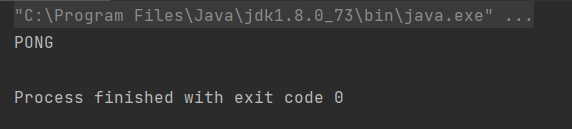

## 常用的API

String

~~~java
package com.sec.base;

import redis.clients.jedis.Jedis;

import java.util.concurrent.TimeUnit;

public class TestString {
    public static void main(String[] args) {
        Jedis jedis = new Jedis("127.0.0.1", 6379);

        jedis.flushDB();
        System.out.println("===========增加数据===========");
        System.out.println(jedis.set("key1","value1"));//OK
        System.out.println(jedis.set("key2","value2"));//OK
        System.out.println(jedis.set("key3", "value3"));//OK
        System.out.println("删除键key2:"+jedis.del("key2"));//1
        System.out.println("获取键key2:"+jedis.get("key2"));//null
        System.out.println("修改key1:"+jedis.set("key1", "value1Changed"));//OK
        System.out.println("获取key1的值："+jedis.get("key1"));//value1Changed
        System.out.println("在key3后面加入值："+jedis.append("key3", "End"));//9
        System.out.println("key3的值："+jedis.get("key3"));//value3End
        System.out.println("增加多个键值对："+jedis.mset("key01","value01","key02","value02","key03","value03"));//OK
        System.out.println("获取多个键值对："+jedis.mget("key01","key02","key03"));//[value01, value02, value03]
        System.out.println("获取多个键值对："+jedis.mget("key01","key02","key03","key04"));//[value01, value02, value03, null]
        System.out.println("删除多个键值对："+jedis.del("key01","key02"));//2
        System.out.println("获取多个键值对："+jedis.mget("key01","key02","key03"));//[null, null, value03]

        jedis.flushDB();
        System.out.println("===========新增键值对防止覆盖原先值==============");
        System.out.println(jedis.setnx("key1", "value1"));//1
        System.out.println(jedis.setnx("key2", "value2"));//1
        System.out.println(jedis.setnx("key2", "value2-new"));//0
        System.out.println(jedis.get("key1"));//value1
        System.out.println(jedis.get("key2"));//value2

        System.out.println("===========新增键值对并设置有效时间=============");
        System.out.println(jedis.setex("key3", 2, "value3"));
        System.out.println(jedis.get("key3"));//value3
        try {
            TimeUnit.SECONDS.sleep(3);//休眠3秒
        } catch (InterruptedException e) {
            e.printStackTrace();
        }
        System.out.println(jedis.get("key3"));//null

        System.out.println("===========获取原值，更新为新值==========");
        System.out.println(jedis.getSet("key2", "key2GetSet"));//value2
        System.out.println(jedis.get("key2"));//key2GetSet

        System.out.println("获得key2的值的字串："+jedis.getrange("key2", 2, 4));//y2G
    }
}

~~~


List

~~~java
package com.sec.base;

import redis.clients.jedis.Jedis;

public class TestList {
    public static void main(String[] args) {
        Jedis jedis = new Jedis("127.0.0.1", 6379);
        jedis.flushDB();
        System.out.println("===========添加一个list===========");
        jedis.lpush("collections", "ArrayList", "Vector", "Stack", "HashMap", "WeakHashMap", "LinkedHashMap");
        jedis.lpush("collections", "HashSet");
        jedis.lpush("collections", "TreeSet");
        jedis.lpush("collections", "TreeMap");
        System.out.println("collections的内容："+jedis.lrange("collections", 0, -1));//-1代表倒数第一个元素，-2代表倒数第二个元素,end为-1表示查询全部
        System.out.println("collections区间0-3的元素："+jedis.lrange("collections",0,3));
        System.out.println("===============================");
        // 删除列表指定的值 ，第二个参数为删除的个数（有重复时），后add进去的值先被删，类似于出栈
        System.out.println("删除指定元素个数："+jedis.lrem("collections", 2, "HashMap"));
        System.out.println("collections的内容："+jedis.lrange("collections", 0, -1));
        System.out.println("删除下表0-3区间之外的元素："+jedis.ltrim("collections", 0, 3));
        System.out.println("collections的内容："+jedis.lrange("collections", 0, -1));
        System.out.println("collections列表出栈（左端）："+jedis.lpop("collections"));
        System.out.println("collections的内容："+jedis.lrange("collections", 0, -1));
        System.out.println("collections添加元素，从列表右端，与lpush相对应："+jedis.rpush("collections", "EnumMap"));
        System.out.println("collections的内容："+jedis.lrange("collections", 0, -1));
        System.out.println("collections列表出栈（右端）："+jedis.rpop("collections"));
        System.out.println("collections的内容："+jedis.lrange("collections", 0, -1));
        System.out.println("修改collections指定下标1的内容："+jedis.lset("collections", 1, "LinkedArrayList"));
        System.out.println("collections的内容："+jedis.lrange("collections", 0, -1));
        System.out.println("===============================");
        System.out.println("collections的长度："+jedis.llen("collections"));
        System.out.println("获取collections下标为2的元素："+jedis.lindex("collections", 2));
        System.out.println("===============================");
        jedis.lpush("sortedList", "3","6","2","0","7","4");
        System.out.println("sortedList排序前："+jedis.lrange("sortedList", 0, -1));
        System.out.println(jedis.sort("sortedList"));
        System.out.println("sortedList排序后："+jedis.lrange("sortedList", 0, -1));
    }
}

~~~


Set

~~~java
package com.sec.base;

import redis.clients.jedis.Jedis;

public class TestSet {
    public static void main(String[] args) {
        Jedis jedis = new Jedis("127.0.0.1", 6379);
        jedis.flushDB();
        System.out.println("============向集合中添加元素（不重复）============");
        System.out.println(jedis.sadd("eleSet", "e1","e2","e4","e3","e0","e8","e7","e5"));//8
        System.out.println(jedis.sadd("eleSet", "e6"));//1
        System.out.println(jedis.sadd("eleSet", "e6"));//1
        System.out.println("eleSet的所有元素为："+jedis.smembers("eleSet"));//[e1, e4, e2, e0, e5, e8, e3, e7, e6]
        System.out.println("删除一个元素e0："+jedis.srem("eleSet", "e0"));//1
        System.out.println("eleSet的所有元素为："+jedis.smembers("eleSet"));//[e4, e2, e5, e8, e3, e1, e7, e6]
        System.out.println("删除两个元素e7和e6："+jedis.srem("eleSet", "e7","e6"));//2
        System.out.println("eleSet的所有元素为："+jedis.smembers("eleSet"));//[e5, e8, e3, e1, e2, e4]
        System.out.println("随机的移除集合中的一个元素："+jedis.spop("eleSet"));//e4
        System.out.println("随机的移除集合中的一个元素："+jedis.spop("eleSet"));//e1
        System.out.println("eleSet的所有元素为："+jedis.smembers("eleSet"));//[e2, e3, e5, e8]
        System.out.println("eleSet中包含元素的个数："+jedis.scard("eleSet"));//4
        System.out.println("e3是否在eleSet中："+jedis.sismember("eleSet", "e3"));//true
        System.out.println("e1是否在eleSet中："+jedis.sismember("eleSet", "e1"));//false
        System.out.println("e1是否在eleSet中："+jedis.sismember("eleSet", "e5"));//true
        System.out.println("=================================");
        System.out.println(jedis.sadd("eleSet1", "e1","e2","e4","e3","e0","e8","e7","e5"));//8
        System.out.println(jedis.sadd("eleSet2", "e1","e2","e4","e3","e0","e8"));//6
        System.out.println("将eleSet1中删除e1并存入eleSet3中："+jedis.smove("eleSet1", "eleSet3", "e1"));//移到集合元素    1
        System.out.println("将eleSet1中删除e2并存入eleSet3中："+jedis.smove("eleSet1", "eleSet3", "e2"));//1
        System.out.println("eleSet1中的元素："+jedis.smembers("eleSet1"));//[e7, e4, e0, e5, e8, e3]
        System.out.println("eleSet3中的元素："+jedis.smembers("eleSet3"));//[e2, e1]
        System.out.println("============集合运算=================");
        System.out.println("eleSet1中的元素："+jedis.smembers("eleSet1"));//[e7, e4, e0, e5, e8, e3]
        System.out.println("eleSet2中的元素："+jedis.smembers("eleSet2"));//[e1, e3, e4, e2, e0, e8]
        System.out.println("eleSet1和eleSet2的交集:"+jedis.sinter("eleSet1","eleSet2"));//[e3, e4, e0, e8]
        System.out.println("eleSet1和eleSet2的并集:"+jedis.sunion("eleSet1","eleSet2"));//[e1, e4, e2, e0, e5, e8, e3, e7]
        System.out.println("eleSet1和eleSet2的差集:"+jedis.sdiff("eleSet1","eleSet2"));//eleSet1中有，eleSet2中没有  [e7, e5]
        jedis.sinterstore("eleSet4","eleSet1","eleSet2");//求交集并将交集保存到eleSet4的集合
        System.out.println("eleSet4中的元素："+jedis.smembers("eleSet4"));//[e0, e8, e3, e4]
    }
}

~~~


Hash

~~~java
package com.sec.base;

import redis.clients.jedis.Jedis;

import java.util.HashMap;
import java.util.Map;

public class TestHash {
    public static void main(String[] args) {
        Jedis jedis = new Jedis("127.0.0.1", 6379);
        jedis.flushDB();
        Map<String,String> map = new HashMap<String,String>();
        map.put("key1","value1");
        map.put("key2","value2");
        map.put("key3","value3");
        map.put("key4","value4");
        //添加名称为hash（key）的hash元素
        jedis.hmset("hash",map);
        //向名称为hash的hash中添加key为key5，value为value5元素
        jedis.hset("hash", "key5", "value5");
        System.out.println("散列hash的所有键值对为："+jedis.hgetAll("hash"));//return Map<String,String>
        System.out.println("散列hash的所有键为："+jedis.hkeys("hash"));//return Set<String>
        System.out.println("散列hash的所有值为："+jedis.hvals("hash"));//return List<String>
        System.out.println("将key6保存的值加上一个整数，如果key6不存在则添加key6："+jedis.hincrBy("hash", "key6", 6));
        System.out.println("散列hash的所有键值对为："+jedis.hgetAll("hash"));
        System.out.println("将key6保存的值加上一个整数，如果key6不存在则添加key6："+jedis.hincrBy("hash", "key6", 3));
        System.out.println("散列hash的所有键值对为："+jedis.hgetAll("hash"));
        System.out.println("删除一个或者多个键值对："+jedis.hdel("hash", "key2"));
        System.out.println("散列hash的所有键值对为："+jedis.hgetAll("hash"));
        System.out.println("散列hash中键值对的个数："+jedis.hlen("hash"));
        System.out.println("判断hash中是否存在key2："+jedis.hexists("hash","key2"));
        System.out.println("判断hash中是否存在key3："+jedis.hexists("hash","key3"));
        System.out.println("获取hash中的值："+jedis.hmget("hash","key3"));
        System.out.println("获取hash中的值："+jedis.hmget("hash","key3","key4"));
    }
}

~~~


Zset

~~~java
package com.sec.base;

import redis.clients.jedis.Jedis;
import redis.clients.jedis.params.ZAddParams;

public class TestZset {
    public static void main(String[] args) {
        Jedis jedis = new Jedis("127.0.0.1", 6379);
        jedis.flushDB();
        System.out.println(jedis.zadd("score", 80, "shuXue"));
        System.out.println(jedis.zadd("score", 90, "yuWen"));
        System.out.println(jedis.zadd("score", 120, "yingYu"));
        System.out.println(jedis.zadd("score", 100, "wuLi"));
        System.out.println(jedis.zadd("score", 150, "shengWu"));
        System.out.println("从小到大排序:"+jedis.zrangeByScoreWithScores("score","-inf","+inf"));//从小到大排序  -inf负无穷  +inf正无穷
        jedis.zaddIncr("score",5,"shuXue", ZAddParams.zAddParams());//数学成绩+5
        System.out.println("数学成绩+5后："+jedis.zrangeByScoreWithScores("score","-inf","+inf"));
        System.out.println("score的个数："+jedis.zcard("score"));//5
        System.out.println("从大到小排序:"+jedis.zrevrangeByScoreWithScores("score","+inf","-inf"));//从大到小排序
        System.out.println("删除一个指定元素shengWu："+jedis.zrem("score","shengWu"));
        System.out.println("结果："+jedis.zrange("score",0,-1));
        //………………
        jedis.flushDB();
    }
}

~~~


# SpringBoot整合

SpringBoot操作数据︰spring-data jpa jdbc mongodb redis !

SpringData也是和SpringBoot齐名的项目!

说明︰在SpringBoot2.x之后，原来使用的jedis被替换为了lettuce

jedis :采用的直连，多个线程操作的话，是不安全的，如果想要避免不安全的，使用jedis pool连接池!更像BIO模式

lettuce :采用netty，实例可以再多个线程中进行共享，不存在线程不安全的情况!可以减少线程数据了，更像NIO模式

> 源码分析:

~~~java
@Bean
@ConditionalOnMissingBean(name = "redisTemplate")//我们可以自己定义一个redisTemplate来替换这个默认的!
@ConditionalOnSingleCandidate(RedisConnectionFactory.class)
public RedisTemplate<Object, Object> redisTemplate(RedisConnectionFactory redisConnectionFactory) {
    //默认的 RedisTemplate没有过多的设置，redis对象都是需要序列化!
    //两个泛型都是 object，object的类型，我们后使用需要强制转换<String，object>
    RedisTemplate<Object, Object> template = new RedisTemplate<>();
    template.setConnectionFactory(redisConnectionFactory);
    return template;
}

@Bean
@ConditionalOnMissingBean	//由于string是redis中最常使用的类型，所以说单独提出来了一个bean !
@ConditionalOnSingleCandidate(RedisConnectionFactory.class)
public StringRedisTemplate stringRedisTemplate(RedisConnectionFactory redisConnectionFactory) {
    StringRedisTemplate template = new StringRedisTemplate();
    template.setConnectionFactory(redisConnectionFactory);
    return template;
}

~~~

> 整合测试一下

1.导入依赖

~~~xml
<dependency>
   <groupId>org.springframework.boot</groupId>
   <artifactId>spring-boot-starter-data-redis</artifactId>
</dependency>
~~~

2.配置连接

~~~properties
#配置redis
spring.redis.port=6379
spring.redis.host=127.0.0.1
~~~

3.测试

~~~java
@SpringBootTest
class Redis02SpringbootApplicationTests {

    @Autowired
    RedisTemplate<Object,Object> redisTemplate;

    @Test
    void contextLoads() {
        /**
         * redisTempLate操作不同的数据类型，api和我们的指令是一样的opsForVaLue操作字符串类似String
         * opsForList操f作List类似List
         * opsForSet
         * opsForHash
         * opsForZSet
         * opsForGeo
         * opsForHyperLogLog
         *
         * 除了基本的操作，我们常用的方法都可以直接通过 redisTemplate 操作，比如事务，和基本的CRUD
         *
         * 获取redis的连接对象
         *          RedisConnection connection = redisTemplate.getConnectionFactory().getConnection();
         *         connection.flushDb();
         *         connection.flushAll();
         */

        redisTemplate.opsForValue().set("springboot-redis","haoJiaCheng");
        System.out.println(redisTemplate.opsForValue().get("springboot-redis"));
    }

}

~~~


关于对象的保存   需要序列化，要么

①

~~~java
String jsonUser = new ObjectMapper().writeValueAsString(user);
~~~

要么

②：继承Serializable接口


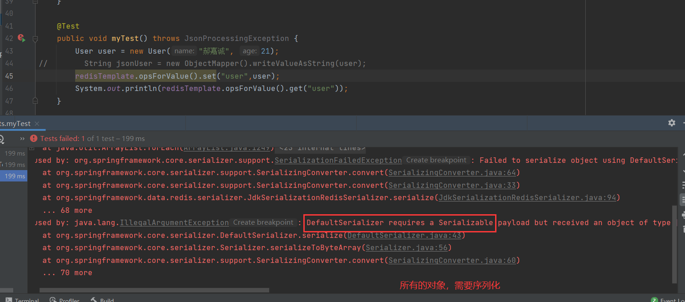

要么

③：编写自己的redisTemplate

~~~java
@Configuration
public class RedisConfig {

    //  自己定义一个 RedisTemplate
    //  固定的模板
    @Bean
    public RedisTemplate<String, Object> myRedisTemplate(RedisConnectionFactory redisConnectionFactory) {
        //  开发中一般使用  <String, Object> 的形式
        RedisTemplate<String, Object> template = new RedisTemplate<>();
        template.setConnectionFactory(redisConnectionFactory);
        //  Json序列化配置
        Jackson2JsonRedisSerializer jackson2JsonRedisSerializer = new Jackson2JsonRedisSerializer(Object.class);
        ObjectMapper objectMapper = new ObjectMapper();
        objectMapper.setVisibility(PropertyAccessor.ALL, JsonAutoDetect.Visibility.ANY);
        //objectMapper.enableDefaultTyping(ObjectMapper.DefaultTyping.NON_FINAL);
        //enableDefaultTyping过期  使用activateDefaultTyping代替		objectMapper.activateDefaultTyping(LaissezFaireSubTypeValidator.instance,ObjectMapper.DefaultTyping.NON_FINAL, JsonTypeInfo.As.PROPERTY);
        jackson2JsonRedisSerializer.setObjectMapper(objectMapper);
        //  String的序列化
        StringRedisSerializer stringRedisSerializer = new StringRedisSerializer();
        //  key使用String的序列化方式
        template.setKeySerializer(stringRedisSerializer);
        //  hash的key也采用String的序列化方式
        template.setHashKeySerializer(stringRedisSerializer);
        // value序列化方式采用jackson
        template.setValueSerializer(jackson2JsonRedisSerializer);
        //以hash的value序列化方式采用jackson
        template.setHashValueSerializer(jackson2JsonRedisSerializer);
        template.afterPropertiesSet();
        return template;
    }
}

~~~


# Redis.conf详解

## 基本配置

> 位置

Redis 的配置文件位于 Redis 安装目录下，文件名为 redis.conf 

~~~bash
config get * # 获取全部的配置
~~~

我们一般情况下，会单独拷贝出来一份进行操作。来保证初始文件的安全。 

启动的时候，就通过配置文件来启动的！

> 单位 	容量单位不区分大小写，G和GB有区别 

==配置文件 unit单位对大小写不敏感==

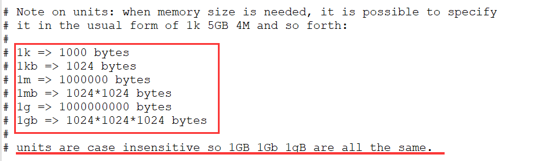

> include  包含,组合多个配置 

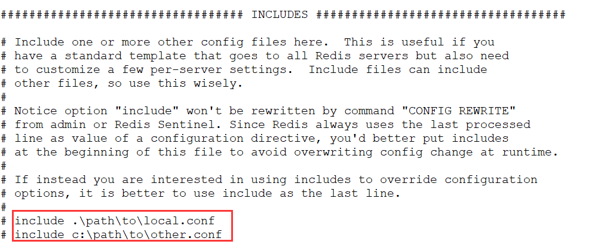

就好比我们学习Spring、Import、include

> NETWORK  网络

~~~bash
bind 127.0.0.1		#绑定的IP
protected-mode yes 	#保护模式
port 6379  			#端口
~~~

>GENERAL 通用

~~~bash
daemonize yes   	#以守护进程的方式运行，默认是no，我们需要修改为yes

pidfile /var/run/redis.pid	#如果以后台的方式运行，我们就需要指定一个 pid 文件

#Specify: the server verbosity level.# This can be. one of :
# debug (a lot of information, useful for development/testing)
# verbose(many rarely useful info，but not a mess like the debug level)
# notice (moderately verbose,what you want in production probably)		生产环境
# warning (only very important / critical messages are logged)
loglevel notice
logfile  ""  	#日志的文件位置名
databases  16	#数据库的数量，默认是16个
always-show-logo  yes	#是否显示logo
~~~

>SNAPSHOPTING  快照，持久化规则 

持久化，在规定的时间内，执行了多少次操作，则会持久化到文件.rdb. aof

redis是内存数据库，如果没有持久化，那么数据断电及失!

~~~bash
# 如果900s内，如果至少有一个1 key进行了修改，我们就进行持久化操作
save 900 1
# 如果300s内，如果至少10 key进行了修改，我们就进行持久化操作
save 300 10
#如果60s内，如果至少10000 key进行了修改，我们就进行持久化操作
save 60 10000
#我们之后学习持久化，会自己定义这个测试!

stop-writes-on-bgsave-error yes	#持久化如果出错，是否还需要继续工作！

rdbcompression	yes	#是否压缩 rdb 文件，需要消耗一些cpu资源！

rdbchecksum	yes	#保存rdb文件的时候，进行错误的检查校验！

dir ./ 	#rdb 文件保存的目录

~~~

> REPLICATION 复制，我们后面讲解主从复制的，时候再进行讲解


> SECURITY	安全

可以在这里设置redis的密码，默认是没有密码的

~~~bash
127.0.0.1:6379> ping
PONG
127.0.0.1:6379> config get requirepass	# 获取redis的密码
1) "requirepass"
2) ""
127.0.0.1:6379> config set requirepass "123456"	# 设置redis的密码
oK
127.0.0.1:6379> config get requirepass #发现所有的命令都没有权限了
(error) NOAUTH Authentication required.
127.0.0.1:6379> ping
(error) NOAUTH Authentication required.
127.0.0.1:6379> auth 123456#使用密码进行登录!
oK
127.0.0.1:6379> config get requirepass
1) "requirepass"
2) "123456"

~~~

> 限制   CLIENTS

~~~bash
maxclients	10000		#设置能连接上redis的最大客户端数量
maxmemory	<bytes>		#配置redis最大的内存容量
maxmemory-policy noeviction	#内存到达上限之后的处理策略
	1、volatile-7ru:		只对设置了过期时间的key进行LRU（默认值)
	2、a7lkeys-7ru :		删除lru算法的key
	3、volatile-random:	随机删除即将过期key
	4、a7lkeys-random:	随机删除
	5、volatile-tt7 :	删除即将过期的
	6、noeviction :		永不过期，返回错误
~~~

> APPEND ONLY 	模式 aof配置

~~~bash
appendonly  no  #默认是不开启aof模式的，默认是使用rdb方式持久化的，大部分情况下rdb够用
appendfilename  "appendonly.aof"	#持久化的文件的名字

#appendfsync  always  #每次修改都会  sync。消耗性能
appendfsync  everysec #每秒执行一次  sync，可能会丢失这1秒的数据！
#appendfsync  no	  #不执行   sync，这个时候操作系统自己同步数据，速度是最快的
~~~

具体的配置，我们在redis持久化中详细讲解！

 

# Redis持久化

面试和工作，持久化都是重点！

Redis是内存数据库，如果不将内存中的数据库状态保存到磁盘，那么一旦服务器进程退出，服务器中的数据库状态也会消失。所以Redis提供了持久化功能!

## RDB（Redis  DataBase）

> 什么是RDB

在主从复制中，RDB就是备用了！在从机上面！


在指定的时间间隔内将内存中的数据集快照写入磁盘，也就是行话讲的Snapshot快照，它恢复时是将快照文件直接读到内存里。

Redis会单独创建 ( fork )一个子进程来进行持久化，会先将数据写入到一个临时文件中，待持久化过程都结束了，再用这个临时文件替换上次持久化好的文件。整个过程中，主进程是不进行任何IO操作的。这就确保了极高的性能。如果需要进行大规模数据的恢复，且对于数据恢复的完整性不是非常敏感，那RDB方式要比AOF方式更加的高效。RDB的缺点是最后一次持久化后的数据可能丢失。我们默认的就是RDB，一般情况下不需要修改这个配置!


==rdb保存的文件是dump.rdb==		都是在我们的配置文件中快照中进行配置的!


> 触发机制

1、save的规则满足的情况下，会自动触发rdb规则

2、执行flushall命令，也会触发我们的rdb规则！

3、退出redis，也会产生rdb文件（dump.rdb）

备份就自动生成一个 dump.rdb


>如何恢复rdb文件！

1、只需要将rdb文件放在我们redis启动目录就可以，redis启动的时候会自动检查dump.rdb ，恢复其中的数据

2、查看需要存在的位置

~~~bash
127.0.0.1:6379>  config get dir
1) "dir"
2) "/usr/local/bin"	#如果在这个目录下存在 dump .rdb文件，启动就会自动恢复其中的数据
~~~

> 几乎就他自己默认的配置就够用了，但是我们还是需要取学习！

**优点：**

1、适合大规模的数据恢复！

2、对数据的完整性要求不高！

**缺点：**

1、需要一定的时间间隔进程操作！如果redis意外宕机了，这个最后一次修改数据就没有了！

2、fork进程的时候，会占用一定的内存空间！

## AOF（Append Only File）

将我们的所有命令都记录下来，恢复的时候把这个文件执行一遍

> AOF是什么


以日志的形式来记录每个写操作，将Redis执特过的所有指令记录下来(**读操作不记录**），只许追加文件但不可以改写文件，redis启动之初会读取该文件重新构建数据，换言之，redis重启的话就根据日志文件的内容将写指令从前到后执行一次以完成数据的恢复工作

==AOF保存的文件是 appendonly.aof 文件==

> append

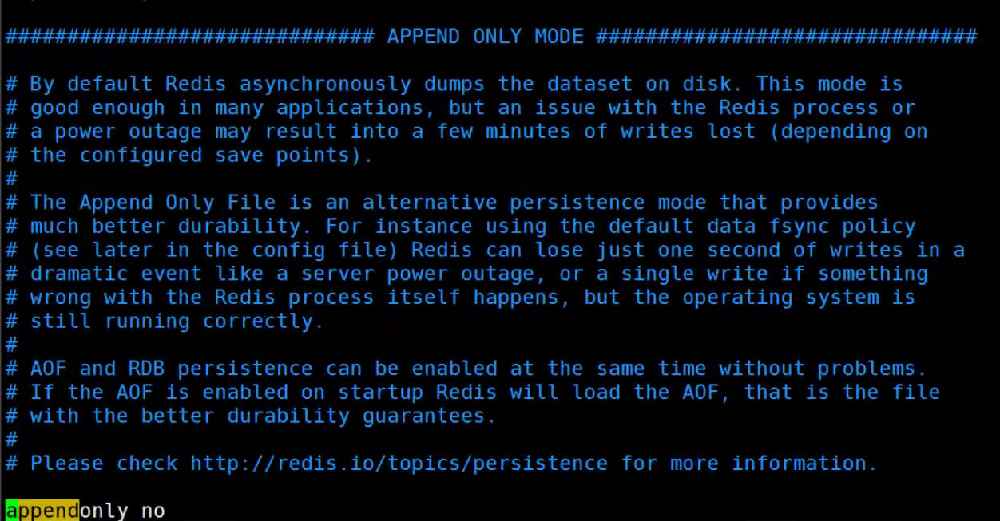

默认是不开启的，需要手动修改为yes

重启redis即可生效！

如果aof文件有错误，redis的服务是启动不起来的，我们需要修复aof文件

redis给我们提供了一个工具  `redis-check-aof`，使用命令`redis-check-aof  --fix`即可修复aof文件！


如果文件正常，重启就可以直接恢复了！（修复文件有一定的==容错率==，可能会导致一些数据丢失）


> 重写规则

aof 默认就是文件的无限追加，文件会越来越大!


如果aof文件大小超过mb，太大了，fork一个新的进程来讲我们的文件进行重写！

> 优点和缺点！

~~~bash
appendonly  no  #默认是不开启aof模式的，默认是使用rdb方式持久化的，大部分情况下rdb够用
appendfilename  "appendonly.aof"	#持久化的文件的名字

#appendfsync  always  #每次修改都会  sync。消耗性能
appendfsync  everysec #每秒执行一次  sync，可能会丢失这1秒的数据！
#appendfsync  no	  #不执行   sync，这个时候操作系统自己同步数据，速度是最快的
# rewrite   重写
~~~


**优点：**

1. 每一次写操作都会同步，数据更加完整！
2. 每秒同步一次，可能会丢失这1秒的数据！
3. 从不同不的话，效率是最高的！

**缺点：**

1. 相对于数据文件来说，aof远远大于rdb，修复的速度也比rdb慢！
2. Aof运行效率也要比rdb慢，所以我们redis默认的配置就是rdb持久化！


**扩展**：

1、RDB持久化方式能够在指定的时间间隔内对你的数据进行快照存储

2、AOF持久化方式记录每次对服务器写的操作，当服务器重启的时候会重新执行这些命令来恢复原始的数据，AOF命令以Redis 协议追加保存每次写的操作到文件末尾，Redis还能对AOF文件进行后台重写，使得AOF文件的体积不至于过大。

3、==只做缓存，如果你只希望你的数据在服务器运行的时候存在，你也可以不使用任何持久化==

4、同时开启两种持久化方式

- 在这种情况下，当redis重启的时候会==优先载入AOF==文件来恢复原始的数据，因为在通常情况下AOF文件保存的数据集要比RDB文件保存的数据集要完整。
- RDB的数据不实时，同时使用两者时服务器重启也只会找AOF文件，那要不要只使用AOF呢?作者建议不要，因为RDB更适合用于备份数据库(AOF在不断变化不好备份），快速重启，而且不会有AOF可能潜在的Bug，留着作为一个万一的手段。

5、性能建议

- 因为RDB文件只用作后备用途，建议只在Slave上持久化RDB文件，而且只要15分钟备份一次就够了，只保留save 9001这条规则。
- 如果Enable AOF，好处是在最恶劣情况下也只会丢失不超过两秒数据，启动脚本较简单只load自己的AOF文件就可以了，代价一是带来了持续的lO，二是AOF rewrite 的最后将rewrite过程中产生的新数据写到新文件造成的阻塞几乎是不可避免的。只要硬盘许可，应该尽量减少AOF rewrite的频率，AOF重写的基础大小默认值64M太小了，可以设到5G以上，默认超过原大小100%大小重写可以改到适当的数值。
- 如果不Enable AOF，仅靠Master-Slave Repllcation实现高可用性也可以，能省掉一大笔(O，也减少了rewrite时带来的系统波动。代价是如果Master/Slave同时倒掉，会丢失十几分钟的数据，启动脚本也要比较两个Master/Slave 中的RDB文件，载入较新的那个，微博就是这种架构。

# Redis发布订阅

Redis发布订阅(pub/sub)是一种消息通信模式∶发送者(pub)发送消息，订阅者(sub)接收消息。

Redis 客户端可以订阅任意数量的频道。

订阅/发布消息图:


下图展示了频道channel1，以及订阅这个频道的三个客户端―—client2、 client5和client1之间的关系∶


当有新消息通过 PUBLISH 命令发送给频道 channel1 时， 这个消息就会被发送给订阅它的三个客户端： 


> 命令

这些命令被广泛用于构建即时通信应用，比如网络聊天室(chatroom)和实时广播、实时提醒等。


> 测试

**订阅端：**

~~~bash
127.0.0.1:6379> SUBSCRIBE feichidesuyi		#订阅一个频道	feichidesuyi
Reading messages... (press Ctrl-C to quit)
1) "subscribe"
2) "feichidesuyi"
3) (integer) 1
#等待读取推送的信息
1) "message"	#消息
2) "feichidesuyi"	#消息的频道
3) "Hello,SuYi"		#消息的内容
~~~

**发布端：**

~~~bash
127.0.0.1:6379> PUBLISH feichidesuyi "Hello,SuYi"	#发布者发布消息到feichidesuyi 频道
(integer) 1
~~~

Pub/Sub从字面上理解就是发布( Publish )与订阅( Subscribe )，在Redis中，你可以设定对某一个key值进行消息发布及消息订阅，当一个key值上进行了消息发布后，所有订阅它的客户端都会收到相应的消息。这一功能最明显的用法就是用作实时消息系统，比如普通的即时聊天，群聊等功能。

**使用场景：**

1. 实时消息系统
2. 实时聊天（频道当作聊天室，将信息回显给所有人即可）
3. 订阅，关注系统

稍微复杂一点的场景，我们会使用，消息中间件MQ（）


# Redis主从复制

## 概念

主从复制，是指将一台Redis服务器的数据，复制到其他的Redis服务器。前者称为主节点(master/leader)，后者称为从节点(slave/follower);数据的复制是单向的，只能由主节点到从节点。Master以写为主，Slave以读为主。

默认情况下，每台Redis服务器都是主节点;且一个主节点可以有多个从节点(或没有从节点)，但一个从节点只能有一个主节点。

**主从复制的作用主要包括︰**

1、数据冗余∶主从复制实现了数据的热备份，是持久化之外的一种数据冗余方式。
2、故障恢复︰当主节点出现问题时，可以由从节点提供服务，实现快速的故障恢复;实际上是一种服务的冗余。

3、负载均衡︰在主从复制的基础上，配合读写分离，可以由主节点提供写服务，由从节点提供读服务即写Redis数据时应用连接主节点，读Redis数据时应用连接从节点），分担服务器负载﹔尤其是在写少读多的场景下，通过多个从节点分担读负载，可以大大提高Redis服务器的并发量。

4、高可用（集群）基石︰除了上述作用以外，主从复制还是哨兵和集群能够实施的基础，因此说主从复制是Redis高可用的基础。

一般来说，要将Redis运用于工程项目中，只使用一台Redis是万万不能的（宕机，一主二从），原因如下︰

1、从结构上，单个Redis服务器会发生单点故障，并且一台服务器需要处理所有的请求负载，压力较大;

2、从容量上，单个Redis服务器内存容量有限，就算一台Redis服务器内存容量为256G，也不能将所有内存用作Redis存储内存，一般来说，==单台Redis最大使用内存不应该超过20G==。

电商网站上的商品，一般都是一次上传，无数次浏览的，说专业点也就是"多读少写"。

对于这种场景，我们可以使如下这种架构∶


主从复制，读写分离，80%的情况下都是在进行读操作！减缓服务器的压力，架构中经常使用！一主二从！

只要在公司中，主从复制就是必须要使用的，因为在真实的项目中不可能单机使用Redis !

## 环境配置

只配置从库，不用配置主库！

~~~bash
127.0.0.1:6379> info replication		#查看当前库的信息
# Replication
role:master	#角色	master
connected_slaves:0	#没有从机
master_failover_state:no-failover
master_replid:20506729ff7cf5007efc95bd0548684d1f9758f2
master_replid2:0000000000000000000000000000000000000000
master_repl_offset:0
second_repl_offset:-1
repl_backlog_active:0
repl_backlog_size:1048576
repl_backlog_first_byte_offset:0
repl_backlog_histlen:0
~~~

**复制3个配置文件，然后修改对应的信息**

~~~bash
[root@VM-8-8-centos redis]# cp redis.conf redis79.conf
[root@VM-8-8-centos redis]# cp redis.conf redis80.conf
[root@VM-8-8-centos redis]# cp redis.conf redis81.conf
~~~


1、端口		79（主） 	80	 81


2、pid 名字


3、log文件名字


4、dump.rdb 名字

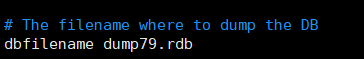

服务启动：

```bash
redis-server redis79.conf
redis-server redis80.conf
redis-server redis81.conf
```


## 一主二从（第一种）


==默认情况下，每台Redis服务器都是主节点；== 	

我们一般情况下只用配置从机就好了！ 

认老大！一主（79）二从（80，81） 

使用`SLAVEOF host port`就可以为从机配置主机了。 


客户端连接：

79:

80:

81:


从机配置（80，81）

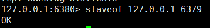

成功后，查看信息


真实的从主配置应该在配置文件中配置，这样的话是永久的，我们这里使用的是命令，暂时的!

> 细节

主机负责写（也可以读）


从机负责读（只能读）


> 测试		（高可用）

- 主机断开后，从机依然可以获取值，但是这时没有写操作了。如果主机又回来了，从机依旧可以获取主机写进去的数据

- 如果是用命令行配置的主从复制，这时，从机断开又重连后，从机将成为主机，此时也拿不到在断开期间，主机写进去的数据，除非再次将它变为从机，即可重新获取到主机的所有值

> 复制原理

slave启动成功连接到master后会发送一个sync命令

Master接到命令，启动后台的存盘进程，同时收集所有接收到的用于修改数据集命令，在后台进程执行完毕之后，==master将传送整个数据文件到slave，并完成一次完全同步。==

==全量复制==:而slave服务在接收到数据库文件数据后，将其存盘并加载到内存中。

==增量复制==:Master继续将新的所有收集到的修改命令依次传给slave，完成同步

但是只要是重新连接master，一次完全同步（全量复制）将被自动执行

## 层层链路（第二种）


这时也可以完成我们的主从复制

> 测试		

==**谋朝篡位**==

如果在层层链路的情况下，主机断开了，这时可以使用 `slaveof no one`来使自己变成主机，如果自己之前还有从机连接着，则连接关系不变。如果这个时候真正的主机恢复了，真正的主机也没有从机了，需要重新手动连接；


## 哨兵模式

（自动选举老大的模式）

> 概述

主从切换技术的方法是∶当主服务器宕机后，需要手动把一台从服务器切换为主服务器，这就需要人工干预，费事费力，还会造成一段时间内服务不可用。这不是一种推荐的方式，更多时候，我们优先考虑哨兵模式。Redis从2.8开始正式提供了Sentinel (哨兵）架构来解决这个问题。

谋朝篡位的自动版，能够后台监控主机是否故障，如果故障了根据投票数自动将从库转换为主库。

哨兵模式是一种特殊的模式，首先Redis提供了哨兵的命令，哨兵是一个独立的进程，作为进程，它会独立运行。**其原理是哨兵通过发送命令，等待Redis服务器响应，从而监控运行的多个Redis实例。**


这里的哨兵有两个作用

1. 通过发送命令，让Redis服务器返回监控其运行状态，包括主服务器和从服务器。
2. 当哨兵监测到master宕机，会自动将slave切换成master，然后通过发布订阅模式通知其他的从服务器，修改配置文件，让它们切换主机。

然而一个哨兵进程对Redis服务器进行监控，可能会出现问题，为此，我们可以使用多个哨兵进行监控。各个哨兵之间还会进行监
控，这样就形成了多哨兵模式。


假设主服务器宕机，哨兵1先检测到这个结果，系统并不会马上进行failover过程，仅仅是哨兵1主观的认为主服务器不可用，这个现象成为**主观下线**。当后面的哨兵也检测到主服务器不可用，并且数量达到一定值时，那么哨兵之间就会进行一次投票，投票的结果由一个哨兵发起，进行failover[故障转移]操作。切换成功后，就会通过发布订阅模式，让各个哨兵把自己监控的从服务器实现切换主机，这个过程称为**客观下线**。

> 测试

我们目前的状态是一主二从

1、配置哨兵配置文件	sentinel.conf

~~~bash
#sentinel monitor 被监控的名称 host port 1
sentinel monitor myredis 127.0.0.1 6379 1
~~~

后面的1代表，主机挂了，salve投票看让谁接替成为主机，票数最多的，就会成为主机！

2、启动哨兵

~~~bash
[root@VM-8-8-centos src]# redis-sentinel sentinel.conf
2808:X 22 Nov 2021 14:10:07.614 # oO0OoO0OoO0Oo Redis is starting oO0OoO0OoO0Oo
2808:X 22 Nov 2021 14:10:07.614 # Redis version=6.2.4, bits=64, commit=00000000, modified=0, pid=2808, just started
2808:X 22 Nov 2021 14:10:07.614 # Configuration loaded
2808:X 22 Nov 2021 14:10:07.615 * monotonic clock: POSIX clock_gettime
                _._                                                  
           _.-``__ ''-._                                             
      _.-``    `.  `_.  ''-._           Redis 6.2.4 (00000000/0) 64 bit
  .-`` .-```.  ```\/    _.,_ ''-._                                  
 (    '      ,       .-`  | `,    )     Running in sentinel mode
 |`-._`-...-` __...-.``-._|'` _.-'|     Port: 26379
 |    `-._   `._    /     _.-'    |     PID: 2808
  `-._    `-._  `-./  _.-'    _.-'                                   
 |`-._`-._    `-.__.-'    _.-'_.-'|                                  
 |    `-._`-._        _.-'_.-'    |           https://redis.io       
  `-._    `-._`-.__.-'_.-'    _.-'                                   
 |`-._`-._    `-.__.-'    _.-'_.-'|                                  
 |    `-._`-._        _.-'_.-'    |                                  
  `-._    `-._`-.__.-'_.-'    _.-'                                   
      `-._    `-.__.-'    _.-'                                       
          `-._        _.-'                                           
              `-.__.-'                                               

2808:X 22 Nov 2021 14:10:07.621 # Sentinel ID is 2d14dac2e1d9a113b782c01050f441fab229476c
2808:X 22 Nov 2021 14:10:07.621 # +monitor master myredis 127.0.0.1 6379 quorum 1
2808:X 22 Nov 2021 14:10:07.622 * +slave slave 127.0.0.1:6380 127.0.0.1 6380 @ myredis 127.0.0.1 6379
2808:X 22 Nov 2021 14:10:07.628 * +slave slave 127.0.0.1:6381 127.0.0.1 6381 @ myredis 127.0.0.1 6379
~~~

如果Master节点断开了，这个时候就会从从机中随机选择一个服务器!（这里面有一个投票算法!)

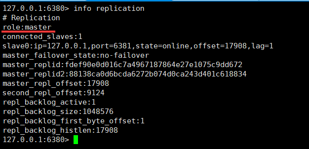


哨兵日志


此时如果真正的主机回来了，它也只能成为6380的从机


哨兵日志


> 哨兵模式的全部配置

~~~bash
# Example sentinel.conf
 
# 哨兵sentinel实例运行的端口 默认26379
port 26379
 
# 哨兵sentinel的工作目录
dir /tmp
 
# 哨兵sentinel监控的redis主节点的 ip port 
# master-name  可以自己命名的主节点名字 只能由字母A-z、数字0-9 、这三个字符".-_"组成。
# quorum 当这些quorum个数sentinel哨兵认为master主节点失联 那么这时 客观上认为主节点失联了
# sentinel monitor <master-name> <ip> <redis-port> <quorum>
sentinel monitor mymaster 127.0.0.1 6379 1
 
# 当在Redis实例中开启了requirepass foobared 授权密码 这样所有连接Redis实例的客户端都要提供密码
# 设置哨兵sentinel 连接主从的密码 注意必须为主从设置一样的验证密码
# sentinel auth-pass <master-name> <password>
sentinel auth-pass mymaster MySUPER--secret-0123passw0rd
 
 
# 指定多少毫秒之后 主节点没有应答哨兵sentinel 此时 哨兵主观上认为主节点下线 默认30秒
# sentinel down-after-milliseconds <master-name> <milliseconds>
sentinel down-after-milliseconds mymaster 30000
 
# 这个配置项指定了在发生failover主备切换时最多可以有多少个slave同时对新的master进行 同步，
这个数字越小，完成failover所需的时间就越长，
但是如果这个数字越大，就意味着越 多的slave因为replication而不可用。
可以通过将这个值设为 1 来保证每次只有一个slave 处于不能处理命令请求的状态。
# sentinel parallel-syncs <master-name> <numslaves>
sentinel parallel-syncs mymaster 1
 
 
 
# 故障转移的超时时间 failover-timeout 可以用在以下这些方面： 
#1. 同一个sentinel对同一个master两次failover之间的间隔时间。
#2. 当一个slave从一个错误的master那里同步数据开始计算时间。直到slave被纠正为向正确的master那里同步数据时。
#3.当想要取消一个正在进行的failover所需要的时间。  
#4.当进行failover时，配置所有slaves指向新的master所需的最大时间。不过，即使过了这个超时，slaves依然会被正确配置为指向master，但是就不按parallel-syncs所配置的规则来了
# 默认三分钟
# sentinel failover-timeout <master-name> <milliseconds>
sentinel failover-timeout mymaster 180000
 
# SCRIPTS EXECUTION
 
#配置当某一事件发生时所需要执行的脚本，可以通过脚本来通知管理员，例如当系统运行不正常时发邮件通知相关人员。
#对于脚本的运行结果有以下规则：
#若脚本执行后返回1，那么该脚本稍后将会被再次执行，重复次数目前默认为10
#若脚本执行后返回2，或者比2更高的一个返回值，脚本将不会重复执行。
#如果脚本在执行过程中由于收到系统中断信号被终止了，则同返回值为1时的行为相同。
#一个脚本的最大执行时间为60s，如果超过这个时间，脚本将会被一个SIGKILL信号终止，之后重新执行。
 
#通知型脚本:当sentinel有任何警告级别的事件发生时（比如说redis实例的主观失效和客观失效等等），将会去调用这个脚本，
#这时这个脚本应该通过邮件，SMS等方式去通知系统管理员关于系统不正常运行的信息。调用该脚本时，将传给脚本两个参数，
#一个是事件的类型，
#一个是事件的描述。
#如果sentinel.conf配置文件中配置了这个脚本路径，那么必须保证这个脚本存在于这个路径，并且是可执行的，否则sentinel无法正常启动成功。
#通知脚本
# sentinel notification-script <master-name> <script-path>
  sentinel notification-script mymaster /var/redis/notify.sh
 
# 客户端重新配置主节点参数脚本
# 当一个master由于failover而发生改变时，这个脚本将会被调用，通知相关的客户端关于master地址已经发生改变的信息。
# 以下参数将会在调用脚本时传给脚本:
# <master-name> <role> <state> <from-ip> <from-port> <to-ip> <to-port>
# 目前<state>总是“failover”,
# <role>是“leader”或者“observer”中的一个。 
# 参数 from-ip, from-port, to-ip, to-port是用来和旧的master和新的master(即旧的slave)通信的
# 这个脚本应该是通用的，能被多次调用，不是针对性的。
# sentinel client-reconfig-script <master-name> <script-path>
sentinel client-reconfig-script mymaster /var/redis/reconfig.sh
~~~


# Redis缓存穿透和雪崩

> 服务的高可用问题！

Redis缓存的使用，极大的提升了应用程序的性能和效率，特别是数据查询方面。但同时，它也带来了一些问题。其中，最要害的问题，就是数据的一致性问题，从严格意义上讲，这个问题无解。如果对数据的一致性要求很高，那么就不能使用缓存。

另外的一些典型问题就是，缓存穿透、缓存雪崩和缓存击穿。目前，业界也都有比较流行的解决方案。


## 缓存穿透（查不到）

> 概念

缓存穿透的概念很简单，用户想要查询一个数据，发现redis内存数据库没有，也就是缓存没有命中，于是向持久层数据库查询。发现也没有，于是本次查询失败。当用户很多的时候，缓存都没有命中(商品的秒杀!），于是都去请求了持久层数据库。这会给持久层数据库造成很大的压力，这时候就相当于出现了缓存穿透。

> 解决方案

**布隆过滤器**

布隆过滤器是一种数据结构，对所有可能查询的参数以hash形式存储，在控制层先进行校验，不符合则丢弃，从而避免了对底层存储系统的查询压力


**缓存空对象**

当存储层不命中后，即使返回的空对象也将其缓存起来，同时会设置一个过期时间，之后再访问这个数据将会从缓存中获取，保护了后端数据源

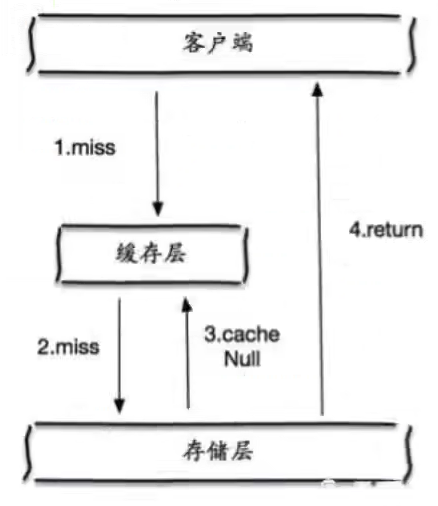

但是这种方法会存在两个问题:
1、如果空值能够被缓存起来，这就意味着缓存需要更多的空间存储更多的键，因为这当中可能会有很多的空值的键；

2、即使对空值设置了过期时间，还是会存在缓存层和存储层的数据会有一段时间窗口的不一致，这对于需要保持一致性的业务会有影响。

## 缓存击穿（量太大，缓存过期）

> 概述

这里需要注意和缓存击穿的区别，缓存击穿，是指一个key非常热点，在不停的扛着大并发，大并发集中对这一个点进行访问，当这个key在失效的瞬间，持续的大并发就穿破缓存，直接请求数据库，就像在一个屏障上凿开了一个洞。

当某个key在过期的瞬间，有大量的请求并发访问，这类数据一般是热点数据，由于缓存过期，会同时访问数据库来查询最新数据，并且回写缓存，会导使数据库瞬间压力过大。

> 解决方案

**设置热点数据永不过期**

从缓存层面来看，没有设置过期时间，所以不会出现热点 key过期后产生的问题。

**加互斥锁**

分布式锁∶使用分布式锁，保证对于每个key同时只有一个线程去查询后端服务，其他线程没有获得分布式锁的权限，因此只需要等待即可。这种方式将高并发的压力转移到了分布式锁，因此对分布式锁的考验很大。

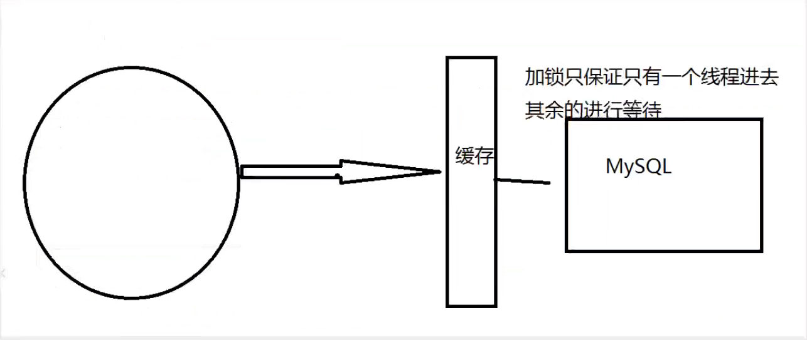


## 缓存雪崩

> 概念

缓存雪崩，是指在某一个时间段，缓存集中过期失效。Redis 宕机!

产生雪崩的原因之一，比如在写本文的时候，马上就要到双十二零点，很快就会迎来一波抢购，这波商品时间比较集中的放入了缓存，假设缓存一个小时。那么到了凌晨一点钟的时候，这批商品的缓存就都过期了。而对这批商品的访问查询，都落到了数据库上，对于数据库而言，就会产生周期性的压力波峰。于是所有的请求都会达到存储层，存储层的调用量会暴增，造成存储层也会挂掉的情况。


其实集中过期，倒不是非常致命，比较致命的缓存雪崩，是缓存服务器某个节点宕机或断网。因为自然形成的缓存雪崩，一定是在某个时间段集中创建缓存，这个时候，数据库也是可以顶住压力的。无非就是对数据库产生周期性的压力而已。而缓存服务节点的宕机，对数据库服务器造成的压力是不可预知的，很有可能瞬间就把数据库压垮。

> 解决方案

**redis高可用**

这个思想的含义是，既然redis有可能挂掉，那我多增设几台redis ，这样一台挂掉之后其他的还可以继续工作，其实就是搭建的集群。

**限流降级**

这个解决方案的思想是，在缓存失效后，通过加锁或者队列来控制读数据库写缓存的线程数量。比如对某个key只允许一个线程查询数据和写缓存，其他线程等待。

**数据预热**

数据加热的含义就是在正式部署之前，我先把可能的数据先预先访问一遍，这样部分可能大量访问的数据就会加载到缓存中。在即将发生大并发访问前手动触发加载缓存不同的key，设置不同的过期时间，让缓存失效的时间点尽量均匀。

