# SpringBoot：快速入门

### 什么是Spring

​	spring是一个开源框架，2003年兴起的一个轻量级的Java开发框架，作者：Rod Johnson。

​	**Spring是为了解决企业级应用开发的复杂性而创建的，简化开发**

### Spring是如何简化java开发的

​	为了降低Java开发的复杂性,Spring采用了以下四种关键策略:

1. 基于pojo的轻量级和最小侵入性编程;
2. 通过IOC(控制反转),依赖注入(DI)和面向接口实现松耦合;
3. 基于切面(AOP)和惯例进行声明式编程;
4. 通过切面和模板减少样式代码;

### 什么是SpringBoot

​	SpringBoot就是一个javaweb的开发框架,和springmvc类似,对比其他javaweb框架的好处,官方说是简化开发,约定大于配置,"you can *just run",能迅速的开发web应用,几行代码开发一个http接口.

### SpringBoot主要优点

- 为所有spring开发者更快的入门
- 开箱即用,提供各种默认配置来简化项目配置
- 内嵌式容器简化web项目
- 没有冗余代码生成和xml配置的要求

### Hello World

创建springboot项目   next

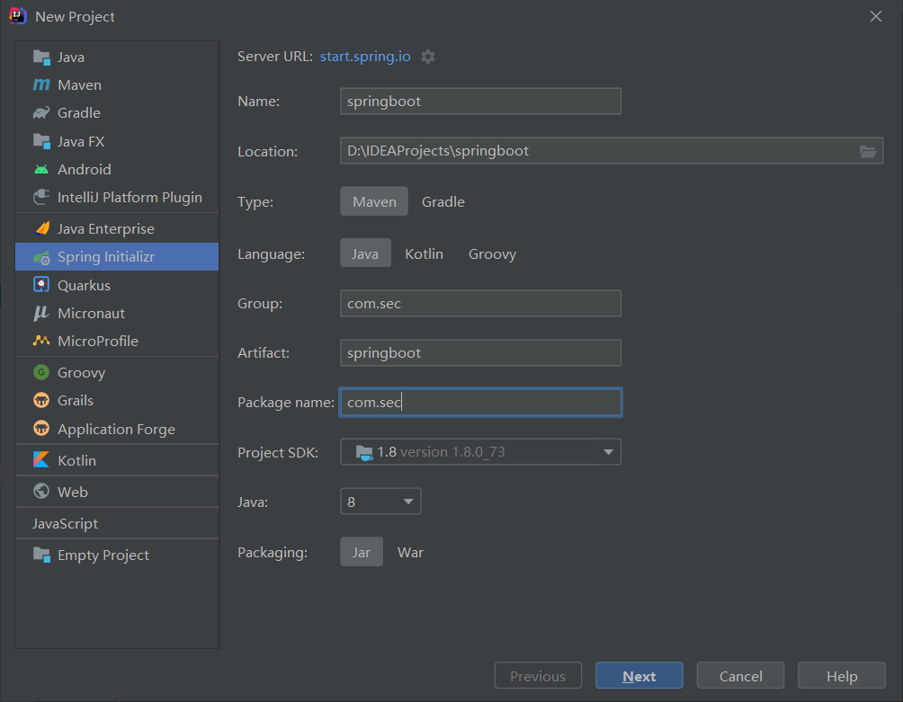

搜索web   勾选springweb  这将在pom.xml自动导入web环境的依赖

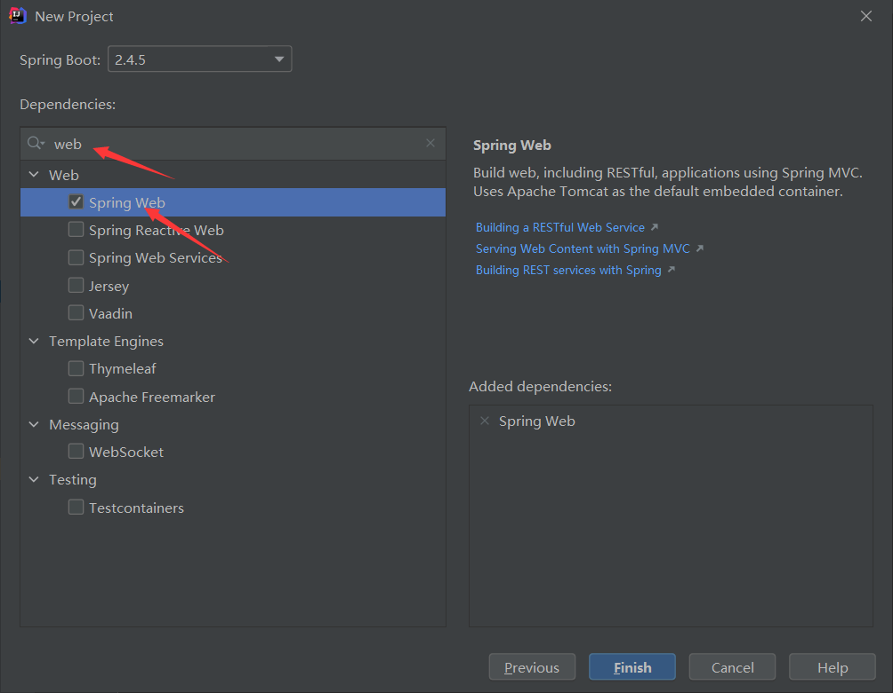

创建好之后在SpringbootApplication同级目录下创建controller包，如果不在此创建，则扫描不到包，虽然运行正常，但是显示不出来。

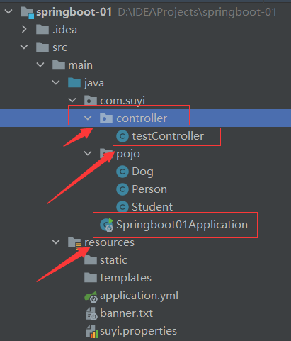

在controller包下写一个简单的方法进行测试


最后在SpringbootApplication中启动

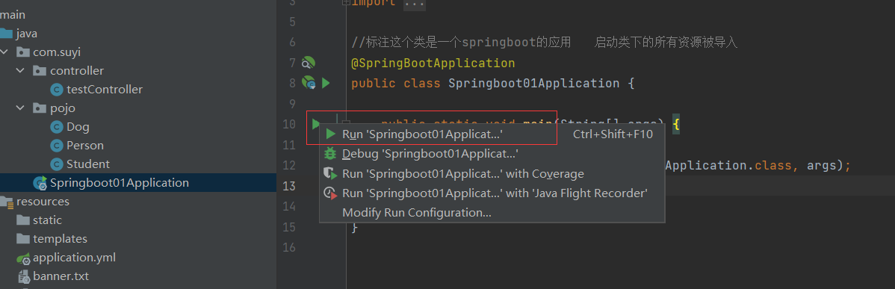

### pom.xml

- spring-boot-dependencies：核心依赖在父工程中！
- 我们在写或者引入一些springboot依赖的时候，不需要指定版本

### 启动器

~~~xml
<dependency>
            <groupId>org.springframework.boot</groupId>
            <artifactId>spring-boot-starter</artifactId>
</dependency>
~~~

- springboot的启动场景
- 自动导入web环境所有的依赖
- springboot会将所有的功能场景，变成一个个的启动器

### 原理初探

主程序：

~~~java
package com.suyi;

import org.springframework.boot.SpringApplication;
import org.springframework.boot.autoconfigure.SpringBootApplication;

//标注这个类是一个springboot的应用
@SpringBootApplication
public class Springboot01Application {

    public static void main(String[] args) {
        //将springboot应用启动
        SpringApplication.run(Springboot01Application.class, args);
    }

}
~~~

- 注解

  - ~~~java
    @SpringBootConfiguration:  springboot的配置
    	@Configuration：  spring配置类
    	@Component：  spring的组件
    @EnableAutoConfiguration：  自动配置
    	@AutoConfigurationPackage：  自动配置包
    	@Import(AutoConfigurationPackages.Registrar.class)：  自动配置‘包注册’
    	@Import(AutoConfigurationImportSelector.class)：  自动配置导入选择
    //获取所有的配置
    List<String> configurations = getCandidateConfigurations(annotationMetadata, attributes);
    
    ~~~

    获取候选的配置

    ```java
    protected List<String> getCandidateConfigurations(AnnotationMetadata metadata, AnnotationAttributes attributes) {
       List<String> configurations = SpringFactoriesLoader.loadFactoryNames(getSpringFactoriesLoaderFactoryClass(),
             getBeanClassLoader());
       Assert.notEmpty(configurations, "No auto configuration classes found in META-INF/spring.factories. If you "
             + "are using a custom packaging, make sure that file is correct.");
       return configurations;
    }
    ```

    META-INF/spring.factories ： 自动配置的核心文件

结论：springboot所有自动装配都是在启动的时候扫描并加载：`‘spring.factories’`，所有自动配置类都在这里面，但是不一定都生效，因为要导入对应的start，导入start后就有启动器了，然后自动装配才会生效，最后配置成功！

1. springboot在启动的时候，从类路径下`META-INF/spring.factories`获取指定的值
2. 将这些自动配置的类导入容器，自动配置就会生效，进行自动配置
3. 以前需要我们手动配置的东西，现在springboot帮我们自动配置好了
4. 整合javaEE ，解决方案和自动配置的东西都在spring-boot-autoconfigure-2.2.0.RELEASE.jar 这个包下
5. 他会把所有需要导入的组件，以类名的方式返回，这些组件就会被添加到容器
6. 容器中也会存在非常多的xxxxAutoConfigurration的文件，就是这些类给容器中导入了这个场景需要的所有组件，并自动配置，@Configuration，JavaConfig！
7. 有了自动配置的类，免去了我们手动编写配置文件的工作！

JavaConfig  @Configuration   @Bean

Docker:进程


关于springboot，谈谈你的理解：

- 自动配置
- run()


全面接管SpringMVC的配置！

### SpringBoot 配置

配置文件：Springboot使用一个全局的配置文件，配置文件名称是固定的

- application.properties
  - 语法结构：key=value
- application.yaml
  - 语法结构：key：空格 value

配置文件的作用：修改SpringBoot自动配置的默认值，因为SpringBoot在底层给我们都已经配置好了。

#### yaml

YAML 是 "YAML Ain't a Markup Language"（YAML 不是一种标记语言）的递归缩写。在开发的这种语言时，YAML 的意思其实是："Yet Another Markup Language"（仍是一种标记语言）。

YAML 的语法和其他高级语言类似，并且可以简单表达清单、散列表，标量等数据形态。它使用空白符号缩进和大量依赖外观的特色，特别适合用来表达或编辑数据结构、各种配置文件、倾印调试内容、文件大纲（例如：许多电子邮件标题格式和YAML非常接近）。

YAML 的配置文件后缀为 .yml，如：**runoob.yml** 。


springboot推荐使用yaml，如果不使用yaml，也可以使用properties配置文件。但是需要设置文件的编码格式

如：

注解解释：

```java
/*
* @ConfigurationProperties的作用：
* 将配置文件中配置的每一个属性的值，映射到这个组件中；
* 告诉SpringBoot将本类中的所有属性和配置文件中相关的配置进行绑定
* 参数 prefix = "person" : 将配置文件中的person下面的所有属性一一对应
*
* 只有这个组件时容器中的组件，才能使用容器提供的@ConfigurationProperties功能
*
* */
@ConfigurationProperties(prefix = "person")

@PropertySource(value = "classpath:suyi.properties")// 加载指定的配置文件  与@Value搭配使用

```

|                      | @ConfigurationProperties |   @Value   |
| :------------------: | :----------------------: | :--------: |
|         功能         | 批量注入配置文件中的属性 | 一个个指定 |
| 松散绑定（松散语法） |           支持           |   不支持   |
|         SpEL         |          不支持          |    支持    |
|    JSR303数据校验    |           支持           |   不支持   |
|     复杂类型封装     |           支持           |   不支持   |

yaml给实体类赋值

~~~java
package com.suyi.pojo;


import org.springframework.beans.factory.annotation.Value;
import org.springframework.boot.context.properties.ConfigurationProperties;
import org.springframework.context.annotation.PropertySource;
import org.springframework.stereotype.Component;

import java.util.Date;
import java.util.List;
import java.util.Map;
/*
* @ConfigurationProperties的作用：
* 将配置文件中配置的每一个属性的值，映射到这个组件中；
* 告诉SpringBoot将本类中的所有属性和配置文件中相关的配置进行绑定
* 参数 prefix = "person" : 将配置文件中的person下面的所有属性一一对应
*
* 只有这个组件时容器中的组件，才能使用容器提供的@ConfigurationProperties功能
*
* */
@Component //注册bean
//@PropertySource(value = "classpath:suyi.properties")// 加载指定的配置文件
@ConfigurationProperties(prefix = "person")
public class Person {
    //@Value("${name}")
    private String name;
    //@Value("${age}")
    private Integer age;
    private Boolean happy;
    private Date birth;
    private Map<String,Object> maps;
    private List<Object> lists;
    private Dog dog;
    ………………
}

~~~

yaml：

~~~yaml
person:
  name: hjc${random.uuid}
  age: ${random.int}
  happy: false
  birth: 2000/11/19
  maps: {k1: v1,k2: v2}
  lists:
    - code
    - music
    - girl
  hello: 'person的'
  dog:
    name: ${person.hello}旺财
    age: 3
~~~


#### 松散绑定

属性松散绑定
表示驼峰式、下划线(_)、短横线(-)

##### **标准方式**

person.firstName

##### **方式一**

大写用-
person.first-name

##### **方式二**

大写用_
person.first_name

三种方式，都可以使用
推荐，属性书写方式
PERSON_FIRST_NAME

#### JSR303数据校验

springboot中可以用@Validated来校验数据，如果数据异常则会统一抛出异常，方便异常中心统一处理。我们这里来写个注解让我们的email只能支持Email格式。

Student.java

```java
package com.suyi.pojo;

import lombok.*;
import org.springframework.boot.context.properties.ConfigurationProperties;
import org.springframework.stereotype.Component;
import org.springframework.validation.annotation.Validated;

import javax.validation.constraints.Email;

@AllArgsConstructor
@NoArgsConstructor
@ToString
@Getter
@Setter
@Component
@ConfigurationProperties(prefix = "student")
@Validated   //数据校验
public class Student {
    private String firstName;
    private Integer age;
	//可以自定义提示信息
    @Email(message = "邮箱格式错误")
    private String email;

}
```

自定义设置提示错误信息


application.yaml

~~~yaml
student:
  first-name: 郝嘉诚
  age: 21
  email: 990784805@qq.com #使用正确格式测试一次和使用错误格式测试一次
~~~

email错误格式运行结果：


**JSR303常用注解**

| 注解                      | 功能                                                        |
| :------------------------ | :---------------------------------------------------------- |
| @Null                     | 对象必须为null                                              |
| @NotNull                  | 对象必须不为null，无法检查长度为0的字符串                   |
| @NotBlank                 | 字符串必须不为Null，且去掉前后空格长度必须大于0             |
| @AssertTrue               | 对象必须为true                                              |
| @AssertFalse              | 对象必须为false                                             |
| @Max(Value)               | 必须为数字，且小于或等于Value                               |
| @Min(Value)               | 必须为数字，且大于或等于Value                               |
| @DecimalMax(Value)        | 必须为数字( BigDecimal )，且小于或等于Value。小数存在精度   |
| @DecimalMin(Value)        | 必须为数字( BigDecimal )，且大于或等于Value。小数存在精度   |
| @Digits(integer,fraction) | 必须为数字( BigDecimal )，integer整数精度，fraction小数精度 |
| @Size(min,max)            | 对象(Array、Collection、Map、String)长度必须在给定范围      |
| @Email                    | 字符串必须是合法邮件地址                                    |
| @Past                     | Date和Calendar对象必须在当前时间之前                        |
| @Future                   | Date和Calendar对象必须在当前时间之后                        |
| @Pattern(regexp=“正则”)   | String对象必须符合正则表达式                                |

#### 多环境配置及配置文件位置

配置文件位置的优先级：


多环境配置：（dev，test，默认）

**方法一**：多配置文件

- 默认  application.properties：

~~~properties
#spring的多环境配置，可以选择激活哪一个配置！
spring.profiles.active=test
~~~

- dev application-dev.properties:

~~~properties
server.port=8081
~~~

- test application-test.properties:

~~~properties
server.port=8082
~~~


**方法二**：yml的多文档块

和properties配置文件中一样，但是使用yml去实现不需要创建多个配置文件了。

~~~yaml
server:
  port: 8081
spring:
  profiles:
    active: test
---
server:
  port: 8082
spring:
  profiles: dev
---
server:
  port: 8083
spring:
  profiles: test
~~~


# SpringBoot Web开发

jar：webapp！

自动装配

springboot到底帮我们配置了什么？我们能不能进行修改？能修改哪些东西？能不能扩展？

- xxxAutoConfiguration..向容器中自动配置组件
- xxxProperties：自动配置类，装配配置文件中自定义的一些内容！


要解决的问题：

- 导入静态资源......
- 首页
- jsp，模板引擎Thymeleaf
- 装配扩展SpringMVC
- 增删改查
- 拦截器
- 国际化！


## 静态资源

~~~java
@Override
    protected void addResourceHandlers(ResourceHandlerRegistry registry) {
        super.addResourceHandlers(registry);
        if (!this.resourceProperties.isAddMappings()) {
            logger.debug("Default resource handling disabled");
            return;
        }
        ServletContext servletContext = getServletContext();
        addResourceHandler(registry, "/webjars/**", "classpath:/META-INF/resources/webjars/");
        addResourceHandler(registry, this.mvcProperties.getStaticPathPattern(), (registration) -> {
            registration.addResourceLocations(this.resourceProperties.getStaticLocations());
            if (servletContext != null) {
                registration.addResourceLocations(new ServletContextResource(servletContext, SERVLET_LOCATION));
            }
        });
}
~~~

### 什么是webjars？

​	WebJars是将客户端（浏览器）资源（JavaScript，Css等）打成jar包文件，以对资源进行统一依赖管理。**WebJars的jar包部署在Maven中央仓库上。** 

### 为什么使用

​	我们在开发Java web项目的时候会使用像Maven，Gradle等构建工具以实现对jar包版本依赖管理，以及项目的自动化管理，但是对于JavaScript，Css等前端资源包，我们只能采用拷贝到webapp目录下的手工方式，这样做就无法对这些资源进行依赖管理。而且容易导致文件混乱、版本不一致等问题。那么**WebJars就提供给我们这些前端资源的jar包形式**，我们就可以进行**依赖管理**。

​	WebJars是将这些**通用的Web前端资源打包成Java的Jar包**，然后**借助Maven工具对其管理**，保证这些Web资源版本唯一性，升级也比较容易。关于webjars资源，有一个专门的网站http://www.webjars.org/，我们可以到这个**网站上找到自己需要的资源，在自己的工程中添加入maven依赖，即可直接使用这些资源了**。

### 总结：

1. 在springboot，我们可以使用以下方式处理静态资源
   - webjars      `http://localhost:8080/webjars/jquery/3.5.1/jquery.js`
   - public ,statis,/**,resources   `localhost:8080/1.js`
2. 优先级：resource>static(默认)>public


### 首页：

​	直接在public或resource或static文件夹下编写html，推荐在public中

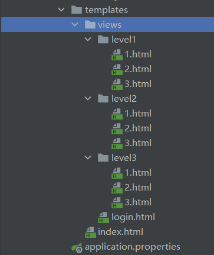

### 页面图标制定：

​	在public或static下创建favicon.ico的图片

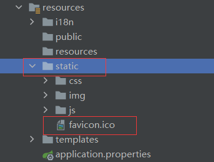

然后在application.properties中写入

~~~properties
spring.mvc.favicon.enabled=false
~~~


### 模板引擎：

导入包

~~~xml
<dependency>
    <groupId>org.springframework.boot</groupId>
    <artifactId>spring-boot-starter-thymeleaf</artifactId>
</dependency>
<dependency>
    <groupId>org.thymeleaf</groupId>
    <artifactId>thymeleaf-spring5</artifactId>
</dependency>
<dependency>
    <groupId>org.thymeleaf.extras</groupId>
    <artifactId>thymeleaf-extras-java8time</artifactId>
</dependency>
~~~

要在templates文件夹中创建html页面，否则识别不到

这里要注意的是在页面头部一定要引入  `xmlns:th="http://www.thymeleaf.org"` 

~~~html
<!DOCTYPE html>
<html lang="en" xmlns:th="http://www.thymeleaf.org">
<head>
    <meta charset="UTF-8">
    <title>Title</title>
</head>
<body>
<div th:text="${msg}"></div>
</body>
</html>
~~~

~~~java
package com.sec.controller;

import org.springframework.stereotype.Controller;
import org.springframework.ui.Model;
import org.springframework.web.bind.annotation.RequestMapping;

@Controller
public class HelloController {
    @RequestMapping("/test")
    public String test(Model model){
        model.addAttribute("msg","hello,springboot!!!");
        return "test";
    }
}
~~~

访问：localhost:8080/test

### Thymeleaf语法：

**· 简单表达式 （simple expressions）**

- 　　${...}  变量表达式
- 　　*{...}  选择变量表达式
- 　　#{...}  消息表达式
- 　　@{...}  链接url表达式

**· 字面量**

- 　	'one text','another one!',...   文本
- 　　0,34,3.0,12.3,... 数值
- 　　true false 布尔类型
- 　　null 空
- ​       one,sometext,main 文本字符

**· 文本操作**

- 　　+  字符串连接
- 　　|The name is ${name}|  字符串连接

**· 算术运算**

- 　　+ , - , * , / , %  二元运算符
- 　　-  负号（一元运算符）

**· 布尔操作**

- 　　and,or  二元操作符
- 　　!,not 非（一元操作符）

**· 关系操作符**

- 　　> , < , >= , <= (gt , lt , ge , le)
- 　　== , != (eq, ne)

**· 条件判断**

- (if) ? (then)      if-then
- (if) ? (then) : (else)   if-then-else


详细语法：https://www.codercto.com/a/50477.html


### MVC配置原理：

#### 视图解析器：

ContentNegotiatingViewResolver.java------ViewResolver(接口)

 ViewResolver 实现了视图解析器接口的类，我们就可以把它看做视图解析器

MyMvcConfig.java

~~~java
package com.sec.config;

import org.springframework.context.annotation.Bean;
import org.springframework.context.annotation.Configuration;
import org.springframework.web.servlet.View;
import org.springframework.web.servlet.ViewResolver;
import org.springframework.web.servlet.config.annotation.InterceptorRegistry;
import org.springframework.web.servlet.config.annotation.WebMvcConfigurer;

import java.util.Locale;

//扩展springmvc
@Configuration
public class MyMvcConfig implements WebMvcConfigurer {
    //public interface ViewResolver 实现了视图解析器接口的类，我们就可以把它看做试图解析器
    @Bean
    public ViewResolver MyViewResolver(){
        return new MyViewResolver();
    }

    //自定义了一个自己的视图解析器MyViewResolver
    public static class MyViewResolver implements ViewResolver{

        @Override
        public View resolveViewName(String viewName, Locale locale) throws Exception {
            return null;
        }
    }
}

~~~

#### 视图跳转：

~~~java
package com.sec.config;

import org.springframework.context.annotation.Configuration;
import org.springframework.web.servlet.config.annotation.ViewControllerRegistry;
import org.springframework.web.servlet.config.annotation.WebMvcConfigurer;

import java.util.Locale;

//扩展springmvc   官方建议这样做
@Configuration
public class MyMvcConfig implements WebMvcConfigurer {
    

    //视图跳转
    @Override
    public void addViewControllers(ViewControllerRegistry registry) {
        registry.addViewController("/qwe").setViewName("test");
    }

}
~~~


在springboot中，有非常多的xxxxConfiguration，帮助我们进行扩展配置，只要看到了这个东西，我们就要注意了

### 国际化：

1. 首页配置：
   1. 注意点，所有页面的静态资源都需要使用thymeleaf接管；@{}
   2. url:   @{}
2. 页面国际化：
   1. 我们需要配置i18n文件
   2. 我们如果需要在项目中进行按钮自动切换，我们需要自定义一个组件`LocaleResolver`
   3. 记得将自己写的组件配置到spring容器  `@Bean`
   4.  #{}


**实现步骤：**①


②  MyLocaleResolver.java:

~~~java
package com.sec.config;

import org.springframework.web.servlet.LocaleResolver;
import org.thymeleaf.util.StringUtils;

import javax.servlet.http.HttpServletRequest;
import javax.servlet.http.HttpServletResponse;
import java.util.Locale;

public class MyLocaleResolver implements LocaleResolver {


@Override
public Locale resolveLocale(HttpServletRequest request) {
    //获取请求中的参数
    String l = request.getParameter("l");
    //如果没有就使用默认的
    Locale locale = Locale.getDefault();
    //如果请求的链接携带了国际化的参数
    if(!StringUtils.isEmpty(l)){
        //zh_CN
        String[] split = l.split("_");
        //国家，地区
         locale = new Locale(split[0], split[1]);
    }
    return locale;
}

@Override
public void setLocale(HttpServletRequest request, HttpServletResponse response, Locale locale) {

}
}
~~~

③

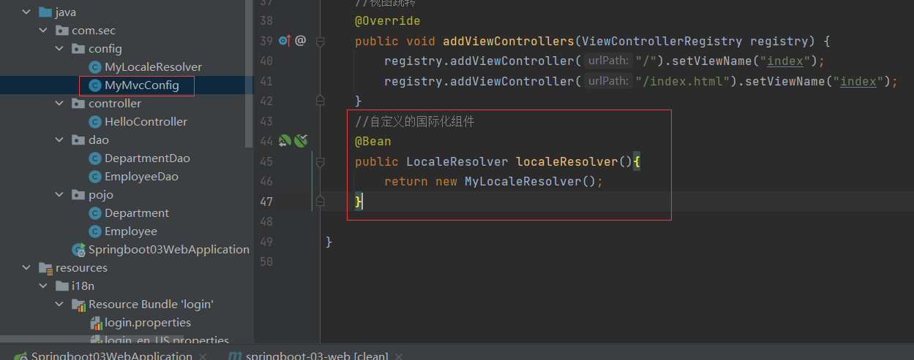


### 拦截器：

①登录跳转时设置session

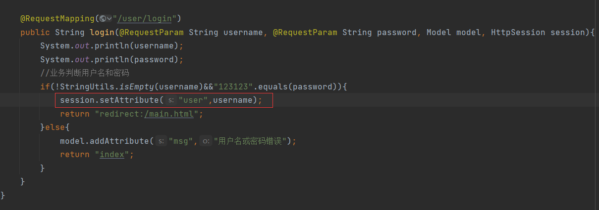

②在config文件下创建--------------LoginHandlerInterceptor.java

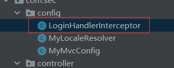

代码：

~~~java
package com.sec.config;

import org.springframework.web.servlet.HandlerInterceptor;

import javax.servlet.http.HttpServletRequest;
import javax.servlet.http.HttpServletResponse;

public class LoginHandlerInterceptor implements HandlerInterceptor {
@Override
public boolean preHandle(HttpServletRequest request, HttpServletResponse response, Object handler) throws Exception {
    Object user = request.getSession().getAttribute("user");
    if(user==null){
        request.setAttribute("msg","没有权限，请先登录");
        request.getRequestDispatcher("/index.html").forward(request,response);
        return  false;
    }else{
        return  true;
    }
}
}

~~~

③在自定义的配置文件中写以下内容：


代码：

~~~java
//拦截器
@Override
public void addInterceptors(InterceptorRegistry registry) {
    registry.addInterceptor(new LoginHandlerInterceptor()).addPathPatterns("/**").excludePathPatterns("/index.html","/","/css/**","/js/**","/img/**","/user/login");
}
~~~


### 自定义错误页面：

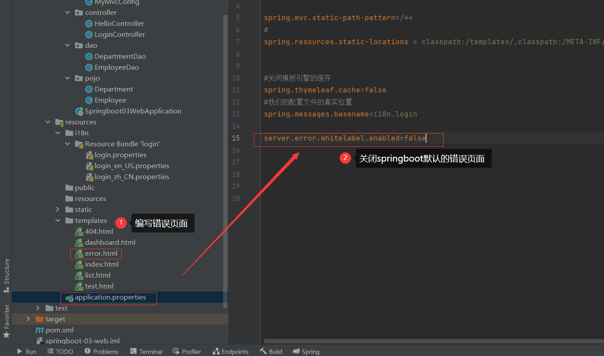


### 员工列表展示：

1. 提取公共页面
   1. 把公共部分写到commons文件夹下  命名为commons.html
   2. 使用th:replace="~{}"
2. 列表循环展示

#### 添加员工：

1. ~~~html
   <!--按钮跳转-->
   <h2><a href="" class="btn btn-sm btn-success" th:href="@{/emp}">添加员工</a></h2>
   ~~~

2. 跳转至添加员工的页面

   ~~~java
   @GetMapping("/emp")
   public String toAddPage(Model model){
       //获取部门
       Collection<Department> departments = departmentDao.getDepartments();
       model.addAttribute("departments",departments);
       return "emp/add";
   }
   ~~~

3. 添加员工的页面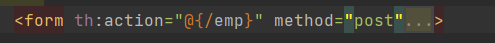

4. controller执行添加

~~~java
@PostMapping("/emp")
public String addEmp(Employee employee){
    //添加的操作
    employeeDao.save(employee);
    return "redirect:emps";//返回首页
}
~~~


#### 查询：

1. 使用thymeleaf语法跳转controller，利用controller实现查询方法

2. ~~~java
   @RequestMapping("/emps")
   public String list(Model model){
       Collection<Employee> employees = employeeDao.getAll();
       model.addAttribute("emps",employees);
       return "emp/list";
   }
   ~~~

3. 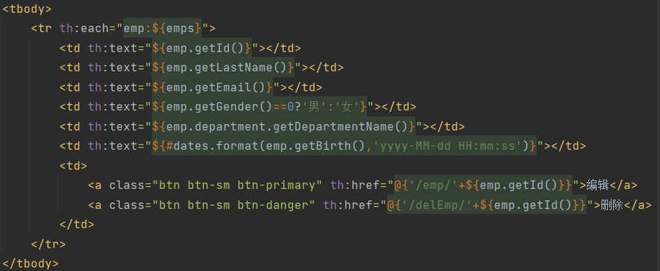


#### 修改：

1. 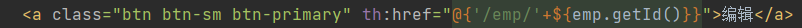

2. 跳转修改页面

   ~~~java
   @GetMapping("/emp/{id}")
   public String updEmp(@PathVariable("id")Integer id,Model model){
       //查出原来的数据
       Employee emlpoyee = employeeDao.getEmlpoyeeById(id);
       model.addAttribute("emp",emlpoyee);
       //查询部门信息
       Collection<Department> departments = departmentDao.getDepartments();
       model.addAttribute("departments",departments);
       return "emp/update";
   }
   ~~~

3. 修改页面

   ~~~html
   <div th:replace="~{commons/commons::topbar}"></div>
   
   <div class="container-fluid">
   <div class="row">
   <div th:replace="~{commons/commons::sidebar}"></div>
   
   <main role="main" class="col-md-9 ml-sm-auto col-lg-10 pt-3 px-4">
     <form th:action="@{/updateEmp}" method="post">
       <div class="form-group">
         <lable>姓名</lable>
         <input type="hidden" class="form-control" name="id" th:value="${emp.getId()}">
         <input type="text" class="form-control" name="lastName" th:value="${emp.getLastName()}" />
       </div>
       <div class="form-group">
         <lable>邮箱</lable>
         <input type="email" class="form-control" name="email" th:value="${emp.getEmail()}" />
       </div>
       <div class="form-group">
         <lable>性别</lable>
         <br>
         <div class="form-check form-check-inline">
           <input class=form-check-input type="radio" name="gender" value="0" th:checked="${emp.getGender()==0}" />
           <lable class=form-check-label>男</lable>
         </div>
         <div class="form-check form-check-inline">
           <input class="form-check-input" type="radio" name="gender" value="1" th:checked="${emp.getGender()==1}" />
           <lable class="form-check-label">女</lable>
         </div>
       </div>
       <div class="form-group">
         <label>部门</label>
         <select class="form-control" name="department.id">
           <option th:selected="${dep.getDepartmentName()==emp.getDepartment()}" th:each="dep:${departments}" th:text="${dep.getDepartmentName()}" th:value="${dep.getId()}"></option>
         </select>
       </div>
       <div class="form-group">
         <label>生日</label>
         <input type="text" class="form-control" name="birth" placeholder="2020-5-22" th:value="${#dates.format(emp.getBirth(),'yyyy-MM-dd HH:mm:ss')}" />
       </div>
       <button type="submit" class="btn btn-primary">修改</button>
     </form>
   
   </main>
   </div>
   </div>
   ~~~

4. 执行修改

   ~~~java
   @PostMapping("/updateEmp")
       public String doUpdEmp(Employee employee){
           employeeDao.save(employee);
           return "redirect:/emps";
       }
   ~~~

   

   #### 删除：

   1. 按钮

   2. 执行删除

      ~~~java
      @GetMapping("/delEmp/{id}")
          public String delEmp(@PathVariable("id")Integer id){
              employeeDao.delete(id);
              return "redirect:/emps";
          }
      ~~~

      #### 404页面：

      在templates文件下创建error文件夹，存放404页面，springboot自定识别

      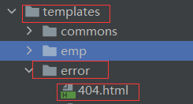

      访问一个错误的页面时，会跳转至404页面；

      500，400页面都是如此！

# 前端：

- 模板：别人写好的，我们拿来改就行了
- 框架：组件：自己手动组合拼接！Bootstrap，Layui，semantic-ui
  - 栅格系统
  - 导航栏
  - 侧边栏
  - 表单

- **前端搞定后，知道页面长什么样子，数据怎么传**
- **设计数据库（难点！）**
- **前端可以独立运行，独立化工程**
- **数据接口如何对接：json，对象all in one！**
- **前后端联调测试！**

1. 有一套自己熟悉的后台模板：工作必要！，----------xadmin

2. 前端界面：至少自己能够通过前端框架，组合出来一个网站页面
   1. index
   2. about
   3. blog
   4. post
   5. user

3. 让这个网站可以独立运行！

   

   

- JDBC
- **mybatis：重点**
- **Druid：重点**
- **Shiro：重点  （安全）**
- **Spring Security：重点 （安全）**
- 异步任务，邮件发送，定时任务
- Swagger
- Dubbo+Zookeeper

# 整合druid数据源

1. application.yml

   ~~~yaml
   #spring:
   #  datasource:
   #    username: root
   #    password: 123456
   #    rul: jdbc:mysql://localhost:3306/mybatis?serverTimezone=UTC&useUnicode=true&characterEncoding=utf-8
   #    driver: com.mysql.jdbc.Driver
   
   spring:
   datasource:
   data:
   username: root
   password: 123456
   url: jdbc:mysql://localhost:3306/mybatis?serverTimezone=UTC&useUnicode=true&characterEncoding=utf-8
   driver-class-name: com.mysql.cj.jdbc.Driver
   type: com.alibaba.druid.pool.DruidDataSource
   
   
   #springboot默认是不注入这些属性值的，需要自己绑定
   #druid 数据源专有配置
   initialSize: 5
   minIdle: 5
   maxActive: 20
   maxWait: 60000
   timeBetweenEvictionRunsMillis: 60000
   minEvictableIdleTimeMillis: 300000
   validationQuery: SELECT 1 FROM DUAL
   testWhileIdle: true
   testOnBorrow: false
   testOnReturn: false
   poolPreparedStatements: true
   
   #配置监控统计拦截的filters,stat:监控统计,log4j:日志记录、wall:防御sql注入
   #如果允许时报错  java.lang.ClassNotFoundException：org.apache.log4j.Priority
   #则导入 log4j 依赖即可，maven 地址：https://mvnrepository.com/artifact/log4j/log4j
   filters: stat,wall,log4j
   maxPoolPreparedStatementPerConnectionSize: 20
   useGlobalDataSourceStat: true
   connectionProperties: druid.stat.mergeSql=true;druid.stat.slowSqlMills=500
   ~~~

2. config===>DruidConfig.java

   ~~~java
   package com.sec.config;
   
   import com.alibaba.druid.pool.DruidDataSource;
   import com.alibaba.druid.support.http.StatViewServlet;
   import com.alibaba.druid.support.http.WebStatFilter;
   import org.springframework.boot.context.properties.ConfigurationProperties;
   import org.springframework.boot.web.servlet.FilterRegistrationBean;
   import org.springframework.boot.web.servlet.ServletRegistrationBean;
   import org.springframework.context.annotation.Bean;
   import org.springframework.context.annotation.Configuration;
   
   import javax.servlet.Filter;
   import javax.sql.DataSource;
   import java.util.HashMap;
   
   @Configuration
   public class DruidConfig {
   //与application.yml绑定
   @ConfigurationProperties("spring.datasource")
   @Bean
   public DataSource druidDataSource(){
       return new DruidDataSource();
   }
   
   //后台监控    ：web.xml   ,   ServletRegistrationBean
   //因为springboot内置了servlet容器，所以没有web.xml， 替方法：ServletRegistrationBean
   @Bean
   public ServletRegistrationBean statViewServlet(){
       ServletRegistrationBean<StatViewServlet> bean = new ServletRegistrationBean<>(new StatViewServlet(), "/druid/*");
       HashMap<String, String> initParameters = new HashMap<>();
       initParameters.put("loginUsername","admin");
       initParameters.put("loginPassword","123456");
   
       //谁可以访问
       initParameters.put("allow","");
   
       //谁不能访问   initParameters.put("haojiacheng","192.168.11.123");
   
       bean.setInitParameters(initParameters);//设置初始化参数
   
       return bean;
   }
   //filter过滤器
   @Bean
   public FilterRegistrationBean webStatFilter(){
       FilterRegistrationBean<Filter> bean = new FilterRegistrationBean<>();
       bean.setFilter(new WebStatFilter());
       //可以过滤哪些请求呢？
       HashMap<String, String> initParameters = new HashMap<>();
       //这些东西不进行统计
       initParameters.put("exclusions","*.js,*.css,/druid/*");
       bean.setInitParameters(initParameters);
       return  bean;
   }
   }
   
   ~~~

   

# 整合mybatis数据源

1. 导入包

   ~~~xml
   <dependency>
       <groupId>org.mybatis.spring.boot</groupId>
       <artifactId>mybatis-spring-boot-starter</artifactId>
       <version>2.1.1</version>
   </dependency>
   ~~~

2. 配置文件
   application.properties

   ~~~properties
   spring.datasource.driver-class-name=com.mysql.cj.jdbc.Driver
   spring.datasource.username=root
   spring.datasource.password=123456
   spring.datasource.url=jdbc:mysql://localhost:3306/mybatis?serverTimezone=UTC&useUnicode=true&characterEncoding=utf-8
   
   #整合mybatis
   mybatis.type-aliases-package=com.sec.pojo
   mybatis.mapper-locations=classpath:mybatis/mapper/*.xml
   ~~~

3. 编写sql

4. 业务层调用dao层

# springSecurity(安全)

在web开发中，安全第一位！过滤器，拦截器

功能性需求：否

做网站：安全应该在设计之初的时候考虑

- 漏洞，隐私泄露
- 架构一旦确定，更改成本很高

shiro、springSecurity:很像、除了类不一样，名字不一样；

认证，授权（vip1，vip2，vip3）


- 功能权限
- 访问权限
- 菜单权限
- ……拦截器，过滤器：大量的原生代码   冗余

MVC—spring---springboot---架构思想


AOP：横切—配置类


**简介**

Spring Security是针对spring项目的安全框架，也是springboot底层安全模块默认的技术选型，他可以实现强大的web安全控制，对于安全控制，我们仅需要引入spring-boot-starter-security模块，进行少量的配置，即可实现强大的安全管理！

记住几个类：

- WebSecurityConfigurerAdapter：自定义security策略
- AuthenticationManagerBuilder：自定义认证策略
- @EnableWebSecurity：开启WebSecurity模式   @Enablexxxx开启某个功能

spring security的两个主要目标是“认证”和“授权”（访问控制）。

“认证”（Authentication）

“授权”（Authorization）

这个概念是通用的，而不是只在springsecurity中存在。


参考官网：https://spring.io/projects/spring-security ,查看我们自己项目中的版本，找到对应的帮助文档：

https://docs.spring.io/spring-security/site/docs/5.2.0.RELEASE/reference/htmlsingle


## 环境搭建：

在com.sec下创建config，在config下创建SecurityConfig

导入依赖：

~~~xml
<!--security-thymeleaf整合包 -->
<dependency>
    <groupId>org.thymeleaf.extras</groupId>
    <artifactId>thymeleaf-extras-springsecurity5</artifactId>
    <version>3.0.4.RELEASE</version>
</dependency>
<!--security-->
<dependency>
    <groupId>org.springframework.boot</groupId>
    <artifactId>spring-boot-starter-security</artifactId>
</dependency>
<!--thymeleaf-->
<dependency>
    <groupId>org.springframework.boot</groupId>
    <artifactId>spring-boot-starter-thymeleaf</artifactId>
</dependency>
<!--web-->
<dependency>
    <groupId>org.springframework.boot</groupId>
    <artifactId>spring-boot-starter-web</artifactId>
</dependency>
~~~


## 授权

- 权限访问问题
- 防止网站攻击，也是注销失败可能出现的原因

## 认证

- 通过设置用户登录名和密码以及权限来相对于的显示页面当前权限该显示的模块

~~~java
package com.sec.config;

import org.springframework.security.config.annotation.authentication.builders.AuthenticationManagerBuilder;
import org.springframework.security.config.annotation.web.builders.HttpSecurity;
import org.springframework.security.config.annotation.web.configuration.EnableWebSecurity;
import org.springframework.security.config.annotation.web.configuration.WebSecurityConfigurerAdapter;
import org.springframework.security.crypto.bcrypt.BCryptPasswordEncoder;

//AOP思想
@EnableWebSecurity
public class SecurityConfig extends WebSecurityConfigurerAdapter {
//授权
//链式编程
@Override
protected void configure(HttpSecurity http) throws Exception {
    //首页所有人可以访问，功能页只有有权限的人才可以访问
    //请求权限的规则
    http.authorizeRequests()
            .antMatchers("/").permitAll()
            .antMatchers("/level1/**").hasRole("vip1")
            .antMatchers("/level2/**").hasRole("vip2")
            .antMatchers("/level3/**").hasRole("vip3");
    //没有权限默认跳转到登录界面    /login
    http.formLogin();


    //防止网站攻击
    http.csrf().disable();//注销失败可能出现的原因

    //注销    清楚cookie和session：   logout().deleteCookies("remove").invalidateHttpSession(true)
    //    .logoutUrl()  ：注销的页面     logoutSuccessUrl("/")  ： 注销成功的页面
    http.logout().logoutSuccessUrl("/");

}

//认证

@Override
protected void configure(AuthenticationManagerBuilder auth) throws Exception {
    auth.inMemoryAuthentication().passwordEncoder(new BCryptPasswordEncoder())
            .withUser("haojiacheng").password(new BCryptPasswordEncoder().encode("123456")).roles("vip2","vip3")
            .and().withUser("mihua").password(new BCryptPasswordEncoder().encode("654321")).roles("vip1","vip2","vip3")
            .and().withUser("user").password(new BCryptPasswordEncoder().encode("111111")).roles("vip1")
            .and().withUser("zhangsan").password(new BCryptPasswordEncoder().encode("123456")).roles("vip1")
            .and().withUser("lisi").password(new BCryptPasswordEncoder().encode("123456")).roles("vip2")
            .and().withUser("wangwu").password(new BCryptPasswordEncoder().encode("123456")).roles("vip3");

}
}

~~~

## 用户名与角色权限显示

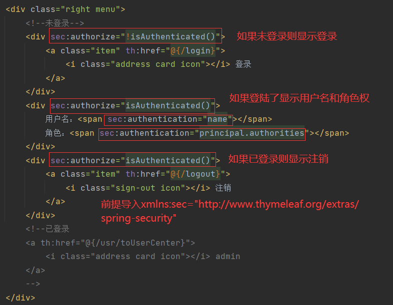


## 不同的权限显示不同的模块：

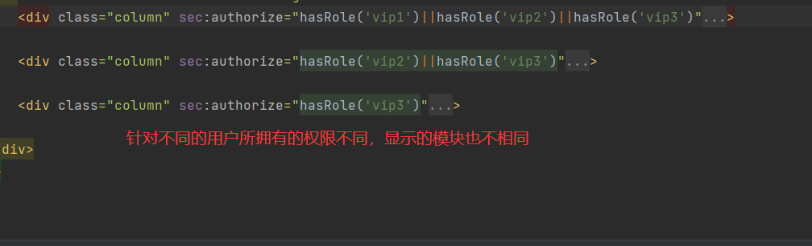

## 记住我：

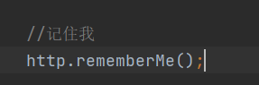

- 用户勾选后，网页存入cookie，cookie存在时长14天
- 但是用户手动删除cookie或者注销，则`记住我`失效


## 首页定制：

- loginPage("/toLogin")：设置自定义登录页面

- usernameParameter("user")：设置自定义登录页面的用户输入的用户名的name

- passwordParameter("pwd")：设置自定义登录页面的用户输入的密码的name

  - ~~~html
    <form th:action="@{/login}" method="post">
        <div class="field">
            <label>Username</label>
            <div class="ui left icon input">
                <input type="text" placeholder="Username" name="user">
                <i class="user icon"></i>
            </div>
        </div>
        <div class="field">
            <label>Password</label>
            <div class="ui left icon input">
                <input type="password" name="pwd">
                <i class="lock icon"></i>
            </div>
        </div>
        <div class="field">
            <input type="checkbox" name="remember">记住我
        </div>
        <input type="submit" class="ui blue submit button"/>
    </form>
    ~~~

- loginProcessingUrl("/login")：设置登录提交信息的页面，也就是自己跳转自己，springboot判断正确则跳至主页面

~~~java
http.formLogin().loginPage("/toLogin").usernameParameter("user").passwordParameter("pwd").loginProcessingUrl("/login");
~~~


## Shiro

### **maven项目：**

1. 导入依赖  pom.xml

   ~~~xml
   <dependencies>
           <dependency>
               <groupId>org.apache.shiro</groupId>
               <artifactId>shiro-core</artifactId>
               <version>1.4.1</version>
           </dependency>
   
           <!-- configure logging -->
           <dependency>
               <groupId>org.slf4j</groupId>
               <artifactId>jcl-over-slf4j</artifactId>
               <version>1.7.21</version>
           </dependency>
           <dependency>
               <groupId>org.slf4j</groupId>
               <artifactId>slf4j-log4j12</artifactId>
               <version>1.7.21</version>
           </dependency>
           <dependency>
               <groupId>log4j</groupId>
               <artifactId>log4j</artifactId>
               <version>1.2.17</version>
           </dependency>
       </dependencies>
   ~~~

2. 配置文件

   1. log4j.properties:

      ~~~properties
      log4j.rootLogger=INFO, stdout
      
      log4j.appender.stdout=org.apache.log4j.ConsoleAppender
      log4j.appender.stdout.layout=org.apache.log4j.PatternLayout
      log4j.appender.stdout.layout.ConversionPattern=%d %p [%c] - %m %n
      
      # General Apache libraries
      log4j.logger.org.apache=WARN
      
      # Spring
      log4j.logger.org.springframework=WARN
      
      # Default Shiro logging
      log4j.logger.org.apache.shiro=INFO
      
      # Disable verbose logging
      log4j.logger.org.apache.shiro.util.ThreadContext=WARN
      log4j.logger.org.apache.shiro.cache.ehcache.EhCache=WARN
      ~~~

   2. shiro.ini:    如果没有代码没有高亮 去下载idea的插件：ini 

      ~~~ini
      [users]
      # user 'root' with password 'secret' and the 'admin' role
      root = secret, admin
      # user 'guest' with the password 'guest' and the 'guest' role
      guest = guest, guest
      # user 'presidentskroob' with password '12345' ("That's the same combination on
      # my luggage!!!" ;)), and role 'president'
      presidentskroob = 12345, president
      # user 'darkhelmet' with password 'ludicrousspeed' and roles 'darklord' and 'schwartz'
      darkhelmet = ludicrousspeed, darklord, schwartz
      # user 'lonestarr' with password 'vespa' and roles 'goodguy' and 'schwartz'
      lonestarr = vespa, goodguy, schwartz
      
      # -----------------------------------------------------------------------------
      # Roles with assigned permissions
      #
      # Each line conforms to the format defined in the
      # org.apache.shiro.realm.text.TextConfigurationRealm#setRoleDefinitions JavaDoc
      # -----------------------------------------------------------------------------
      [roles]
      # 'admin' role has all permissions, indicated by the wildcard '*'
      admin = *
      # The 'schwartz' role can do anything (*) with any lightsaber:
      schwartz = lightsaber:*
      # The 'goodguy' role is allowed to 'drive' (action) the winnebago (type) with
      # license plate 'eagle5' (instance specific id)
      goodguy = winnebago:drive:eagle5
      ~~~

   3. QuickStart.java:

      ~~~java
      import org.apache.shiro.SecurityUtils;
      import org.apache.shiro.authc.*;
      import org.apache.shiro.config.IniSecurityManagerFactory;
      import org.apache.shiro.mgt.SecurityManager;
      import org.apache.shiro.session.Session;
      import org.apache.shiro.subject.Subject;
      import org.apache.shiro.util.Factory;
      import org.slf4j.Logger;
      import org.slf4j.LoggerFactory;
      
      public class Quickstart {
      
      private static final transient Logger log = LoggerFactory.getLogger(Quickstart.class);
      
      
      public static void main(String[] args) {
      
          // 创建具有已配置领域，用户，角色和权限的Shiro SecurityManager的最简单方法是使用简单的INI配置。
          // 我们将通过使用可以提取.ini文件并返回SecurityManager实例的工厂来做到这一点：
          // 在类路径的根目录下使用shiro.ini文件（分别从文件和url加载前缀：file：和url：）：
          Factory<SecurityManager> factory = new IniSecurityManagerFactory("classpath:shiro.ini");
          SecurityManager securityManager = factory.getInstance();
      
          // 对于这个简单的示例快速入门，使SecurityManager可以作为JVM单例进行访问。大多数应用程序不会这样做，
          // 而是依赖于其容器配置或webapps的web.xml。这超出了此简单快速入门的范围，因此我们将只做最少的工作，
          // 以便您可以继续感受一下。
          SecurityUtils.setSecurityManager(securityManager);
      
          // 获取当前执行的用户：Subject
          Subject currentUser = SecurityUtils.getSubject();
      
          // 通过当前用户拿到session
          Session session = currentUser.getSession();
          session.setAttribute("someKey", "aValue");
          String value = (String) session.getAttribute("someKey");
          if (value.equals("aValue")) {
              log.info("Subject==>Session [" + value + "]");
          }
      
          // 判断当前的用户是否被认证   isAuthenticated=>已认证
          if (!currentUser.isAuthenticated()) {
              UsernamePasswordToken token = new UsernamePasswordToken("lonestarr", "vespa");
              token.setRememberMe(true);
              try {
                  //登录
                  currentUser.login(token);
              } catch (UnknownAccountException uae) {//未知帐户异常
                  log.info("There is no user with username of " + token.getPrincipal());
              } catch (IncorrectCredentialsException ice) {//账号密码不正确
                  log.info("Password for account " + token.getPrincipal() + " was incorrect!");
              } catch (LockedAccountException lae) {//锁定帐户异常
                  log.info("The account for username " + token.getPrincipal() + " is locked.  " +
                          "Please contact your administrator to unlock it.");
              }
              // 在这里捕获更多异常（也许是针对您的应用程序的自定义异常？
              catch (AuthenticationException ae) {
                  //意外情况？错误？
              }
          }
      
          //说出他们是谁：打印其身份验证主体（在这种情况下，为用户名）：
          log.info("User [" + currentUser.getPrincipal() + "] logged in successfully.");
      
          //测试角色：
          if (currentUser.hasRole("schwartz")) {
              log.info("May the Schwartz be with you!");
          } else {
              log.info("Hello, mere mortal.");
          }
      
          //测试类型化的权限（不是实例级别）  isPermitted: 被允许
          if (currentUser.isPermitted("lightsaber:wield")) {
              log.info("You may use a lightsaber ring.  Use it wisely.");
          } else {
              log.info("Sorry, lightsaber rings are for schwartz masters only.");
          }
      
          //（非常强大的）实例级别权限：
          if (currentUser.isPermitted("winnebago:drive:eagle5")) {
              log.info("You are permitted to 'drive' the winnebago with license plate (id) 'eagle5'.  " +
                      "Here are the keys - have fun!");
          } else {
              log.info("Sorry, you aren't allowed to drive the 'eagle5' winnebago!");
          }
      
          //注销！
          currentUser.logout();
      
          System.exit(0);
      }
      }
      
      ~~~

3. Hello World!
   


Spring Security都有

~~~java
Subject currentUser = SecurityUtils.getSubject();//获取当前用户
Session session = currentUser.getSession();//通过当前用户获取session
!currentUser.isAuthenticated()；//当前用户未认证
currentUser.login(token);//登录
currentUser.hasRole("schwartz")；//当前用户的角色
currentUser.isPermitted("lightsaber:wield")；//当前用户有什么权限
currentUser.isPermitted("winnebago:drive:eagle5")；//权限
currentUser.logout();//注销
System.exit(0);//系统结束
~~~

### springboot集成shiro

#### 环境搭建

- pom.xml:       spring-boot-starter-parent===>2.4.5

~~~xml
<dependencies>
    <dependency>
        <groupId>org.apache.shiro</groupId>
        <artifactId>shiro-web</artifactId>
        <version>1.3.2</version>
    </dependency>
    <dependency>
        <groupId>org.apache.shiro</groupId>
        <artifactId>shiro-spring</artifactId>
        <version>1.4.1</version>
    </dependency>
    <dependency>
        <groupId>org.apache.shiro</groupId>
        <artifactId>shiro-core</artifactId>
        <version>1.4.1</version>
    </dependency>
    <dependency>
        <groupId>org.thymeleaf</groupId>
        <artifactId>thymeleaf-spring5</artifactId>
    </dependency>
    <dependency>
        <groupId>org.thymeleaf.extras</groupId>
        <artifactId>thymeleaf-extras-java8time</artifactId>
    </dependency>
    <dependency>
        <groupId>org.springframework.boot</groupId>
        <artifactId>spring-boot-starter-thymeleaf</artifactId>
    </dependency>
    <dependency>
        <groupId>org.springframework.boot</groupId>
        <artifactId>spring-boot-starter-web</artifactId>
    </dependency>
    <dependency>
        <groupId>org.springframework.boot</groupId>
        <artifactId>spring-boot-starter-test</artifactId>
        <scope>test</scope>
    </dependency>
</dependencies>
~~~

- 配置文件和controller
  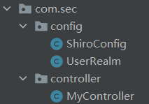

  - ShiroConfig:java:

    ~~~java
    package com.sec.config;
    
    import org.apache.shiro.spring.web.ShiroFilterFactoryBean;
    import org.apache.shiro.web.mgt.DefaultWebSecurityManager;
    import org.springframework.beans.factory.annotation.Qualifier;
    import org.springframework.context.annotation.Bean;
    import org.springframework.context.annotation.Configuration;
    
    @Configuration
    public class ShiroConfig {
        //ShiroFilterFactoryBean:3
        @Bean
        public ShiroFilterFactoryBean getShiroFilterFactoryBean(@Qualifier("getDefaultWebSecurityManager") DefaultWebSecurityManager defaultWebSecurityManager){
            ShiroFilterFactoryBean bean=new ShiroFilterFactoryBean();
            //设置安全管理器
            bean.setSecurityManager(defaultWebSecurityManager);
            return bean;
        }
        //DefaultWebSecurityManager:2
        //如果我们在某个注入点需要另一个 bean，我们需要专门指出它。我们可以通过 @Qualifier 注解来做到这一点。
        @Bean
        public DefaultWebSecurityManager getDefaultWebSecurityManager(@Qualifier("userRealm") UserRealm userRealm){
            DefaultWebSecurityManager securityManager = new DefaultWebSecurityManager();
            //关联UserRealm
            securityManager.setRealm(userRealm);
    
            return securityManager;
        }
    
        //创建 realm 对象 ， 需要自定义:1
        @Bean(name = "userRealm")
        public UserRealm userRealm(){
            return new UserRealm();
        }
    }
    
    ~~~

  - UserRealm.java

    ~~~java
    package com.sec.config;
    
    
    import org.apache.shiro.authc.AuthenticationException;
    import org.apache.shiro.authc.AuthenticationInfo;
    import org.apache.shiro.authc.AuthenticationToken;
    import org.apache.shiro.authz.AuthorizationInfo;
    import org.apache.shiro.realm.AuthorizingRealm;
    import org.apache.shiro.subject.PrincipalCollection;
    
    //自定义的 UserRealm
    public class UserRealm extends AuthorizingRealm {
        @Override
        //doGetAuthenticationInfo：获取身份验证信息
        protected AuthenticationInfo doGetAuthenticationInfo(AuthenticationToken authenticationToken) throws AuthenticationException {
            System.out.println("执行了=>授权doGetAuthenticationInfo:获取身份验证信息");
            return null;
        }
    
        @Override
        //doGetAuthorizationInfo：获取授权信息
        protected AuthorizationInfo doGetAuthorizationInfo(PrincipalCollection principalCollection) {
            System.out.println("执行了=>doGetAuthorizationInfo:获取授权信息");
            return null;
        }
    }
    
    ~~~

  - MyController.java

    ~~~java
    package com.sec.controller;
    
    import org.springframework.stereotype.Controller;
    import org.springframework.ui.Model;
    import org.springframework.web.bind.annotation.RequestMapping;
    
    @Controller
    public class MyController {
        @RequestMapping({"/","/index","/index.html"})
        public String toIndex(Model model){
            model.addAttribute("msg","hello shiro");
            return "index";
        }
        @RequestMapping("/user/add")
        public String add(){
            return "user/add";
        }
    
        @RequestMapping("/user/upd")
        public String upd(){
            return "/user/upd";
        }
    }
    
    ~~~

- 页面：
  

  - add.html：

    ~~~html
    <!DOCTYPE html>
    <html lang="en">
    <head>
        <meta charset="UTF-8">
        <title>Title</title>
    </head>
    <body>
    <h1>add</h1>
    </body>
    </html>
    ~~~

  - upd.html：

    ~~~html
    <!DOCTYPE html>
    <html lang="en">
    <head>
        <meta charset="UTF-8">
        <title>Title</title>
    </head>
    <body>
    <h1>upd</h1>
    </body>
    </html>
    ~~~

  - index.html：

    ~~~html
    <!DOCTYPE html>
    <html lang="en" xmlns:th="http://www.thymeleaf.org">
    <head>
        <meta charset="UTF-8">
        <title>Title</title>
    </head>
    <body>
    <h2>我是index</h2>
    <p th:text="${msg}"></p>
    <hr>
    
    <a th:href="@{/user/add}">add</a> ||  <a th:href="@{/user/upd}">upd</a>
    </body>
    </html>
    ~~~

  - application.properties：

    ~~~properties
    spring.thymeleaf.cache=false
    ~~~

#### Shiro实现登录拦截

- Shiro的内置过滤器
  - anon：无需认证就可以访问
  - authc：必须认证了才能访问
  - user：必须拥有  记住我  功能才能用
  - perms：拥有对某个资源的权限才能访问

- ~~~java
  LinkedHashMap<String, String> filterMap = new LinkedHashMap<>();
  filterMap.put("/user/*","authc");
  bean.setFilterChainDefinitionMap(filterMap);
  //设置登录的请求
  bean.setLoginUrl("/toLogin");
  ~~~


1. UserRealm：

   ~~~java
   @Override
   //doGetAuthenticationInfo：获取身份验证信息
   protected AuthenticationInfo doGetAuthenticationInfo(AuthenticationToken authenticationToken) throws AuthenticationException {
       System.out.println("执行了=>认证doGetAuthenticationInfo:获取身份验证信息");
   
       //用户名和密码  原本来数据库中取
       String name="admin";
       String pwd="123123";
   
       //加密令牌
       UsernamePasswordToken uToken= (UsernamePasswordToken) authenticationToken;
       //判断用户名
       if(!uToken.getUsername().equals(name)){
           return null;//这里返回null  也就是抛出异常 UnknownAccountException
       }
       //密码认证：shiro做
       return new SimpleAuthenticationInfo("",pwd,"");
   }
   ~~~

2. login.html：  登录界面

   ~~~html
   <!DOCTYPE html>
   <html lang="en" xmlns:th="http://www.thymeleaf.org">
   <head>
       <meta charset="UTF-8">
       <title>登录</title>
   </head>
   <body>
   <h1>登录</h1>
   <p th:text="${msg}" style="color: red"></p>
   <form th:action="@{/login}" method="post">
     <p>用户名：<input type="text" name="username"></p>
   
     <p>密码：<input type="password" name="password"></p>
     <p><input type="submit" ></p>
   </form>
   </body>
   </html>
   ~~~

3. 跳转登录  and    登录执行

   ~~~java
   @RequestMapping("/toLogin")
       public String toLogin(){
           return "login";
   }
   
   @RequestMapping("/login")
   public String login(String username,String password,Model model){
       //获取当前用户
       Subject subject = SecurityUtils.getSubject();
       //封装用户的登录数据
       UsernamePasswordToken token = new UsernamePasswordToken(username, password);
       try {
           subject.login(token);
           return "index";
       } catch (UnknownAccountException e) {
           model.addAttribute("msg","用户名错误");
           return "login";
       } catch (IncorrectCredentialsException e){
           model.addAttribute("msg","密码错误");
           return "login";
       }
   }
   ~~~


#### Shiro整合mybatis

1. pom.xml:

   ~~~xml
   <dependencies>
       <dependency>
           <groupId>org.apache.shiro</groupId>
           <artifactId>shiro-web</artifactId>
           <version>1.3.2</version>
       </dependency>
       <dependency>
           <groupId>org.projectlombok</groupId>
           <artifactId>lombok</artifactId>
           <version>1.18.12</version>
       </dependency>
       <dependency>
           <groupId>mysql</groupId>
           <artifactId>mysql-connector-java</artifactId>
       </dependency>
       <dependency>
           <groupId>log4j</groupId>
           <artifactId>log4j</artifactId>
           <version>1.2.17</version>
       </dependency>
       <dependency>
           <groupId>com.alibaba</groupId>
           <artifactId>druid</artifactId>
           <version>1.1.21</version>
       </dependency>
       <dependency>
           <groupId>org.mybatis.spring.boot</groupId>
           <artifactId>mybatis-spring-boot-starter</artifactId>
           <version>2.1.1</version>
       </dependency>
       <dependency>
           <groupId>org.apache.shiro</groupId>
           <artifactId>shiro-spring</artifactId>
           <version>1.4.1</version>
       </dependency>
       <dependency>
           <groupId>org.apache.shiro</groupId>
           <artifactId>shiro-core</artifactId>
           <version>1.4.1</version>
       </dependency>
       <dependency>
           <groupId>org.thymeleaf</groupId>
           <artifactId>thymeleaf-spring5</artifactId>
       </dependency>
       <dependency>
           <groupId>org.thymeleaf.extras</groupId>
           <artifactId>thymeleaf-extras-java8time</artifactId>
       </dependency>
       <dependency>
           <groupId>org.springframework.boot</groupId>
           <artifactId>spring-boot-starter-thymeleaf</artifactId>
       </dependency>
       <dependency>
           <groupId>org.springframework.boot</groupId>
           <artifactId>spring-boot-starter-web</artifactId>
       </dependency>
   
       <dependency>
           <groupId>org.springframework.boot</groupId>
           <artifactId>spring-boot-starter-test</artifactId>
           <scope>test</scope>
       </dependency>
   </dependencies>
   ~~~

2. application.properties:

   ~~~properties
   spring.datasource.driver-class-name=com.mysql.cj.jdbc.Driver
   spring.datasource.username=root
   spring.datasource.password=123456
   spring.datasource.url=jdbc:mysql://localhost:3306/mybatis?serverTimezone=UTC&useUnicode=true&characterEncoding=utf-8
   
   mybatis.type-aliases-package=com.sec.pojo
   mybatis.mapper-locations=classpath:mapper/*.xml
   ~~~

3. UserRealm.java

   ~~~java
   package com.sec.config;
   
   import com.sec.pojo.User;
   import com.sec.service.userService;
   import org.apache.shiro.authc.*;
   import org.apache.shiro.authz.AuthorizationInfo;
   import org.apache.shiro.realm.AuthorizingRealm;
   import org.apache.shiro.subject.PrincipalCollection;
   import org.springframework.beans.factory.annotation.Autowired;
   
   //自定义的 UserRealm
   public class UserRealm extends AuthorizingRealm {
   
   @Autowired
   private userService uS;
   
   //授权
   @Override
   //doGetAuthorizationInfo：获取授权信息
   protected AuthorizationInfo doGetAuthorizationInfo(PrincipalCollection principalCollection) {
       System.out.println("执行了=>授权doGetAuthorizationInfo:获取授权信息");
       return null;
   }
   
   //认证
   @Override
   //doGetAuthenticationInfo：获取身份验证信息
   protected AuthenticationInfo doGetAuthenticationInfo(AuthenticationToken authenticationToken) throws AuthenticationException {
       System.out.println("执行了=>认证doGetAuthenticationInfo:获取身份验证信息");
       //加密令牌
       UsernamePasswordToken uToken= (UsernamePasswordToken) authenticationToken;
       User u = uS.selectUserByName(uToken.getUsername());
       if(u==null){
           return  null;
       }
       //密码可以加密：MD5  MD5盐值加密
       //密码认证：shiro做
       return new SimpleAuthenticationInfo("",u.getPwd(),"");
   }
   }
   
   ~~~

4. mapper=>userMapper.java

   ~~~java
   package com.sec.mapper;
   
   import com.sec.pojo.User;
   import org.apache.ibatis.annotations.Mapper;
   import org.springframework.stereotype.Repository;
   
   @Repository
   @Mapper
   public interface userMapper {
       public User selectUserByName(String name);
   }
   
   ~~~

5. service=>userService.java

   ~~~java
   package com.sec.service;
   
   import com.sec.pojo.User;
   
   public interface userService {
       public User selectUserByName(String name);
   }
   
   ~~~

6. service=>userServiceImpl.java

   ~~~java
   package com.sec.service;
   
   import com.sec.mapper.userMapper;
   import com.sec.pojo.User;
   import org.springframework.beans.factory.annotation.Autowired;
   import org.springframework.stereotype.Service;
   
   @Service
   public class userServiceImpl  implements userService{
   
       @Autowired
       private userMapper uM;
   
       @Override
       public User selectUserByName(String name) {
           return uM.selectUserByName(name);
       }
   }
   
   ~~~

7. resource=>mapper=>userMapper.xml:

   ~~~xml
   <?xml version="1.0" encoding="UTF-8" ?>
   <!DOCTYPE mapper
           PUBLIC "-//mybatis.org//DTD Mapper 3.0//EN"
           "http://mybatis.org/dtd/mybatis-3-mapper.dtd">
   <mapper namespace="com.sec.mapper.userMapper">
       <select id="selectUserByName" resultType="User">
           select * from user where name = #{name}
       </select>
   </mapper>
   ~~~

8. pojo=>User.java

   ~~~java
   package com.sec.pojo;
   
   import lombok.AllArgsConstructor;
   import lombok.Data;
   import lombok.NoArgsConstructor;
   import lombok.ToString;
   
   @Data
   @ToString
   @NoArgsConstructor
   @AllArgsConstructor
   public class User {
       private int id;
       private String name;
       private String pwd;
   }
   
   ~~~


#### 请求授权实现

1. ~~~java
   //授权，正常的情况下，没有授权会跳转到未授权页面
   filterMap.put("/user/add","perms[user:add]");//用户user需要拥有对add资源的权限
   ~~~

2. ~~~java
   //设置未授权页面
   bean.setUnauthorizedUrl("/noauth");
   ~~~

3. ~~~java
   @RequestMapping("/noauth")
   @ResponseBody
   public String unauthorized(){
       return "未经授权不得进入";
   }
   ~~~


#### 用户登录访问授权

- 从数据库拿用户的权限：

  ~~~java
  //授权
  @Override
  //doGetAuthorizationInfo：获取授权信息
  protected AuthorizationInfo doGetAuthorizationInfo(PrincipalCollection principalCollection) {
      System.out.println("执行了=>授权doGetAuthorizationInfo:获取授权信息");
      //SimpleAuthorizationInfo
      SimpleAuthorizationInfo info = new SimpleAuthorizationInfo();
      //拿到当前登录的这个对象
      Subject subject = SecurityUtils.getSubject();
      //拿到user对象
      User currentUser = (User) subject.getPrincipal();
      //设置当前用户权限
      info.addStringPermission(currentUser.getPerms());
      return info;
  }
  ~~~

- 设置用户对某资源的权限

  ~~~java
  //授权，正常的情况下，没有授权会跳转到未授权页面
  filterMap.put("/user/add","perms[user:add]");
  filterMap.put("/user/upd","perms[user:update]");
  ~~~

数据库表：

测试结果：root用户没有进入add的权限，user用户没有进入upd的权限


#### Shiro整合Thymeleaf

导入依赖：

~~~xml
<dependency>
    <groupId>com.github.theborakompanioni</groupId>
    <artifactId>thymeleaf-extras-shiro</artifactId>
    <version>2.0.0</version>
</dependency>
~~~

写Bean

~~~java
@Bean
public ShiroDialect getShiroDialect(){
    return new ShiroDialect();
}
~~~


- 方法一：在认证时存入当前用户到session中

  ~~~java
  Subject subject = SecurityUtils.getSubject();
  Session session = subject.getSession();
  session.setAttribute("loginUser",u);
  ~~~

  ~~~html
  <div th:if="${session.get('loginUser')==null}">
      <a th:href="@{/toLogin}">登录</a>
  </div>
  ~~~

- 方法二：

  ~~~html
  <div shiro:guest="true">
      <a th:href="@{/toLogin}">登录</a>
  </div>
  ~~~

- 方法三：

  ~~~html
  <div shiro:notAuthenticated="">
      <a th:href="@{/toLogin}">登录</a>
  </div>
  ~~~

  

~~~html
<div shiro:hasPermission="user:add">
    <a th:href="@{/user/add}">add</a>
</div>

<div shiro:hasPermission="user:update">
    <a th:href="@{/user/upd}">upd</a>
</div>
~~~

#### Swagger

学习目标：

- 了解Swagger的作用和概念
- 了解前后端分离
- 在SpringBoot中集成Swagger


## Swagger简介

**前后端分离**

Vue + SpringBoot

后端时代：前端只用管理静态页面； html==》后端。模板引擎 JSP =》 后端是主力


前后端分离时代：

- 后端：后端控制层、服务层、数据访问层【后端团队】
- 前端：前端控制层、视图层【前端团队】
  - 伪造后端数据，json。已经存在了，不需要后端，前端工程依旧可以跑起来
- 前后端如何交互？==》API
- 前后端相对独立，松耦合；
- 前后端甚至可以部署在不同的服务器上；


产生一个问题：

- 前后端集成联调，前端人员和后端人员无法做到“及时协商，尽早解决”，最终导致问题集中爆发；

解决方案：

- 首先指定schema[计划的提纲]，实时更新最新API，降低了集成的风险；
- 早些年：制定word计划文档；
- 前后端分离：
  - 前端测试后端接口：postman
  - 后端提供接口，需要实时更新最新的消息及改动！


## Swagger

- 号称世界上最流行的API框架
- RestFul API 文档在线自动生成工具=》==API文档与API定义同步更新==
- 直接运行，可以在线测试API接口；
- 支持多种语言：（java，PHP）；


官网：https://swagger.io


在项目使用Swagger需要springbox；

- swagger2
- ui


# SpringBoot 集成Swagger

1. 新建一个springboot-web项目

2. 导入相关依赖

   ~~~xml
   <!-- https://mvnrepository.com/artifact/io.springfox/springfox-swagger2 -->
   <dependency>
       <groupId>io.springfox</groupId>
       <artifactId>springfox-swagger2</artifactId>
       <version>2.9.2</version>
   </dependency>
   <!-- https://mvnrepository.com/artifact/io.springfox/springfox-swagger-ui -->
   <dependency>
       <groupId>io.springfox</groupId>
       <artifactId>springfox-swagger-ui</artifactId>
       <version>2.9.2</version>
   </dependency>
   
   ~~~

3. 编写一个Hello工程

4. 配置swagger==》Config

   ~~~java
   package com.sec.config;
   
   import org.springframework.context.annotation.Configuration;
   import springfox.documentation.swagger2.annotations.EnableSwagger2;
   
   @Configuration
   @EnableSwagger2     //开启Swagger2
   public class SwaggerConfig {
       
   }
   ~~~

5. 测试运行
   http://localhost:8080/swagger-ui.html


### 配置Swagger

Swagger的bean实例Docket；

com.sec.config=>SwaggerConfig.java

- ~~~java
  package com.sec.config;
  
  import org.springframework.context.annotation.Bean;
  import org.springframework.context.annotation.Configuration;
  import springfox.documentation.service.ApiInfo;
  import springfox.documentation.service.Contact;
  import springfox.documentation.spi.DocumentationType;
  import springfox.documentation.spring.web.plugins.Docket;
  import springfox.documentation.swagger2.annotations.EnableSwagger2;
  
  import java.util.ArrayList;
  
  @Configuration
  @EnableSwagger2     //开启Swagger2
  public class SwaggerConfig {
  
      //配置swagger的Docket的bean实例
      @Bean
      public Docket docket(){
          return new Docket(DocumentationType.SWAGGER_2).apiInfo(apiInfo());
      }
  
      //配置swagger信息=apiInfo
      private ApiInfo apiInfo(){
          //作者信息
          Contact contact = new Contact("郝嘉诚", "http://haojiacheng.cn", "990784805@qq.com");
  
          return new ApiInfo("苏弋的swaggerAPI文档",
                  "不积硅步无以至千里",
                  "v1.0",
                  "http://haojiacheng.cn",
                  contact,
                  "Apache 2.0",
                  "http://www.apache.org/licenses/LICENSE-2.0",
                  new ArrayList()
          );
      }
  }
  
  ~~~


### Swagger配置扫描接口

Docket.select()

~~~java
//配置swagger的Docket的bean实例
    @Bean
    public Docket docket(){
        return new Docket(DocumentationType.SWAGGER_2)
                .apiInfo(apiInfo())
                .select()
                //RequestHandlerSelectors：配置要扫描接口的方式
                //basePackage：指定要扫描的包
                //any():扫描全部
                //none()：不扫描
                //withMethodAnnotation:扫描方法上的注解，参数是注解的反射对象
                //withClassAnnotation:扫描类上的注解
                .apis(RequestHandlerSelectors.basePackage("com.sec.controller"))
                //paths:过滤什么路径
                .paths(PathSelectors.ant("/sec/**"))
                .build();
    }
~~~

**配置是否启动swagger**

~~~java
.enable(false)//为false时则swagger不能在浏览器中访问
~~~

我只希望我的swagger在生产环境中使用，在发布的时候不用？

- 判断是不是生产环境    flag=false
- 注入enable(flag)

==步骤==：

1. application.properties:   执行dev

   ~~~properties
   spring.profiles.active=dev
   ~~~

2. application-dev.properties:   

   ~~~properties
   server.port=8081
   ~~~

3. application-prod.properties: 

   ~~~properties
   server.port=8082
   ~~~

4. SwaggerConfig.java:

   ~~~java
   package com.sec.config;
   
   ....
       
   @Configuration
   @EnableSwagger2     //开启Swagger2
   public class SwaggerConfig {
   
       //配置swagger的Docket的bean实例
       @Bean
       public Docket docket(Environment environment){
           //设置要显示的Swagger环境
           Profiles profiles = Profiles.of("dev","test");
   
           //获取项目的环境：
           //通过environment.acceptsProfiles判断此时是否处于自己设定的环境
           boolean flag = environment.acceptsProfiles(profiles);
   
           return new Docket(DocumentationType.SWAGGER_2)
                   .apiInfo(apiInfo())
                   //enable：是否启动swagger
                   .enable(flag)//若为false，则在浏览器中不能访问swagger-ui.html
                   .select()
                   .apis(RequestHandlerSelectors.basePackage("com.sec.controller"))
                   .build();
       }
   
       //配置swagger信息=apiInfo
       private ApiInfo apiInfo(){
           //作者信息
           Contact contact = new Contact("郝嘉诚", "http://haojiacheng.cn", "990784805@qq.com");
   
           return new ApiInfo("苏弋的swaggerAPI文档",
                   "不积硅步无以至千里",
                   "v1.0",
                   "http://haojiacheng.cn",
                   contact,
                   "Apache 2.0",
                   "http://www.apache.org/licenses/LICENSE-2.0",
                   new ArrayList()
           );
       }
   }
   
   ~~~

   

配置API文档的分组

```java
.groupName("郝嘉诚")
```

如何配置多个分组；多个Docket即可

```java
@Bean
public Docket docket1(){
    return new Docket(DocumentationType.SWAGGER_2).groupName("张三");
}

@Bean
public Docket docket2(){
    return new Docket(DocumentationType.SWAGGER_2).groupName("李四");
}

@Bean
public Docket docket3(){
    return new Docket(DocumentationType.SWAGGER_2).groupName("王五");
}
```


### Swagger常用注解使用详解

#### 1. Api

@Api 用在类上，说明该类的作用。

```java
@Api(value = "hello控制类",tags = "苏弋")
public class HelloController {
    @ApiOperation(value = "hello方法",notes = "hello方法的notes")
    @GetMapping (value = "/hello")
    public String hello(@ApiParam("名字") String name){
        return "hello"+name;
    }

    @ApiOperation(value = "user方法",notes = "user方法的notes")
    //只要接口中，返回值有实体类，它就会被扫描到swagger中
    @PostMapping(value = "/user")
    public User user(){
        return new User();
    }
}
```

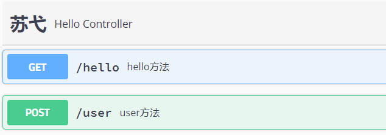

#### 2. ApiModel

@ApiModel 常用在实体类上

```java
@ApiModel("用户实体类")
public class User {
    public String username;
    public String password;
}
```


#### 3. ApiModelProperty

@ApiModelProperty() 用于字段，表示对 model 属性的说明。

~~~java
@ApiModel("用户实体类")
public class User {
    @ApiModelProperty("用户名")
    public String username;
    @ApiModelProperty("密码")
    public String password;
}
~~~

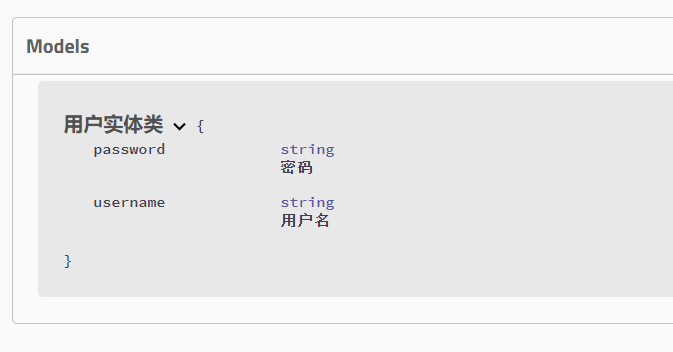

#### 4. ApiParam

@ApiParam 用于 Controller 中方法的参数说明。

~~~java
@ApiOperation(value = "hello方法",notes = "hello方法的notes")
@GetMapping (value = "/hello")
public String hello(@ApiParam("名字") String name){
    return "hello"+name;
}
~~~


#### 5. ApiOperation

@ApiOperation 用在 Controller 里的方法上，说明方法的作用

~~~java
@ApiOperation(value = "user方法",notes = "user方法的notes")
//只要接口中，返回值有实体类，它就会被扫描到swagger中
@PostMapping(value = "/user")
public User user(){
    return new User();
}
~~~


#### 6. ApiResponse 和 ApiResponses

@ApiResponse 用于方法上，说明接口响应的一些信息；@ApiResponses 组装了多个 @ApiResponse。

~~~java
@ApiResponses({ @ApiResponse(code = 200, message = "OK", response = UserDto.class) })
@PostMapping("/user")
public UserDto addUser(@ApiParam(value = "新增用户参数", required = true) @RequestBody AddUserParam param) {
}
~~~

#### 7. ApiImplicitParam 和 ApiImplicitParams

用于方法上，为单独的请求参数进行说明。

~~~java
@ApiImplicitParams({
        @ApiImplicitParam(name = "id", value = "用户ID", dataType = "string", paramType = "query", required = true, defaultValue = "1") })
@ApiResponses({ @ApiResponse(code = 200, message = "OK", response = UserDto.class) })
@GetMapping("/user")
public UserDto getUser(@RequestParam("id") String id) {
    return new UserDto();
}
~~~

- name：参数名，对应方法中单独的参数名称。
- value：参数中文说明。
- required：是否必填。
- paramType：参数类型，取值为 path、query、body、header、form。
- dataType：参数数据类型。
- defaultValue：默认值。


### Swagger中的Try it out

实体类：

~~~java
package com.sec.pojo;

import io.swagger.annotations.ApiModel;
import io.swagger.annotations.ApiModelProperty;

@ApiModel("用户实体类")
public class User {
    @ApiModelProperty("用户名")
    public String username;
    @ApiModelProperty("密码")
    public String password;

    public User() {
    }

    public User(String username, String password) {
        this.username = username;
        this.password = password;
    }

    public String getUsername() {
        return username;
    }

    public void setUsername(String username) {
        this.username = username;
    }

    public String getPassword() {
        return password;
    }

    public void setPassword(String password) {
        this.password = password;
    }
}

~~~


controller：

~~~java
@ApiOperation(value = "测试方法",notes = "这是一个测试方法")
@PostMapping("/ceshi")
public User ceshi(User user){
    return user;
}
~~~

点击 Try it out，输入用户名和密码


点击 execute

可以看到方法执行的结果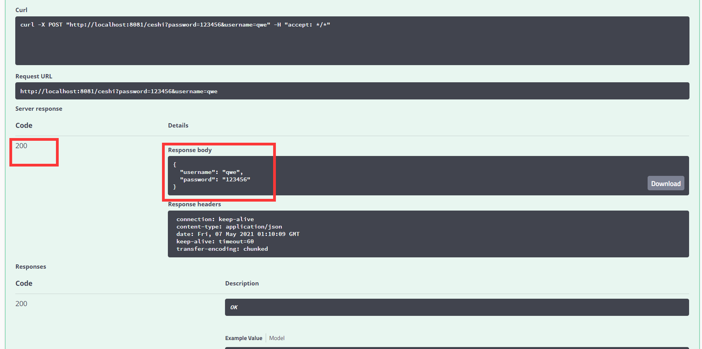


### 总结：

- 我们可以通过swagger给一些难理解的属性或接口，添加注释
- 接口文档实时更新
- 可以在线测试controller中的方法

==注意==：在正式发布的时候，要关闭swagger，不能被用户所看到。出于安全考虑，节省运行内存；