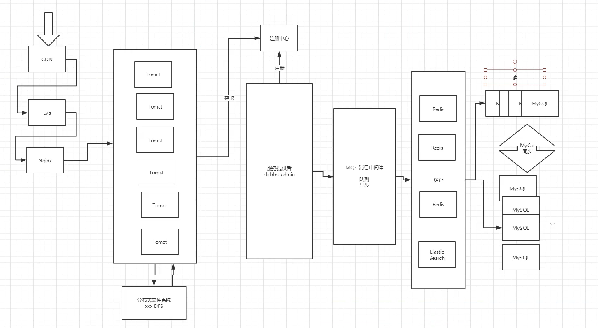
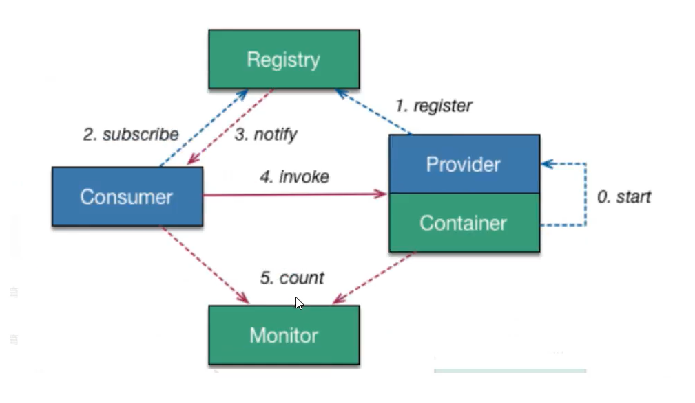
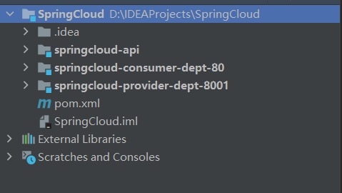
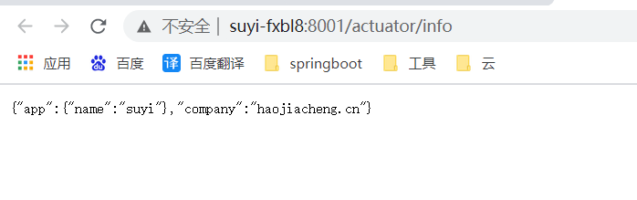
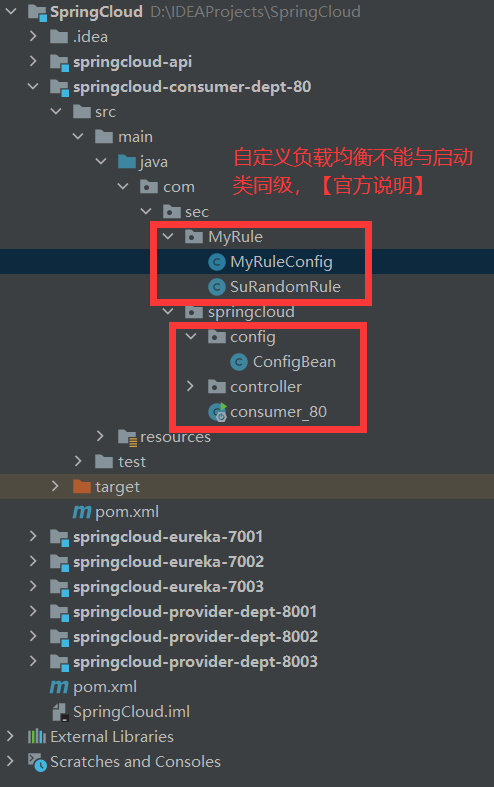
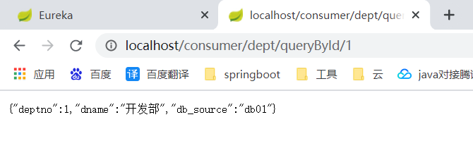
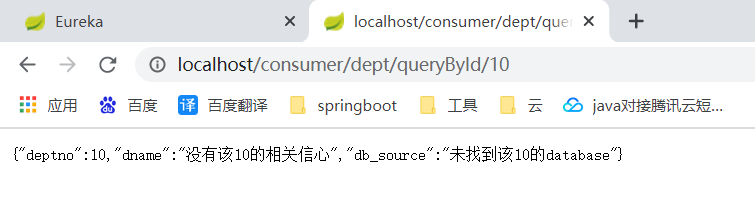
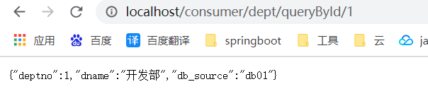
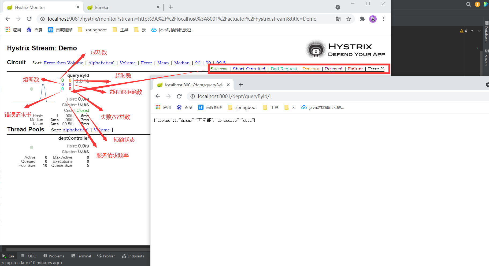

# SpringCloud-Netflix

~~~
1.spring cloud Netflix 一站式解决方案！
	api网关，zuul组件
	Feign --- HttpClinet --- Http 通信方式，同步，阻塞
	服务注册发现： Eureka
	熔断机制： Hystrix
	。。。
2.Apache Dubbo Zookeeper  半自动，需要整合别人的
	API：没有，找第三方组件，或自己实现
	Dubbo
	Zookeeper
	没有：借助 Hystrix
	Dubbo这个方案并不完善
3.Spring Cloud Alibaba 一站式解决方案！ 更简单
新概念：服务网格~ Server Mesh
	istio
	
万变不离其宗
	1.API
	2.HTTP，RPC
	3.注册和发现
	4.熔断机制
~~~

# 常见面试题

1.1、什么是微服务？

1.2、 微服务之间是如何独立通讯的？

1.3、 SpringCloud和Dubbo有哪些区别？

1.4、 SpringBoot和SpringCloud，请你谈谈对他们的理解

1.5、 什么是服务熔断？什么是服务降级？

1.6、 微服务的优缺点分别是什么？说一下你在项目开发中遇到的坑

1.7、 你所知道的微服务服务技术栈有哪些？列举一二

1.8、 eureka和zookeeper都可以提供服务注册与发现的功能，请说说两个的区别？

……

## 什么是微服务？

微服务（Microservice Architecture）是近几年流行的一种架构思想，关于它的概念很难一言以蔽之。

究竟什么是微服务呢？我们再次引用ThoughtWorks公司的首席科学家Martin Fowler于2014年提出的一段话：
原文：https://martinfowler.com/articles/microservices.html

汉化：http://www.bdata-cap.com/newsinfo/1713874.html

## 微服务与微服务架构

### 微服务

强调的是服务的大小，他关注的是某一个点，是具体解决某一问题/提供落地对应服务的一个服务应用，下一的看，可以看做是IDEA中的一个个微服务工程，或者Moudle

~~~
IDEA 工具里面使用Maven开发的一个独立的小Moudle，它具体是使用springboot开发的一个小模块，专业的事情交给专业的模块来做，一个模块就做着一件事
强调的是一个个的个体，每个个体完成一个具体的任务或者功能！
~~~

### 微服务架构

一种新的结构形式，Martin Fowler，2014提出

微服务架构是一种架构模式，它提倡将单应用程序划分成一组小的服务，服务之间互相协调，互相配合，为用户提供最终价值。每个服务运行在其独立的进程中，服务于服务间采用轻量级的通信机制互相协作，每个服务都围绕着具体的业务构建，并且能够被独立的部署到生产环境中，另外，应尽量避免统一的，集中式的服务管理机制，对具体的一个服务而言，应根据业务上下文，选择合适的语言，工具对其进行构建。

### 微服务优缺点

#### 优点

- 单一职责原则
- 每个服务足够内聚，足够小，代码容易理解，这样能聚焦一个指定的业务功能或业务需求；
- 开发简单，开发效率提高，一个服务可能就是转移的只干一件事
- 微服务能够被小团队单独开发，这个小团队是2--5人的开发人员组成
- 微服务是松耦合的，是有功能意义的服务，无论是在开发阶段或部署阶段都是独立的。
- 微服务能使用不同的语言开发
- 易于和第三方集成，微服务允许容易且灵活的方式集成自动部署，通过持续集成工具，如jenkins，Hudson，bamboo
- 微服务易于被一个开发人员理解，修改和维护，这样小团队能够更关注自己的工作成果。无需通过合作才能体现价值
- 微服务允许你利用融合最新技术
- 微服务只是业务逻辑的代码，不会和HTML，CSS或其他界面混合
- 每个微服务都有自己的存储能力，可以有自己的数据库，也可以有统一数据库

#### 缺点

- 开发人员要处理分布式系统的复杂性
- 多服务运维难度，随着服务的增加，运维的压力也在增大
- 系统部署依赖
- 服务间通信成本
- 数据统一性
- 系统集成测试
- 性能监控……

## 微服务技术栈有哪些？

| 服务条条目                               | 落地技术                                                     |
| ---------------------------------------- | ------------------------------------------------------------ |
| 服务开发                                 | SpringBoot,Spring,SpringMVC                                  |
| 服务配置与管理                           | Netflix公司的Archaius、阿里的Diamond等                       |
| 服务注册与发现                           | Eureka、Consul、Zookeeper等                                  |
| 服务调用                                 | Rest、RPC、gRPC                                              |
| 服务熔断器                               | Hystrix、Envoy等                                             |
| 负载均衡                                 | Ribbon、Nginx等                                              |
| 服务接口调用（客户端调用服务的简化工具） | Feign等                                                      |
| 消息队列                                 | Kafka、RabbitMQ、ActiveMQ等                                  |
| 服务配置中心管理                         | SpringCloudConfig、Chef等                                    |
| 服务路由（API网关）                      | Zuul等                                                       |
| 服务监控                                 | Zabbix、Nagios、Metrics、Specatator等                        |
| 全链路追踪                               | Zipkin、Brave、Dapper等                                      |
| 服务部署                                 | Docker、OpenStack、Kubernetes等                              |
| 数据流操作开发包                         | SpringCloud Stream（封装与Redis、Rabbit、Kafka等发送接收消息） |
| 时间消息总线                             | SpringCloud Bus                                              |

## 为什么选择SpringCloud作为微服务架构

### 1.选型依据

- 整体解决方案和框架成熟
- 社区热度
- 可维护性
- 学习曲线

### 2.当前各大IT公司用的微服务架构有哪些？

- 阿里：dubbo+HFS
- 京东：JSF
- 新浪：Motan
- 当当网：DubboX
- ………

### 3.各微服务框架对比

| 功能点/服务框架 | Netflix/SpringCloud                                          | Motan                                                        | gRPC                      | Thrift   | Dubbo/DubboX                        |
| --------------- | ------------------------------------------------------------ | ------------------------------------------------------------ | ------------------------- | -------- | ----------------------------------- |
| 功能定位        | 完整的微服务框架                                             | RPC框架，但整合了ZK或Consul，实现集群环境的基本服务注册/发现 | RPC框架                   | RPC框架  | 服务框架                            |
| 支持Rest        | 是，Ribbon支持多种可插拔的序列化选择                         | 否                                                           | 否                        | 否       | 否                                  |
| 支持RPC         | 否                                                           | 是（Hession2）                                               | 是                        | 是       | 是                                  |
| 支持多语言      | 是（Rest形式）？                                             | 否                                                           | 是                        | 是       | 否                                  |
| 负载均衡        | 是（服务端zuul+客户端Ribbon），zuul-服务，动态路由，云端负载均衡Eureka（针对中间层服务器） | 是（客户端）                                                 | 否                        | 否       | 是（客户端）                        |
| 配置服务        | Netflix Archaius，SpringCloud Config Server集中配置          | 是（zookeeper提供）                                          | 否                        | 否       | 否                                  |
| 服务调用链监    | 是（zuul），zuul提供边缘服务，API网关                        | 否                                                           | 否                        | 否       | 否                                  |
| 高可用/容错     | 是（服务端Hystrix+客户端Ribbon）                             | 是（客户端）                                                 | 否                        | 否       | 是（客户端）                        |
| 典型应用案例    | Netflix                                                      | Sina                                                         | Google                    | Faceboot |                                     |
| 社区活跃程度    | 高                                                           | 一般                                                         | 高                        | 一般     | 2017年后重新开始维护，之前终端了5年 |
| 学习难度        | 中断                                                         | 低                                                           | 高                        | 高       | 低                                  |
| 文档丰富成都    | 高                                                           | 一般                                                         | 一般                      | 一般     | 高                                  |
| 其他            | SpringCloudBus为我们的应用程序带来了更多管理端点             | 支持降级                                                     | Netflix内部在开发集成gRPC | IDL定义  | 实践的公司比较多                    |

# 什么是SpringCloud？

## SpringCloud和SpringBoot关系

- SpringBoot专注于快速方便的开发单个个体微服务。 -Jar
- SpringCloud是关注全局的服务服务协调整理治理框架，它将SpringBoot开发的一个个单体微服务整合并管理起来，为各个微服务之间提供：配置管理，服务发现，断路器，路由，微代理，事件总线，全局锁，决策竞选，分布式会话等等集成服务。
- SpringBoot可以离开SpringCloud独立使用，开发项目，但是SpringCloud离不开SpringBoot，属于依赖关系
- **SpringBoot专注于快速、方便的开发单个个体微服务，SpringCloud关注全局的服务治理框架**

 

# Dubbo和SpringCloud技术选型

## 1.分布式+服务治理Dubbo

目前成熟的互联网架构：应用服务化拆分+消息中间件

## 2.Dubbo和SpringCloud对比

可以看一下社区活跃度

https://github.com/dubbo

https://github.com/spring-cloud

结果：

|              | Dubbo         | Spring                      |
| ------------ | ------------- | --------------------------- |
| 服务注册中心 | Zookeeper     | SpringCloud Netflix Eureka  |
| 服务调用方式 | RPC           | Rest API                    |
| 服务监控     | Dubbo-monitor | SpringBoot Admin            |
| 断路器       | 不完善        | SpringCloud Netflix Hystrix |
| 服务网关     | 无            | SpringCloud Netflix Zuul    |
| 分布式配置   | 无            | SpringCloud Config          |
| 服务跟踪     | 无            | SpringCloud Sleuth          |
| 消息总线     | 无            | SpringCloud Bus             |
| 数据流       | 无            | SpringCloud Stream          |
| 批量任务     | 无            | SpringCloud Task            |

**最大区别**：SpringCloud抛弃了Dubbo的RPC通信，采用的是基于HTTP的Resst方式。

**解决的问题与不一样：Dubbo的定位是一款RPC框架，SpringCloud的目标是微服务架构下的一站式解决方案**

## SpringCloud能干什么？

- Distributed/versioned configuration（分布式/版本控制配置）
- Service registration and discovery（服务注册与发现）
- Routing（路由）
- Service-to-service calls（服务到服务的调用）
- Load balancing（负载均衡配置）
- Circuit Breakers（段容器）
- Distributed messaging（分布式消息管理）
- ……

## SpringCloud在哪里下？

官网：https://projects.spring.io/spring-cloud/

~~~
这些版本名称的命名方式采用了伦敦地铁站的名称，同时根据字母表的顺序来对应版本时间顺序，比如最早的Release版本：Angel，第二个Release版本：Brixton，然后是Camden、Dalston、Edgware，目前最新的是Finchley版本。
~~~

参考书：

- https://springcloud.cc/spring-cloud-netflix.html
- 中文API文档：https://springcloud.cc/spring-cloud-dalston.html
- SpringCloud中国社区 https://springcloud.cn/
- SpringCloud中文网 https://springcloud.cc

# SpringCloud

## 依赖

父级依赖pom.xml : maven依赖

~~~xml
<?xml version="1.0" encoding="UTF-8"?>
<project xmlns="http://maven.apache.org/POM/4.0.0"
         xmlns:xsi="http://www.w3.org/2001/XMLSchema-instance"
         xsi:schemaLocation="http://maven.apache.org/POM/4.0.0 http://maven.apache.org/xsd/maven-4.0.0.xsd">
    <modelVersion>4.0.0</modelVersion>

    <groupId>com.sec</groupId>
    <artifactId>SpringCloud</artifactId>
    <version>1.0-SNAPSHOT</version>
    <packaging>pom</packaging>

    <properties>
        <project.build.sourceEncoding>UTF-8</project.build.sourceEncoding>
        <maven.compiler.source>1.8</maven.compiler.source>
        <maven.compiler.target>1.8</maven.compiler.target>
        <junit.version>4.12</junit.version>
        <lombok.version>1.16.18</lombok.version>
        <log4j.version>1.2.17</log4j.version>
    </properties>
    <dependencyManagement>
        <dependencies>
            <!--springCloud的依赖-->
            <dependency>
                <groupId>org.springframework.cloud</groupId>
                <artifactId>spring-cloud-dependencies</artifactId>
                <version>Greenwich.SR1</version>
                <type>pom</type>
                <scope>import</scope>
            </dependency>
            <!--springboot依赖-->
            <dependency>
                <groupId>org.springframework.boot</groupId>
                <artifactId>spring-boot-dependencies</artifactId>
                <version>2.1.4.RELEASE</version>
                <type>pom</type>
                <scope>import</scope>
            </dependency>
            <!--数据库-->
            <dependency>
                <groupId>mysql</groupId>
                <artifactId>mysql-connector-java</artifactId>
                <version>5.1.47</version>
            </dependency>
            <!--德鲁伊-->
            <dependency>
                <groupId>com.alibaba</groupId>
                <artifactId>druid</artifactId>
                <version>1.1.10</version>
            </dependency>
            <!--springboot 启动器-->
            <dependency>
                <groupId>org.mybatis.spring.boot</groupId>
                <artifactId>mybatis-spring-boot-starter</artifactId>
                <version>1.3.2</version>
            </dependency>
            <!--日志测试-->
            <dependency>
                <groupId>ch.qos.logback</groupId>
                <artifactId>logback-core</artifactId>
                <version>1.2.3</version>
            </dependency>
            <!--单元测试-->
            <dependency>
                <groupId>junit</groupId>
                <artifactId>junit</artifactId>
                <version>${junit.version}</version>
            </dependency>
            <!--lombok-->
            <dependency>
                <groupId>org.projectlombok</groupId>
                <artifactId>lombok</artifactId>
                <version>${lombok.version}</version>
            </dependency>
            <!--log4j-->
            <dependency>
                <groupId>log4j</groupId>
                <artifactId>log4j</artifactId>
                <version>${log4j.version}</version>
            </dependency>
        </dependencies>
    </dependencyManagement>

    <build>
        <resources>
            <resource>
                <directory>src/main/java</directory>
                <includes>
                    <include>**/*.properties</include>
                    <include>**/*.xml</include>
                </includes>
                <filtering>false</filtering>
            </resource>
            <resource>
                <directory>src/main/resources</directory>
                <includes>
                    <include>**/*.properties</include>
                    <include>**/*.xml</include>
                </includes>
                <filtering>false</filtering>
            </resource>
        </resources>
    </build>

</project>
~~~

注册中心依赖

~~~xml
<dependencies>
    <!--eureka服务-->
    <dependency>
        <groupId>org.springframework.cloud</groupId>
        <artifactId>spring-cloud-starter-eureka-server</artifactId>
        <version>1.4.6.RELEASE</version>
    </dependency>
    <!--热部署-->
    <dependency>
        <groupId>org.springframework.boot</groupId>
        <artifactId>spring-boot-devtools</artifactId>
    </dependency>
</dependencies>
~~~

服务提供者依赖

~~~xml
<dependencies>
    <!--actuator 完善监控信息-->
    <dependency>
        <groupId>org.springframework.boot</groupId>
        <artifactId>spring-boot-starter-actuator</artifactId>
    </dependency>
    <!--eureka-->
    <dependency>
        <groupId>org.springframework.cloud</groupId>
        <artifactId>spring-cloud-starter-eureka</artifactId>
        <version>1.4.6.RELEASE</version>
    </dependency>
    <!--我们需要拿到实体类，所以要配置api module-->
    <dependency>
        <groupId>com.sec</groupId>
        <artifactId>springcloud-api</artifactId>
        <version>1.0-SNAPSHOT</version>
    </dependency>
    <dependency>
        <groupId>junit</groupId>
        <artifactId>junit</artifactId>
    </dependency>
    <dependency>
        <groupId>mysql</groupId>
        <artifactId>mysql-connector-java</artifactId>
    </dependency>
    <dependency>
        <groupId>com.alibaba</groupId>
        <artifactId>druid</artifactId>
    </dependency>
    <dependency>
        <groupId>ch.qos.logback</groupId>
        <artifactId>logback-core</artifactId>
    </dependency>
    <dependency>
        <groupId>org.mybatis.spring.boot</groupId>
        <artifactId>mybatis-spring-boot-starter</artifactId>
    </dependency>
    <!--test-->
    <dependency>
        <groupId>org.springframework.boot</groupId>
        <artifactId>spring-boot-test</artifactId>
    </dependency>
    <dependency>
        <groupId>org.springframework.boot</groupId>
        <artifactId>spring-boot-starter-web</artifactId>
    </dependency>
    <!--jetty-->
    <!-- https://mvnrepository.com/artifact/org.springframework.boot/spring-boot-starter-jetty -->
    <dependency>
        <groupId>org.springframework.boot</groupId>
        <artifactId>spring-boot-starter-jetty</artifactId>
    </dependency>

    <!--热部署-->
    <dependency>
        <groupId>org.springframework.boot</groupId>
        <artifactId>spring-boot-devtools</artifactId>
    </dependency>
</dependencies>
~~~

消费者依赖

~~~xml
<dependencies>
    <dependency>
        <groupId>org.springframework.cloud</groupId>
        <artifactId>spring-cloud-starter-eureka</artifactId>
        <version>1.4.6.RELEASE</version>
    </dependency>
    <dependency>
        <groupId>com.sec</groupId>
        <artifactId>springcloud-api</artifactId>
        <version>1.0-SNAPSHOT</version>
    </dependency>
    <dependency>
        <groupId>org.springframework.boot</groupId>
        <artifactId>spring-boot-starter-web</artifactId>
    </dependency>
    <dependency>
        <groupId>org.springframework.boot</groupId>
        <artifactId>spring-boot-devtools</artifactId>
    </dependency>
</dependencies>
~~~

## 配置文件

注册中心application配置文件

~~~yaml
server:
  port: 7001

#Eureka配置
eureka:
  instance:
    hostname: eureka7001.com
  client:
    register-with-eureka: false  #是否向eureka注册中心注册自己
    fetch-registry: false  #如果为false，则表示自己为注册中心
    service-url:
      defaultZone: http://eureka7002.com:7002/eureka/,http://eureka7003.com:7003/eureka/

~~~

服务提供者application配置文件

~~~yaml
server:
  port: 8001
#mybatis的配置
mybatis:
  type-aliases-package: com.suyi.springcloud.pojo
  config-location: classpath:mybatis/mybatis-config.xml
  mapper-locations: classpath:mybatis/mapper/*.xml
#spring的配置
spring:
  application:
    name: springcloud-provider-dept
  datasource:
    type: com.alibaba.druid.pool.DruidDataSource
    driver-class-name: com.mysql.jdbc.Driver
    url: jdbc:mysql://localhost:3306/db01?useUnicode=true&characterEncoding=utf8&setTimezone=UTC
    username: root
    password: 123456

#eureka的配置
eureka:
  client:
    service-url:
      defaultZone: http://eureka7001.com:7001/eureka/,http://eureka7002.com:7002/eureka/,http://eureka7003.com:7003/eureka/
  instance:
    instance-id: springcloud-provider-dept8001
info:
  app.name: suyi
  company: haojiacheng.cn
~~~

消费者application配置文件

~~~yaml
server:
  port: 80

#Eureka配置
eureka:
  client:
    register-with-eureka: false
    service-url:
      defaultZone: http://eureka7001.com:7001/eureka/,http://eureka7002.com:7002/eureka/,http://eureka7003.com:7003/eureka/
~~~

## 数据库文件，三个数据库

~~~sql
drop database if exists db01; -- db02/db03
create database db03 default character set utf8;

use db01;-- db02/db03

create table dept(
	deptno BIGINT not null PRIMARY KEY auto_increment,
	dname varchar(60) not null,
	db_source varchar(60)
);

INSERT INTO `dept`(dname,db_source) VALUES ('开发部','DATABASE()');
INSERT INTO `dept`(dname,db_source) VALUES ('人事部','DATABASE()');
INSERT INTO `dept`(dname,db_source) VALUES ('财务部','DATABASE()');
INSERT INTO `dept`(dname,db_source) VALUES ('市场部','DATABASE()');
INSERT INTO `dept`(dname,db_source) VALUES ('运维部','DATABASE()');

select * from dept;
~~~

# Eureka服务注册与与发现

## 什么是Eureka？

- Netflix在设计Eureka时，遵循的就是AP原则
- Eureka时Netflix的一个子模块，也是核心模块之一，Eureka是一个基于REST的服务，用于定位服务，以实现云端中间层服务发现和故障转移，服务注册与发现对于微服务来说是非常重要的，有了服务发现与注册，只需要使用服务的标识，就可以访问到服务，而不需要修改服务调用的配置文件了，功能类似于Dubbo的注册中心，比如Zookeeper；

## 原理讲解

- Eureka的基本架构
  - SpringCloud封装了Netflix公司开发的Eureka模块来实现服务注册和发现（对比Zookeeper）
  - Eureka采用了C-S的架构设计，EurekaServer作为服务服务注册功能的服务器，他是服务注册中心
  - 而系统中的其他微服务。使用Eureka的客户端连接到EurekaServer并维持心跳连接。这样系统的维护人员就可以通过EurekaServer来监控系统中各个微服务是否正常运行，SpringCloud的一些其他模块（比如Zuul）就可以通过EurekaServer来发现系统中的其他微服务，并执行相关的逻辑；
  - 和Dubbo架构对比
    
    
  - Eureka包含两个组件：Eureka Server和Eureka Client。
  - Eureka Server提供服务注册服务，各个节点启动后，会在EurekaServer中进行注册，这样Eureka Server中的服务注册表中将会存储所有可用服务节点的信息，服务节点的信息可以在界面中直观的看到。
- 三大角色
  - Eureka Server：提供服务的注册与发现
  - Service Provider：将自身服务注册到Eureka中，从而使消费方能够找到
  - Service Consumer：服务消费方从Eureka中获取注册服务列表，从而找到消费服务。
- 盘点目前工程状况
  - 

## 构建步骤

### eureka-server

1. springcloud-eureka-7001模块建立

2. pom.xml配置

   ~~~xml
   <dependencies>
           <!--eureka服务-->
           <dependency>
               <groupId>org.springframework.cloud</groupId>
               <artifactId>spring-cloud-starter-eureka-server</artifactId>
               <version>1.4.6.RELEASE</version>
           </dependency>
           <!--热部署-->
           <dependency>
               <groupId>org.springframework.boot</groupId>
               <artifactId>spring-boot-devtools</artifactId>
           </dependency>
   
       </dependencies>
   ~~~

3. 配置application.yml

   ~~~yml
   server:
   port: 7001
   
   #Eureka配置
   eureka:
   instance:
   hostname: localhost
   client:
   register-with-eureka: false  #是否向eureka注册中心注册自己
   fetch-registry: false  #如果为false，则表示自己为注册中心
   service-url:
     defaultZone: http://${eureka.instance.hostname}:${server.port}/eureka/
   ~~~

4. 服务提供者导入依赖

   ~~~xml
   <!--actuator  完善监控信息-->
       <dependency>
           <groupId>org.springframework.boot</groupId>
           <artifactId>spring-boot-starter-actuator</artifactId>
       </dependency>
       <!--eureka-->
       <dependency>
           <groupId>org.springframework.cloud</groupId>
           <artifactId>spring-cloud-starter-eureka-server</artifactId>
           <version>1.4.6.RELEASE</version>
       </dependency>
   ~~~

5. 开启服务

   ~~~java
   @SpringBootApplication
   @EnableEurekaClient
   public class DeptProvider_8001 {
   public static void main(String[] args) {
       SpringApplication.run(DeptProvider_8001.class,args);
   }
   
   }
   ~~~

6. 首先启动服务注册中心，再启动服务提供者，先7001，后8001，然后访问：http://localhost:7001/

   

7. 配置服务提供者名称
   

   ~~~yml
   info:
     app.name: suyi
     company: haojiacheng.cn
   ~~~

8. 访问

9. 

### eureka自我保护机制：好死不如赖活着

一句话总结：某时某刻某一个微服务不可用了，eureka不会立刻清理，依旧会对该微服务的信息进行保存！

- 默认情况下，如果EurekaServer在一定时间内没有接收到某个微服务实例的心跳，EurekaServer将会注销该实例（默认90）秒，但是当网络分区故障发生时，微服务与Eureka之间无法正常同行，以上行为可能变得非常危险了--因为微服务本身其实是健康的，此时本不应该注销这个服务，Eureka通过自我保护机制来解决这个问题--当EurekaServer节点在短时间内丢失过多客户端时（可能发生了网络分区故障），那么这个节点就会进行自我保护模式，一旦进入该模式，EurekaServer就会保护服务注册表中的信息，不再删除服务注册表中的数据（也就是不会注销任何微服务）。当网络故障恢复后，该EurekaServer节点会自动退出自我保护模式。
- 在自我保护模式中，EurekaServer会保护服务注册表中的信息，不再注销任何服务实例。当它收到的心跳数重新恢复到阈值以上时，该EurekaServer节点就会自动推出自我保护模式，它的设计哲学就是宁可保留错误的服务注册信息，也不盲目注销任何可能健康的服务实例，一句话：好死不如赖活着
- 综上，自我保护模式是一种应对网络异常的安全保护措施，它的架构哲学是宁可同时保留所有微服务（健康的微服务和不健康的微服务都会保留），也不盲目注销任何健康的微服务。使用自我保护模式，可以让Eureka集群更加的健壮和稳定
- 在SpringCloud中，可以使用eureka.server.enable-self-preservation = false 禁用自我保护模式【不推荐关闭自我保护机制】

# eureka集群

为了能区分开，首先改了本地的 ==域名映射==

`C:\Windows\System32\drivers\etc\hosts` 

添加三个域名映射

~~~basic
127.0.0.1       eureka7001.com
127.0.0.1       eureka7002.com
127.0.0.1       eureka7003.com
~~~

1.创建三个注册中心

- springcloud-eureka-7001
- springcloud-eureka-7002
- springcloud-eureka-7003

2.导入依赖    三个注册中心的依赖是一样的

~~~xml
<!--eureka服务-->
<dependency>
    <groupId>org.springframework.cloud</groupId>
    <artifactId>spring-cloud-starter-eureka-server</artifactId>
    <version>1.4.6.RELEASE</version>
</dependency>
<!--热部署-->
<dependency>
    <groupId>org.springframework.boot</groupId>
    <artifactId>spring-boot-devtools</artifactId>
</dependency>
~~~

3.创建启动项   三个都是一样的   记得开启==eureka服务==

~~~java
package com.sec.springcloud;

import org.springframework.boot.SpringApplication;
import org.springframework.boot.autoconfigure.SpringBootApplication;
import org.springframework.cloud.netflix.eureka.server.EnableEurekaServer;

@SpringBootApplication
@EnableEurekaServer //开启eureka服务
public class eurekaServer_7001 {
    public static void main(String[] args) {
        SpringApplication.run(eurekaServer_7001.class,args);
    }
}

~~~

4.配置application.yml

~~~yaml
server:
  port: 7001

#Eureka配置
eureka:
  instance:
    hostname: eureka7001.com
  client:
    register-with-eureka: false  #是否向eureka注册中心注册自己
    fetch-registry: false  #如果为false，则表示自己为注册中心
    service-url:
      defaultZone: http://eureka7002.com:7002/eureka/,http://eureka7003.com:7003/eureka/

~~~

~~~yaml
server:
  port: 7002

#Eureka配置
eureka:
  instance:
    hostname: eureka7002.com
  client:
    register-with-eureka: false  #是否向eureka注册中心注册自己
    fetch-registry: false  #如果为false，则表示自己为注册中心
    service-url:
      defaultZone: http://eureka7001.com:7001/eureka/,http://eureka7003.com:7003/eureka/

~~~

~~~yaml
server:
  port: 7003

#Eureka配置
eureka:
  instance:
    hostname: eureka7003.com
  client:
    register-with-eureka: false  #是否向eureka注册中心注册自己
    fetch-registry: false  #如果为false，则表示自己为注册中心
    service-url:
      defaultZone: http://eureka7001.com:7001/eureka/,http://eureka7002.com:7002/eureka/

~~~

# ACID是什么？

- A（Atomicity）原子性
- C（Consistency）一致性
- I（Isolation）隔离性
- D（Durability）持久性

# CAP是什么？

- C（Consistency）强一致性
- A（Availability）可用性
- P（Partition tolerance）分区容错性

CAP的三进二：CA、AP、CP

CAP理论的核心

- 一个分布式系统不可能同时很好的满足一致性，可用性和分区容错性这三个需求
- 根据CAP原理，将NoSQL数据库分成了满足CA原则，满足CP原则和满足AP原则三大类：
  - CA：单点集群，满足一致性，可用性的系统，通常可扩展性较差
  - CP：满足一致性，分区容错性的系统，通常性能不是特别高
  - AP：满足可用性，分区容错性的系统，通常可能对一致性要求低一些

# 作为服务注册中心，Eureka比Zookeeper好在哪里？

著名的CAP理论指出，一个分布式系统不可能同时满足C（一致性）、A（可用性）、P（容错性）。

由于分区容错性P在分布式系统中是必须要保证的，因此我们只能在A和C之间进行权衡。

- Zookeeper保证的是CP
- Eureka保证的是AP

## Zookeeper保证的是CP

​	当向注册中心查询服务列表时，我们可以容忍注册中心返回的是几分钟以前的注册信息，但不能接收服务直接down掉不可用，也就是说，服务注册功能对可用性的要求高于一致性，但是Zookeeper会出现这样一种情况，当master节点因为网络故障与其他节点失去联系时，剩余节点会重新进行leader选举。问题在于，选举leader的时间太长，30~120s，且选举期间整个zk集群都是不可用的，这就导致在选举期间注册服务瘫痪。在云部署的环境下，因为网络问题使得zk集群失去master节点是较大概率会发生的事件，虽然服务最终能够恢复，但是漫长的选举时间导致的注册长期不可用是不能容忍的。

## Eureka保证的是AP

​	Eureka看明白了这一点，因此在设计时就优先保证可用性。**Eureka各个节点都是平等的**，几个节点挂掉不会影响正常节点的工作，剩余的节点依然可以提供注册和查询服务。而Eureka的客户端在向某个Eureka注册时，如果发现连接失败，则会自动切换至其他节点，只要有一台Eureka还在，就能保住注册服务的可用性，只不过查到的信息可能不是最新的，除此之外，Eureka还有一种自我保护机制，如果在15分钟内超过85%的节点都没有正常的心跳，那么Eureka就认为客户端与注册中心出现了网络故障，此时会出现以下几种情况：

1. Eureka不再从注册列表中移除因为长时间没收到心跳而应该过期的服务
2. Eureka仍然能够接收新服务的注册和查询请求，但是不会被同步到其他节点上（即保证当前节点依然可用）
3. 当网络稳定时，当前实例新的注册信息就会被同步到其他节点中

==因此，Eureka可以很好的应对因网络故障导致部分节点失去联系的情况，而不会像zookeeper那样使整个服务瘫痪==

# Ribbon是什么？

- Spring Cloud Ribbon是基于Netflix Ribbon实现的一套==客户端负载均衡的工具==。
- 简单地说，Ribbon是Netflix发布的开源项目，主要功能是提供客户端的软件负载均衡算法，将Netflix的中间层服务连接在一起。Ribbon的客户端组件提供一系列完整的配置如：连接超时、重试等等。简单地说，就是在配置文件中列出Load Balancer（简称LB，负载均衡）后面所有的机器，Ribbon会自动的帮你基于某种规则（如简单轮询，随机连接等等）去连接这些机器。我们也很容易使用Ribbon实现自定义的负载均衡算法！
- 面试造飞机，工作拧螺丝

LVS是什么？

​	LVS**是**Linux Virtual Server**的简写，意即**Linux虚拟服务器**，是一个虚拟的服务器集群系统。本项目在1998年5月由`章文嵩`博士成立，是中国国内最早出现的自由软件项目之一。 

## Ribbon能干嘛？

- LB，即负载均衡（Load Balance），在微服务或分布式集群中经常用的一种应用。
- 负载均衡简单的说就是将用户的请求平摊的分配到多个服务上，从而达到系统的HA（高可用）。
- 常见的负载均衡软件有Nginx，LVS等等  Apache+Tomcat
- dubbo、SpringCloud中均给我们提供了负载均衡，SpringCloud的负载均衡算法可以自定义
- 负载均衡简单分类：
  - 集中式LB
    - 即在服务的消费方和提供方之间是同独立的LB设施，如Nginx，由该设施负责把访问请求通过某种策略转发至服务的提供方！
  - 进程式LB
    - 将LB逻辑集成到消费方，消费方从注册中心获知有哪些地址可用，然后自己再从这些地址中选出一个合适的服务器。
    - ==Ribbon就属于进程内LB==，它只是一个类库，集成于消费方进程，消费方通过它来获取到服务提供方的地址！

测试目录：

MyRuleConfig.java:

~~~java
package com.sec.MyRule;

import org.springframework.context.annotation.Bean;
import org.springframework.context.annotation.Configuration;

@Configuration
public class MyRuleConfig {

    @Bean
    public SuRandomRule getSuRandomRule(){
        return new SuRandomRule();
    }
}

~~~

SuRandomRule.java

~~~java
package com.sec.MyRule;

import com.netflix.client.config.IClientConfig;
import com.netflix.loadbalancer.AbstractLoadBalancerRule;
import com.netflix.loadbalancer.ILoadBalancer;
import com.netflix.loadbalancer.Server;
//import edu.umd.cs.findbugs.annotations.SuppressWarnings;
import java.util.List;
import java.util.concurrent.ThreadLocalRandom;

public class SuRandomRule extends AbstractLoadBalancerRule {

    /*
     每个服务用5次？
     */

    private int total=0;//每个服务调用的次数，当它==5的时候，调用下一个服务
    private int currentIndex=0;//当前的服务索引，当total==5的时候，currentIndex+1；

    public SuRandomRule() {
    }

    //@SuppressWarnings({"RCN_REDUNDANT_NULLCHECK_OF_NULL_VALUE"})
    public Server choose(ILoadBalancer lb, Object key) {
        if (lb == null) {
            return null;
        } else {
            Server server = null;

            while(server == null) {
                if (Thread.interrupted()) {
                    return null;
                }

                List<Server> upList = lb.getReachableServers();//获取活着的服务
                List<Server> allList = lb.getAllServers();//获取全部服务
                int serverCount = allList.size();
                if (serverCount == 0) {
                    return null;
                }

                /*int index = this.chooseRandomInt(serverCount);//获取随机数
                server = (Server)upList.get(index);//根据随机数来拿到服务列表中的一个服务*/

                //-============================================================
                if(total<5){
                    server=upList.get(currentIndex);
                    total++;
                }else{
                    total=0;
                    currentIndex++;
                    if(currentIndex>upList.size()-1){
                        currentIndex=0;
                    }
                    server=upList.get(currentIndex);

                }

                //-============================================================
                if (server == null) {
                    Thread.yield();
                } else {
                    if (server.isAlive()) {
                        return server;
                    }

                    server = null;
                    Thread.yield();
                }
            }

            return server;
        }
    }

    protected int chooseRandomInt(int serverCount) {
        return ThreadLocalRandom.current().nextInt(serverCount);
    }

    public Server choose(Object key) {
        return this.choose(this.getLoadBalancer(), key);
    }

    public void initWithNiwsConfig(IClientConfig clientConfig) {
    }
}

~~~

ConfigBean.java

~~~java
package com.sec.springcloud.config;

import org.springframework.cloud.client.loadbalancer.LoadBalanced;
import org.springframework.context.annotation.Bean;
import org.springframework.context.annotation.Configuration;
import org.springframework.web.client.RestTemplate;

@Configuration
public class ConfigBean {

    //配置负载均衡实现RestTemplate
    @Bean
    @LoadBalanced //Ribbon
    //IRule接口下的↓↓↓↓↓↓↓↓↓↓↓
    //AvailabilityFilteringRule：会先过滤掉，跳闸，访问故障的服务，对剩下的服务进行轮询~
    //RoundRobinRule：轮询
    //RandomRule：随机
    //WeightedResponseTimeRule：权重
    //RetryRule：会先按照轮询的方式获取服务，如果服务失败，则会在指定的时间内进行，重试
    public RestTemplate getRestTemplate(){
        return new RestTemplate();
    }
}

~~~

启动类：consumer_80.java

~~~java
package com.sec.springcloud;

import com.sec.MyRule.MyRuleConfig;
import org.springframework.boot.SpringApplication;
import org.springframework.boot.autoconfigure.SpringBootApplication;
import org.springframework.cloud.netflix.eureka.EnableEurekaClient;
import org.springframework.cloud.netflix.ribbon.RibbonClient;

@SpringBootApplication
@EnableEurekaClient
//在微服务启动的时候就可以去加载我们自定义的Ribbon类
@RibbonClient(name = "springcloud-provider-dept",configuration = MyRuleConfig.class)
public class consumer_80 {
    public static void main(String[] args) {
        SpringApplication.run(consumer_80.class);
    }
}

~~~

# Feign负载均衡

## 简介

​	feign是声明式的web Service客户端，它让微服务之间的调用变得更简单了，类似controller调用service。SpringCloud集成了Ribbon和Eureka，可在使用Feign时提供负载均衡的http客户端。

只需要创建一个接口，然后添加注解即可！

feign，主要是社区，大家都习惯面向接口编程。这个是很多开发人员的规范。调用微服务访问两种方法

1. 微服务名字【Ribbon】
2. 接口和注解【Feign】

Feign能干什么？

- Feign旨在使编写java Http客户端变得更容易
- 前面再使用Ribbon+RestTemplate时，利用RestTemplate对Http请求的封装处理，形成了一套模板化的调用方法。但是在实际开发中，由于对服务依赖的调用可能不止一处，往往一个接口会被多处调用，所以通常都会针对每个微服务自行封装一些客户端类来包装这些依赖服务的调用。所以，Feign在此基础上作了进一步封装，由他来帮助我们定义和实现依赖服务接口的定义，==在Feign的实现下，我们只需要创建一个接口并使用注解的方式来配置它（类似于以前Dao接口上标注Mapper注解，现在是一个微服务接口上面标注一个Feign注解即可。）==即可完成对服务提供方的接口绑定，简化了使用Spring Cloud Ribbon时，自动封装服务调用客户端的开发量。

Feign集成了Ribbon

- 利用Ribbon维护了MicroServiceCloud-Dept的服务列表信息，并且通过轮询实现了客户端的负载均衡，而与Ribbon不同的是，通过Feign只需要定义服务绑定接口且以声明式的方法，优雅而且简单的实现了服务调用。

## 使用接口方式调用服务

1. 导入依赖   springcloud-api

   ~~~xml
   <dependencies>
       <!--feign-->
       <dependency>
           <groupId>org.springframework.cloud</groupId>
           <artifactId>spring-cloud-starter-openfeign</artifactId>
           <version>1.4.6.RELEASE</version>
       </dependency>
       <dependency>
           <groupId>org.springframework.cloud</groupId>
           <artifactId>spring-cloud-openfeign-core</artifactId>
       </dependency>
       <dependency>
           <groupId>org.projectlombok</groupId>
           <artifactId>lombok</artifactId>
       </dependency>
   </dependencies>
   ~~~

2. 再编写service层

   ~~~java
   package com.suyi.springcloud.service;
   
   import com.suyi.springcloud.pojo.Dept;
   import org.springframework.cloud.openfeign.FeignClient;
   import org.springframework.stereotype.Component;
   import org.springframework.web.bind.annotation.GetMapping;
   import org.springframework.web.bind.annotation.PathVariable;
   import org.springframework.web.bind.annotation.PostMapping;
   
   import java.util.List;
   @Component
   @FeignClient(value = "SPRINGCLOUD-PROVIDER-DEPT")
   public interface DeptClientService {
       @GetMapping("/dept/queryAll")
       public List<Dept> queryAll();
   
       @GetMapping("/dept/queryById/{id}")
       public Dept queryById(@PathVariable("id") Long id);
   
       @PostMapping("/dept/addDept/{dept}")
       public boolean add(@PathVariable("dept") Dept dept);
   }
   
   ~~~

3. 创建一个Module `springcloud-consumer-dept-feign`   导入pom依赖

   ~~~xml
   <dependency>
       <groupId>org.springframework.cloud</groupId>
       <artifactId>spring-cloud-starter-openfeign</artifactId>
       <version>1.4.6.RELEASE</version>
   </dependency>
   <dependency>
       <groupId>org.springframework.cloud</groupId>
       <artifactId>spring-cloud-starter-eureka</artifactId>
       <version>1.4.6.RELEASE</version>
   </dependency>
   <dependency>
       <groupId>com.sec</groupId>
       <artifactId>springcloud-api</artifactId>
       <version>1.0-SNAPSHOT</version>
   </dependency>
   <dependency>
       <groupId>org.springframework.boot</groupId>
       <artifactId>spring-boot-starter-web</artifactId>
   </dependency>
   <dependency>
       <groupId>org.springframework.boot</groupId>
       <artifactId>spring-boot-devtools</artifactId>
   </dependency>
   ~~~

4. application.yml:

   ~~~yaml
   server:
     port: 80
   
   #Eureka配置
   eureka:
     client:
       register-with-eureka: false
       service-url:
         defaultZone: http://eureka7001.com:7001/eureka/,http://eureka7002.com:7002/eureka/,http://eureka7003.com:7003/eureka/
   ~~~

5. config->ConfigBean

   ~~~java
   package com.sec.springcloud.config;
   
   import org.springframework.cloud.client.loadbalancer.LoadBalanced;
   import org.springframework.context.annotation.Bean;
   import org.springframework.context.annotation.Configuration;
   import org.springframework.web.client.RestTemplate;
   
   @Configuration
   public class ConfigBean {
   
       //配置负载均衡实现RestTemplate
       @Bean
       @LoadBalanced //Ribbon
       //IRule接口下的↓↓↓↓↓↓↓↓↓↓↓
       //AvailabilityFilteringRule：会先过滤掉，跳闸，访问故障的服务，对剩下的服务进行轮询~
       //RoundRobinRule：轮询
       //RandomRule：随机
       //WeightedResponseTimeRule：权重
       //RetryRule：会先按照轮询的方式获取服务，如果服务失败，则会在指定的时间内进行，重试
       public RestTemplate getRestTemplate(){
           return new RestTemplate();
       }
   }
   
   ~~~

6. controller->DeptConsumerController

   ~~~java
   package com.sec.springcloud.controller;
   
   import com.suyi.springcloud.pojo.Dept;
   import com.suyi.springcloud.service.DeptClientService;
   import org.springframework.beans.factory.annotation.Autowired;
   import org.springframework.web.bind.annotation.PathVariable;
   import org.springframework.web.bind.annotation.RequestMapping;
   import org.springframework.web.bind.annotation.RestController;
   
   import java.util.List;
   
   @RestController
   public class DeptConsumerController {
   
       @Autowired
       private DeptClientService deptClientService;
   
       @RequestMapping("/consumer/dept/add/{dept}")
       public boolean add(@PathVariable("dept") Dept dept){
           return deptClientService.add(dept);
       }
   
       @RequestMapping("/consumer/dept/queryById/{id}")
       public Dept queryById(@PathVariable("id") Long id){
           return deptClientService.queryById(id);
       }
   
       @RequestMapping("/consumer/dept/queryAll")
       public List<Dept> queryAll(){
           return deptClientService.queryAll();
       }
   
   }
   
   ~~~

7. 启动项

   ~~~java
   package com.sec.springcloud;
   
   import org.springframework.boot.SpringApplication;
   import org.springframework.boot.autoconfigure.SpringBootApplication;
   import org.springframework.cloud.netflix.eureka.EnableEurekaClient;
   import org.springframework.cloud.openfeign.EnableFeignClients;
   
   @SpringBootApplication
   @EnableEurekaClient
   @EnableFeignClients(basePackages = {"com.suyi.springcloud"})
   public class Feign_consumer_80 {
       public static void main(String[] args) {
           SpringApplication.run(Feign_consumer_80.class);
       }
   }
   
   ~~~

   

# 分布式系统面临的问题

复杂分布式体系结构中的应用程序有数十个依赖关系，每个依赖关系在某些时候将不可避免的失败！

## 服务雪崩

​	多个服务之间调用的时候，假设微服务A调用微服务B和微服务C，微服务B和微服务C又调用其他的微服务，这就是所谓的“扇出”、如果扇出的链路上某个微服务的调用响应时间过长或者不可用，对微服务A的调用就会占用越来越多的系统资源，进而引起系统崩溃，所谓的“雪崩效应”。

​	对于高流量的应用来说，单一的后端依赖可能会导致所有服务器上的所有资源都在几秒钟内饱和。比失败更糟糕的是，这些应用程序还可能导致服务之间的延迟增加，备份队列，线程和其他系统资源紧张，导致整个系统发生更多的级联故障，这些都表示需要对故障和延迟进行隔离和管理，以便单个依赖关系的失败，不能取消整个应用程序或系统。

​	我们需要   `弃车保帅`

## 什么是Hystrix

​	Hystrix是一个用于处理分布式系统的延迟和容错的开源库，在分布式系统里，许多依赖不可避免的会调用失败，比如超时，异常等，Hystrix能够保证在一个依赖出问题的情况下，不会导致整体服务失败，避免级联故障，以提高分布式系统的弹性。

​	“断路器”本身是一种开关装置，当某个服务单元发生故障之后，通过断路器的故障监控（类似熔断保险丝），**向调用方返回一个服务预期的，可处理的备选响应（FallBack），而不是长时间的等待或者抛出调用方法无法处理的异常，这样就可以保证了服务调用方的线程不会被长时间**，不必要的占用，从而避免了故障在分布式系统中的蔓延，乃至雪崩

## Hystrix能干嘛

- 服务降级
- 服务熔断
- 服务限流
- 接近实时的监控
- …………

官网资料

https://github.com/Netflix/Hystrix/wiki

## 服务熔断

**是什么**

​    熔断机制是对应雪崩效应的一种微服务链路保护机制

​    当扇出链路的某个微服务不可用或者响应时间太长时，会进行服务的降级，==进而熔断该节点微服务的调用，快速返回错误的响应信息==。当检测到该节点微服务调用响应正常后恢复调用链路。在SpringCloud框架里熔断机制通过Hystrix实现。Hystrix会监控微服务间调用的状况，当失败的调用到一定阈值，缺省是5秒内20次调用失败就会启动熔断机制。熔断机制的注解是@HystrixCommand。

**实现步骤**

1. 创建`springcloud-provider-dept-hystrix-8001`

   

2. 导入依赖

   ~~~xml
   <dependencies>
       <!--hystrix-->
       <dependency>
           <groupId>org.springframework.cloud</groupId>
           <artifactId>spring-cloud-starter-hystrix</artifactId>
           <version>1.4.6.RELEASE</version>
       </dependency>
       <!--actuator 完善监控信息-->
       <dependency>
           <groupId>org.springframework.boot</groupId>
           <artifactId>spring-boot-starter-actuator</artifactId>
       </dependency>
       <!--eureka-->
       <dependency>
           <groupId>org.springframework.cloud</groupId>
           <artifactId>spring-cloud-starter-eureka</artifactId>
           <version>1.4.6.RELEASE</version>
       </dependency>
       <!--我们需要拿到实体类，所以要配置api module-->
       <dependency>
           <groupId>com.sec</groupId>
           <artifactId>springcloud-api</artifactId>
           <version>1.0-SNAPSHOT</version>
       </dependency>
       <dependency>
           <groupId>junit</groupId>
           <artifactId>junit</artifactId>
       </dependency>
       <dependency>
           <groupId>mysql</groupId>
           <artifactId>mysql-connector-java</artifactId>
       </dependency>
       <dependency>
           <groupId>com.alibaba</groupId>
           <artifactId>druid</artifactId>
       </dependency>
       <dependency>
           <groupId>ch.qos.logback</groupId>
           <artifactId>logback-core</artifactId>
       </dependency>
       <dependency>
           <groupId>org.mybatis.spring.boot</groupId>
           <artifactId>mybatis-spring-boot-starter</artifactId>
       </dependency>
       <!--test-->
       <dependency>
           <groupId>org.springframework.boot</groupId>
           <artifactId>spring-boot-test</artifactId>
       </dependency>
       <dependency>
           <groupId>org.springframework.boot</groupId>
           <artifactId>spring-boot-starter-web</artifactId>
       </dependency>
       <!--jetty-->
       <!-- https://mvnrepository.com/artifact/org.springframework.boot/spring-boot-starter-jetty -->
       <dependency>
           <groupId>org.springframework.boot</groupId>
           <artifactId>spring-boot-starter-jetty</artifactId>
       </dependency>
   
       <!--热部署-->
       <dependency>
           <groupId>org.springframework.boot</groupId>
           <artifactId>spring-boot-devtools</artifactId>
       </dependency>
   </dependencies>
   ~~~

3. controller层写一个方法的备选方法

   ~~~java
   package com.sec.springcloud.controller;
   
   import com.netflix.hystrix.contrib.javanica.annotation.HystrixCommand;
   import com.sec.springcloud.service.deptService;
   import com.suyi.springcloud.pojo.Dept;
   import org.springframework.beans.factory.annotation.Autowired;
   import org.springframework.cloud.client.ServiceInstance;
   import org.springframework.cloud.client.discovery.DiscoveryClient;
   import org.springframework.stereotype.Controller;
   import org.springframework.web.bind.annotation.*;
   
   import java.util.List;
   
   //提供Restful服务
   @RestController
   public class deptController {
   
       @Autowired
       deptService ds;
   
       @GetMapping("/dept/queryById/{id}")
       @HystrixCommand(fallbackMethod = "queryByIdHystrix")
       public Dept queryById(@PathVariable("id") Long id){
           Dept dept = ds.queryById(id);
           if(dept==null){
               throw new RuntimeException("id异常");
           }
           return dept;
       }
   
       //备选方法
       public Dept queryByIdHystrix(@PathVariable("id") Long id){
           return new Dept().setDeptno(id).setDname("没有该"+id+"的相关信心").setDb_source("未找到该"+id+"的database");
   
       }
   }
   
   ~~~

4. 主启动类上开启断路器

   ~~~java
   package com.sec.springcloud;
   
   import org.springframework.boot.SpringApplication;
   import org.springframework.boot.autoconfigure.SpringBootApplication;
   import org.springframework.cloud.client.circuitbreaker.EnableCircuitBreaker;
   import org.springframework.cloud.client.discovery.EnableDiscoveryClient;
   import org.springframework.cloud.netflix.eureka.EnableEurekaClient;
   
   @SpringBootApplication
   @EnableEurekaClient //在服务启动后自动注册到eureka中
   @EnableDiscoveryClient //服务发现
   @EnableCircuitBreaker  //启用断路器
   public class DeptProviderHystrix_8001 {
       public static void main(String[] args) {
           SpringApplication.run(DeptProviderHystrix_8001.class,args);
       }
   
   }
   
   ~~~

5. 测试

服务正常被注册到注册中心里来

访问id为1的

访问id不存在的

显示服务IP地址

~~~yaml
eureka:
  client:
    service-url:
      defaultZone: http://eureka7001.com:7001/eureka/,http://eureka7002.com:7002/eureka/,http://eureka7003.com:7003/eureka/
  instance:
    instance-id: springcloud-provider-dept-hystrix-8001
    prefer-ip-address: true #true标识显示该服务的ip地址
~~~

## 服务降级

springcloud-api的service下实现DeptClientService接口的实现类

接口：

- 注意加上==@Component==注解，和

- `fallbackFactory = DeptClientServiceFallbackFactory.class`

~~~java
package com.suyi.springcloud.service;

import com.suyi.springcloud.pojo.Dept;
import org.springframework.cloud.openfeign.FeignClient;
import org.springframework.stereotype.Component;
import org.springframework.web.bind.annotation.GetMapping;
import org.springframework.web.bind.annotation.PathVariable;
import org.springframework.web.bind.annotation.PostMapping;
import java.util.List;
@Component
@FeignClient(value = "SPRINGCLOUD-PROVIDER-DEPT",fallbackFactory = DeptClientServiceFallbackFactory.class)
public interface DeptClientService {
    @GetMapping("/dept/queryAll")
    public List<Dept> queryAll();

    @GetMapping("/dept/queryById/{id}")
    public Dept queryById(@PathVariable("id") Long id);

    @PostMapping("/dept/addDept/{dept}")
    public boolean add(@PathVariable("dept") Dept dept);
}

~~~

实现类： `FallbackFactory<DeptClientService>`

~~~java
package com.suyi.springcloud.service;

import com.suyi.springcloud.pojo.Dept;
import feign.hystrix.FallbackFactory;
import org.springframework.stereotype.Component;

import java.util.List;
@Component
public class DeptClientServiceFallbackFactory implements FallbackFactory<DeptClientService> {
    @Override
    public DeptClientService create(Throwable throwable) {
        return new DeptClientService() {
            @Override
            public List<Dept> queryAll() {
                return null;
            }

            @Override
            public Dept queryById(Long id) {
                return new Dept()
                        .setDeptno(id)
                        .setDname("没有对应的信息，客户端提供了降级的信息，这个服务已经被关闭")
                        .setDb_source("没有数据");
            }
            @Override
            public boolean add(Dept dept) {
                return false;
            }
        };
    }
}

~~~

`springcloud-consumer-dept-feign`的启动类上添加注解

**注意：**

- @ComponentScans({@ComponentScan("com.suyi.springcloud")}) 
- ~ `com.suyi.springcloud`就是`springcloud-api`的接口的包 

开启服务降级    `application.yaml`

~~~yaml
#开启服务降级
feign:
  hystrix:
    enabled: true
~~~

**启动**`springcloud-eureka-7001`，`springcloud-provider-dept-8001`，`springcloud-consumer-dept-feign`

**访问**http://localhost/consumer/dept/queryById/1

**关掉**`springcloud-provider-dept-8001`    

 **再次访问**

### 总结：

- 服务熔断：服务端~，某个服务超时或异常，引起熔断~   类似于保险丝
- 服务降级：客户端~，从整个网站请求负载考虑，当某个服务熔断或者关闭后，服务将不再被调用
                    此时在客户端，我们可以准备一个FallbackFactory，返回一个默认的值（缺省值），整体的服务水平下降了

## Hystrix：Dashboard监控流

创建`springcloud-consumer-hystrix-dashboard`

写启动类

~~~java
package com.sec.springcloud;

import org.springframework.boot.SpringApplication;
import org.springframework.boot.autoconfigure.SpringBootApplication;
import org.springframework.cloud.netflix.hystrix.dashboard.EnableHystrixDashboard;

@SpringBootApplication
@EnableHystrixDashboard //开启监控页面
public class DeptConsumerDashboard_9001 {
    public static void main(String[] args) {
        SpringApplication.run(DeptConsumerDashboard_9001.class,args);
    }
}

~~~

测试访问http://localhost:9081/hystrix

1. 导入依赖

   ~~~xml
   <dependencies>
           <dependency>
               <groupId>org.springframework.cloud</groupId>
               <artifactId>spring-cloud-starter-hystrix-dashboard</artifactId>
               <version>1.4.6.RELEASE</version>
           </dependency>
           <dependency>
               <groupId>org.springframework.cloud</groupId>
               <artifactId>spring-cloud-starter-hystrix</artifactId>
               <version>1.4.6.RELEASE</version>
           </dependency>
           <dependency>
               <groupId>org.springframework.cloud</groupId>
               <artifactId>spring-cloud-starter-eureka</artifactId>
               <version>1.4.6.RELEASE</version>
           </dependency>
           <dependency>
               <groupId>com.sec</groupId>
               <artifactId>springcloud-api</artifactId>
               <version>1.0-SNAPSHOT</version>
           </dependency>
           <dependency>
               <groupId>org.springframework.boot</groupId>
               <artifactId>spring-boot-starter-web</artifactId>
           </dependency>
           <dependency>
               <groupId>org.springframework.boot</groupId>
               <artifactId>spring-boot-devtools</artifactId>
           </dependency>
       </dependencies>
   ~~~

   

2. 编写application.yaml

   ~~~yaml
   server:
     port: 9081
   eureka:
     client:
       register-with-eureka: false
   ~~~

3. `springcloud-provider-dept-hystrix-8001`的启动类中编写

   ~~~java
   //增加一个  Servlet
       @Bean
       public ServletRegistrationBean HystrixMetricsStreamServlet(){
           ServletRegistrationBean registrationBean = new ServletRegistrationBean(new HystrixMetricsStreamServlet());
           registrationBean.addUrlMappings("/actuator/hystrix.stream");
           return  registrationBean;
       }
   ~~~

4. 访问http://localhost:9081/hystrix.stream

