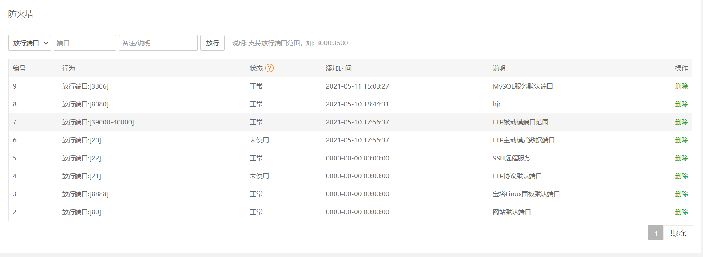
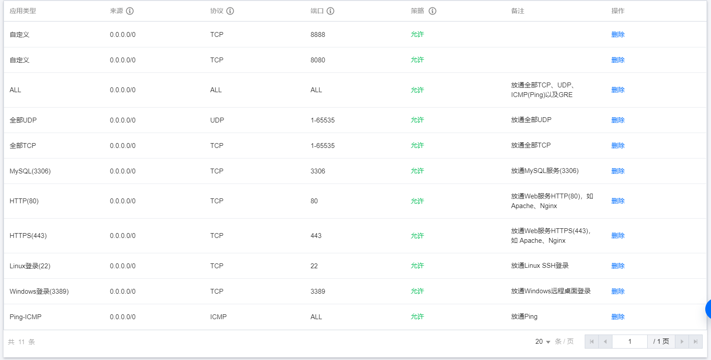
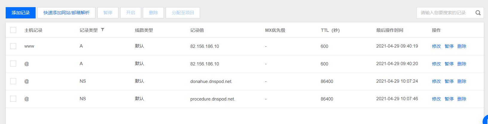

# 宝塔面板配置文件记录

## MySQL配置文件

~~~
[client]
#password	= your_password
port		= 3306
socket		= /tmp/mysql.sock

[mysqld]
lower_case_table_names=1
port		= 3306
socket		= /tmp/mysql.sock
datadir = /www/server/data
default_storage_engine = InnoDB
performance_schema_max_table_instances = 400
table_definition_cache = 400
skip-external-locking
key_buffer_size = 32M
max_allowed_packet = 100G
table_open_cache = 128
sort_buffer_size = 768K
net_buffer_length = 4K
read_buffer_size = 768K
read_rnd_buffer_size = 256K
myisam_sort_buffer_size = 8M
thread_cache_size = 16
query_cache_size = 16M
tmp_table_size = 32M
sql-mode=NO_ENGINE_SUBSTITUTION,STRICT_TRANS_TABLES

explicit_defaults_for_timestamp = true
#skip-name-resolve
max_connections = 500
max_connect_errors = 100
open_files_limit = 65535

log-bin=mysql-bin
binlog_format=mixed
server-id = 1
expire_logs_days = 10
slow_query_log=1
slow-query-log-file=/www/server/data/mysql-slow.log
long_query_time=3
#log_queries_not_using_indexes=on
early-plugin-load = ""

innodb_data_home_dir = /www/server/data
innodb_data_file_path = ibdata1:10M:autoextend
innodb_log_group_home_dir = /www/server/data
innodb_buffer_pool_size = 128M
innodb_log_file_size = 64M
innodb_log_buffer_size = 16M
innodb_flush_log_at_trx_commit = 1
innodb_lock_wait_timeout = 50
innodb_max_dirty_pages_pct = 90
innodb_read_io_threads = 1
innodb_write_io_threads = 1

[mysqldump]
quick
max_allowed_packet = 500M

[mysql]
no-auto-rehash

[myisamchk]
key_buffer_size = 32M
sort_buffer_size = 768K
read_buffer = 2M
write_buffer = 2M

[mysqlhotcopy]
interactive-timeout

~~~

## Tomcat配置文件

~~~xml
<Server port="8005" shutdown="SHUTDOWN">
  <Listener className="org.apache.catalina.startup.VersionLoggerListener" />
  <Listener SSLEngine="on" className="org.apache.catalina.core.AprLifecycleListener" />
  <Listener className="org.apache.catalina.core.JreMemoryLeakPreventionListener" />
  <Listener className="org.apache.catalina.mbeans.GlobalResourcesLifecycleListener" />
  <Listener className="org.apache.catalina.core.ThreadLocalLeakPreventionListener" />
  <GlobalNamingResources>
    <Resource auth="Container" description="User database that can be updated and saved" factory="org.apache.catalina.users.MemoryUserDatabaseFactory" name="UserDatabase" pathname="conf/tomcat-users.xml" type="org.apache.catalina.UserDatabase" />
  </GlobalNamingResources>
  <Service name="Catalina">
    <Connector connectionTimeout="20000" port="8080" protocol="HTTP/1.1" redirectPort="8443" />
    <Connector port="8009" protocol="AJP/1.3" redirectPort="8443" />
    <Engine defaultHost="localhost" name="Catalina">
      <Realm className="org.apache.catalina.realm.LockOutRealm">
        <Realm className="org.apache.catalina.realm.UserDatabaseRealm" resourceName="UserDatabase" />
      </Realm>
      <Host appBase="webapps" autoDeploy="true" name="localhost" unpackWARs="true">
        <Valve className="org.apache.catalina.valves.AccessLogValve" directory="logs" pattern="%h %l %u %t &quot;%r&quot; %s %b" prefix="localhost_access_log" suffix=".txt" />
      </Host>
      <Host autoDeploy="true" name="haojiacheng.cn" unpackWARs="true" xmlNamespaceAware="false" xmlValidation="false">
        <Context crossContext="true" docBase="/www/server/tomcat/webapps/zhjc" path="" reloadable="true" />
        <Context docBase="/temp/images" path="/pic" />
      </Host>
    </Engine>
  </Service>
</Server>
~~~

## 网站站点配置文件

~~~
server
{
    listen 80;
    server_name haojiacheng.cn www.haojiacheng.cn;
    index index.php index.html index.htm default.php default.htm default.html;
    root /www/server/tomcat/webapps/zhjc;
    
    #SSL-START SSL相关配置，请勿删除或修改下一行带注释的404规则
    #error_page 404/404.html;
    #SSL-END
    
    #ERROR-PAGE-START  错误页配置，可以注释、删除或修改
    #error_page 404 /404.html;
    #error_page 502 /502.html;
    #ERROR-PAGE-END
    
    #PHP-INFO-START  PHP引用配置，可以注释或修改
    #TOMCAT-START
    location /
    {
        proxy_pass "http://haojiacheng.cn:8080";
        proxy_set_header Host haojiacheng.cn;
        proxy_set_header X-Forwarded-For $remote_addr;
    }
    location ~ .*\.(gif|jpg|jpeg|bmp|png|ico|txt|js|css)$
    {
        #expires      12h;
        proxy_pass http://haojiacheng.cn:8080;
    }
     location ~ .*\.(js|css)?$
     {
         proxy_pass http://haojiacheng.cn:8080;
     }
    
    location ~ .*\.war$
    {
        return 404;
    }
    #TOMCAT-END
    include enable-php-00.conf;
    #PHP-INFO-END
    
    #REWRITE-START URL重写规则引用,修改后将导致面板设置的伪静态规则失效
    include /www/server/panel/vhost/rewrite/haojiacheng.cn.conf;
    #REWRITE-END
    
    #禁止访问的文件或目录
    location ~ ^/(\.user.ini|\.htaccess|\.git|\.svn|\.project|LICENSE|README.md)
    {
        return 404;
    }
    
    #一键申请SSL证书验证目录相关设置
    location ~ \.well-known{
        allow all;
    }
    
    location ~ .*\.(gif|jpg|jpeg|png|bmp|swf)$
    {
        expires      30d;
        error_log /dev/null;
        access_log /dev/null;
    }
    
    location ~ .*\.(js|css)?$
    {
        expires      12h;
        error_log /dev/null;
        access_log /dev/null; 
    }
    location /temp/images/ {  
        alias /pic/;
    }
    access_log  /www/wwwlogs/haojiacheng.cn.log;
    error_log  /www/wwwlogs/haojiacheng.cn.error.log;
}
~~~

## Tomcat  零配置文件

~~~xml
<?xml version="1.0" encoding="UTF-8"?>

<Server port="8005" shutdown="SHUTDOWN">
  <Listener className="org.apache.catalina.startup.VersionLoggerListener" />

  <Listener className="org.apache.catalina.core.AprLifecycleListener" SSLEngine="on" />
  <!-- Prevent memory leaks due to use of particular java/javax APIs-->
  <Listener className="org.apache.catalina.core.JreMemoryLeakPreventionListener" />
  <Listener className="org.apache.catalina.mbeans.GlobalResourcesLifecycleListener" />
  <Listener className="org.apache.catalina.core.ThreadLocalLeakPreventionListener" />

  <GlobalNamingResources>

    <Resource name="UserDatabase" auth="Container"
              type="org.apache.catalina.UserDatabase"
              description="User database that can be updated and saved"
              factory="org.apache.catalina.users.MemoryUserDatabaseFactory"
              pathname="conf/tomcat-users.xml" />
  </GlobalNamingResources>
  <Service name="Catalina">
    <Connector port="8080" protocol="HTTP/1.1"
               connectionTimeout="20000"
               redirectPort="8443" /> 
    <Connector port="8009" protocol="AJP/1.3" redirectPort="8443" />
    <Engine name="Catalina" defaultHost="localhost">
      <Realm className="org.apache.catalina.realm.LockOutRealm">
        <Realm className="org.apache.catalina.realm.UserDatabaseRealm"
               resourceName="UserDatabase"/>
      </Realm>
      <Host name="localhost"  appBase="webapps"
            unpackWARs="true" autoDeploy="true">  
        <Valve className="org.apache.catalina.valves.AccessLogValve" directory="logs"
               prefix="localhost_access_log" suffix=".txt"
               pattern="%h %l %u %t &quot;%r&quot; %s %b" />
      </Host>
    </Engine>
  </Service>
</Server>

~~~

## 宝塔面板端口开放记录

# 腾讯云服务器配置记录

## 端口开放记录

## 域名解析记录

